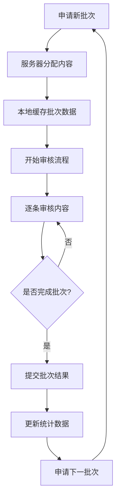
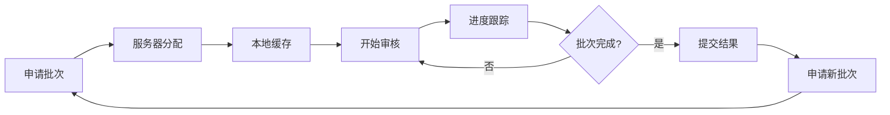

# 🚀 快速审核系统 - 功能克隆指南

## 📋 项目概述

**快速审核系统**是一个高效的内容审核平台，支持批次处理、键盘快捷键操作和多种内容类型的快速审核。本系统通过优化的用户界面和智能的批次管理，大幅提升审核效率。

### 🎯 核心特性

- **🔥 批次请求管理**: 一次性申请50条待审核内容
- **⌨️ 键盘快捷键**: 全键盘操作，无需鼠标
- **📊 实时统计**: 审核进度和效率统计
- **🎨 直观界面**: 卡片式内容展示
- **🔄 自动切换**: 审核完成后自动跳转下一条
- **📝 拒绝原因**: 预设拒绝原因快速选择
- **⏱️ 性能监控**: 审核时间和效率分析

### 🏗️ 系统架构

```
快速审核系统
├── 批次管理模块
│   ├── 批次申请服务
│   ├── 内容分配算法
│   └── 进度跟踪系统
├── 审核界面模块
│   ├── 内容展示组件
│   ├── 操作按钮组件
│   └── 统计面板组件
├── 键盘控制模块
│   ├── 快捷键监听器
│   ├── 操作映射系统
│   └── 状态管理器
└── 数据服务模块
    ├── API接口服务
    ├── 本地状态管理
    └── 缓存优化系统
```

## 🛠️ 技术栈

- **前端框架**: React 18 + TypeScript
- **UI组件库**: Tailwind CSS + Shadcn/ui
- **状态管理**: React Hooks + Context API
- **路由管理**: React Router v6
- **HTTP客户端**: Fetch API
- **图标库**: Lucide React
- **构建工具**: Vite
- **类型检查**: TypeScript 5.0+

## 📁 项目结构

```
quick-review/
├── README.md                          # 项目文档
├── components/                        # 核心组件
│   ├── QuickReviewPanel.tsx          # 主审核面板
│   ├── QuickReviewPanel.css          # 样式文件
│   ├── BatchRequestManager.tsx       # 批次管理器
│   ├── KeyboardShortcuts.tsx         # 键盘快捷键组件
│   ├── ReviewStatistics.tsx          # 统计面板
│   ├── ContentCard.tsx               # 内容卡片
│   └── RejectReasonDialog.tsx        # 拒绝原因对话框
├── services/                         # 服务层
│   ├── quickReviewService.ts         # 快速审核服务
│   ├── batchService.ts               # 批次管理服务
│   ├── keyboardService.ts            # 键盘控制服务
│   └── statisticsService.ts          # 统计服务
├── hooks/                            # 自定义Hooks
│   ├── useQuickReview.ts             # 快速审核Hook
│   ├── useBatchRequest.ts            # 批次请求Hook
│   ├── useKeyboardShortcuts.ts       # 键盘快捷键Hook
│   └── useReviewStatistics.ts        # 统计Hook
├── types/                            # 类型定义
│   ├── review.types.ts               # 审核相关类型
│   ├── batch.types.ts                # 批次相关类型
│   └── keyboard.types.ts             # 键盘相关类型
├── utils/                            # 工具函数
│   ├── keyboardUtils.ts              # 键盘工具
│   ├── reviewUtils.ts                # 审核工具
│   └── statisticsUtils.ts            # 统计工具
├── config/                           # 配置文件
│   ├── keyboard-shortcuts.json       # 快捷键配置
│   ├── review-settings.json          # 审核设置
│   └── batch-config.json             # 批次配置
├── examples/                         # 示例文件
│   ├── basic-integration.html        # 基础集成示例
│   ├── advanced-features.html        # 高级功能示例
│   └── custom-shortcuts.html         # 自定义快捷键示例
└── test/                             # 测试文件
    ├── quick-review.test.html        # 功能测试页面
    └── performance.test.html         # 性能测试页面
```

## ⌨️ 键盘快捷键系统

### 🎮 基础快捷键

| 快捷键 | 功能 | 说明 |
|--------|------|------|
| `A` / `↑` | 批准 | 批准当前内容 |
| `R` / `↓` | 拒绝 | 拒绝当前内容 |
| `N` / `→` | 下一个 | 切换到下一条内容 |
| `P` / `←` | 上一个 | 切换到上一条内容 |
| `E` / `Enter` | 编辑 | 编辑当前内容 |
| `Space` | 暂停/继续 | 暂停或继续自动播放 |
| `Esc` | 退出 | 退出快速审核模式 |

### 🔧 高级快捷键

| 快捷键 | 功能 | 说明 |
|--------|------|------|
| `Ctrl+A` | 全选 | 选择当前批次所有内容 |
| `Ctrl+R` | 刷新 | 刷新当前批次 |
| `Ctrl+S` | 保存 | 保存当前进度 |
| `Ctrl+Z` | 撤销 | 撤销上一个操作 |
| `Ctrl+Y` | 重做 | 重做上一个操作 |
| `F1` | 帮助 | 显示快捷键帮助 |
| `F5` | 申请新批次 | 申请新的审核批次 |

### 🎯 拒绝对话框快捷键

| 快捷键 | 功能 | 说明 |
|--------|------|------|
| `←` / `→` | 选择原因 | 在拒绝原因间切换 |
| `Enter` | 确认选择 | 选择当前高亮的原因 |
| `Ctrl+Enter` | 确认拒绝 | 确认拒绝并提交 |
| `Esc` | 取消 | 取消拒绝操作 |

## 📦 批次请求系统

### 🔄 批次管理流程



### 📊 批次配置参数

```json
{
  "batchSize": 50,
  "autoRequestNext": true,
  "cacheEnabled": true,
  "prefetchNext": true,
  "maxConcurrentBatches": 3,
  "batchTimeout": 1800000,
  "retryAttempts": 3,
  "retryDelay": 5000
}
```

### 🎯 批次类型支持

- **📝 故事审核**: 用户提交的故事内容
- **💬 问卷心声**: 问卷调查的用户反馈
- **🖼️ 图片内容**: 用户上传的图片资源
- **📹 视频内容**: 用户上传的视频资源
- **💭 评论内容**: 用户评论和回复
- **🏷️ 标签内容**: 用户创建的标签

## 🎨 用户界面设计

### 📱 响应式布局

```css
/* 桌面端 (>= 1024px) */
.quick-review-container {
  max-width: 1200px;
  margin: 0 auto;
  padding: 24px;
}

/* 平板端 (768px - 1023px) */
@media (max-width: 1023px) {
  .quick-review-container {
    padding: 16px;
  }
}

/* 移动端 (< 768px) */
@media (max-width: 767px) {
  .quick-review-container {
    padding: 12px;
  }
}
```

### 🎨 主题配色

```css
:root {
  /* 主色调 */
  --primary-color: #3b82f6;
  --primary-hover: #2563eb;
  --primary-light: #dbeafe;

  /* 功能色 */
  --success-color: #10b981;
  --warning-color: #f59e0b;
  --error-color: #ef4444;
  --info-color: #06b6d4;

  /* 中性色 */
  --gray-50: #f9fafb;
  --gray-100: #f3f4f6;
  --gray-200: #e5e7eb;
  --gray-300: #d1d5db;
  --gray-400: #9ca3af;
  --gray-500: #6b7280;
  --gray-600: #4b5563;
  --gray-700: #374151;
  --gray-800: #1f2937;
  --gray-900: #111827;
}
```

### 🔄 动画效果

```css
/* 卡片切换动画 */
.content-card {
  transition: all 0.3s cubic-bezier(0.4, 0, 0.2, 1);
}

.content-card.entering {
  transform: translateX(100%);
  opacity: 0;
}

.content-card.entered {
  transform: translateX(0);
  opacity: 1;
}

.content-card.exiting {
  transform: translateX(-100%);
  opacity: 0;
}

/* 按钮反馈动画 */
.review-button {
  transition: all 0.2s ease;
}

.review-button:active {
  transform: scale(0.95);
}

.review-button.success {
  background-color: var(--success-color);
  animation: pulse 0.5s ease-in-out;
}

@keyframes pulse {
  0% { transform: scale(1); }
  50% { transform: scale(1.05); }
  100% { transform: scale(1); }
}
```

## 📊 统计与分析系统

### 📈 实时统计指标

```typescript
interface ReviewStatistics {
  // 基础统计
  totalReviewed: number;
  approved: number;
  rejected: number;
  pending: number;

  // 效率统计
  averageTimePerItem: number;
  reviewsPerHour: number;
  totalTimeSpent: number;

  // 质量统计
  accuracyRate: number;
  consistencyScore: number;

  // 批次统计
  batchesCompleted: number;
  currentBatchProgress: number;

  // 时间统计
  sessionStartTime: number;
  lastReviewTime: number;

  // 趋势数据
  hourlyTrend: number[];
  dailyTrend: number[];
}
```

### 📊 性能监控

```typescript
interface PerformanceMetrics {
  // 响应时间
  apiResponseTime: number;
  uiRenderTime: number;
  keyboardResponseTime: number;

  // 资源使用
  memoryUsage: number;
  cpuUsage: number;
  networkUsage: number;

  // 错误统计
  errorCount: number;
  errorRate: number;
  lastError: string;

  // 用户行为
  keyboardUsageRate: number;
  mouseUsageRate: number;
  averageSessionLength: number;
}
```

## 🔧 配置与自定义

### ⚙️ 系统配置

```json
{
  "review": {
    "autoAdvance": true,
    "autoAdvanceDelay": 1000,
    "showConfirmation": true,
    "enableUndo": true,
    "maxUndoSteps": 10
  },
  "keyboard": {
    "enabled": true,
    "customShortcuts": true,
    "preventDefaults": true,
    "caseSensitive": false
  },
  "batch": {
    "defaultSize": 50,
    "maxSize": 100,
    "minSize": 10,
    "autoRequest": true,
    "prefetch": true
  },
  "ui": {
    "theme": "light",
    "animations": true,
    "sounds": false,
    "notifications": true
  },
  "performance": {
    "enableMetrics": true,
    "cacheSize": 1000,
    "preloadImages": true,
    "lazyLoading": true
  }
}
```

### 🎨 主题自定义

```json
{
  "themes": {
    "light": {
      "primary": "#3b82f6",
      "background": "#ffffff",
      "surface": "#f9fafb",
      "text": "#111827"
    },
    "dark": {
      "primary": "#60a5fa",
      "background": "#111827",
      "surface": "#1f2937",
      "text": "#f9fafb"
    },
    "high-contrast": {
      "primary": "#000000",
      "background": "#ffffff",
      "surface": "#f0f0f0",
      "text": "#000000"
    }
  }
}
```

## 🚀 快速开始

### 📋 环境要求

- Node.js >= 16.0.0
- npm >= 8.0.0 或 yarn >= 1.22.0
- 现代浏览器支持 (Chrome 90+, Firefox 88+, Safari 14+)

### 🛠️ 安装步骤

1. **克隆项目**
```bash
git clone <repository-url>
cd function-login/quick-review
```

2. **安装依赖**
```bash
npm install
# 或
yarn install
```

3. **配置环境**
```bash
cp .env.example .env
# 编辑 .env 文件，配置API端点和其他环境变量
```

4. **启动开发服务器**
```bash
npm run dev
# 或
yarn dev
```

5. **访问应用**
```
http://localhost:3000/quick-review
```

### 🔧 基础配置

```typescript
// 在你的应用中初始化快速审核系统
import { QuickReviewSystem } from './quick-review';

const quickReview = new QuickReviewSystem({
  apiEndpoint: 'https://api.example.com',
  batchSize: 50,
  enableKeyboard: true,
  theme: 'light',
  onReviewComplete: (result) => {
    console.log('审核完成:', result);
  },
  onBatchComplete: (stats) => {
    console.log('批次完成:', stats);
  }
});

// 启动快速审核
quickReview.start();
```

## 🎯 核心功能详解

### 📦 批次请求管理

批次请求管理是快速审核系统的核心功能之一，它通过智能的批次分配和预加载机制，确保审核员始终有内容可审核。

#### 🔄 批次生命周期



#### 📊 批次配置选项

```json
{
  "batchSize": 50,
  "autoRequestNext": true,
  "prefetchNext": true,
  "maxConcurrentBatches": 3,
  "batchTimeout": 1800000,
  "retryAttempts": 3,
  "retryDelay": 5000,
  "estimatedTimePerItem": 30000
}
```

#### 🚀 使用示例

```typescript
import { useBatchRequest } from './hooks/useBatchRequest';

const MyReviewComponent = () => {
  const {
    requestBatch,
    batchStats,
    isBatchLoading,
    batchError
  } = useBatchRequest('story', {
    batchSize: 50,
    autoRequestNext: true,
    prefetchNext: true
  });

  const handleRequestNewBatch = async () => {
    try {
      const result = await requestBatch();
      console.log('新批次已获取:', result);
    } catch (error) {
      console.error('批次申请失败:', error);
    }
  };

  return (
    <div>
      <button onClick={handleRequestNewBatch} disabled={isBatchLoading}>
        {isBatchLoading ? '申请中...' : '申请新批次'}
      </button>
      {batchError && <div>错误: {batchError.message}</div>}
    </div>
  );
};
```

### ⌨️ 键盘快捷键系统

键盘快捷键系统是提升审核效率的关键功能，支持全键盘操作和自定义快捷键配置。

#### 🎮 快捷键架构

```typescript
interface KeyboardShortcut {
  key: string;                    // 按键组合
  action: KeyboardAction;         // 动作类型
  description: string;            // 描述
  category?: string;              // 分类
  context?: KeyboardContext;      // 上下文
  enabled?: boolean;              // 是否启用
  priority?: number;              // 优先级
}
```

#### 📈 使用统计

系统会自动跟踪快捷键使用情况，提供详细的统计分析：

- **使用频率**: 每个快捷键的使用次数
- **响应时间**: 按键到执行的时间延迟
- **错误率**: 误按或无效按键的比例
- **学习建议**: 基于使用模式的个性化建议

#### 🔧 自定义配置

```typescript
import { useKeyboardShortcuts } from './hooks/useKeyboardShortcuts';

const shortcuts: KeyboardShortcut[] = [
  {
    key: 'a',
    action: 'approve',
    description: '批准当前内容',
    category: 'review',
    priority: 10
  },
  {
    key: 'Ctrl+Enter',
    action: 'quick-approve',
    description: '快速批准并跳转',
    category: 'review',
    priority: 9
  }
];

const actions = {
  approve: () => handleApprove(),
  'quick-approve': () => handleQuickApprove()
};

const { enableShortcuts, stats } = useKeyboardShortcuts(shortcuts, actions, {
  enabled: true,
  preventDefault: true,
  enableStats: true
});
```

### 📊 实时统计分析

系统提供全面的实时统计功能，帮助监控审核效率和质量。

#### 📈 统计指标

```typescript
interface ReviewStatistics {
  // 基础统计
  totalReviewed: number;
  approved: number;
  rejected: number;
  pending: number;

  // 效率统计
  averageTimePerItem: number;
  reviewsPerHour: number;
  totalTimeSpent: number;

  // 质量统计
  accuracyRate: number;
  consistencyScore: number;

  // 趋势数据
  hourlyTrend: number[];
  dailyTrend: number[];
}
```

#### 📊 可视化展示

```typescript
import { useReviewStatistics } from './hooks/useReviewStatistics';

const StatisticsPanel = () => {
  const { statistics, updateStatistics } = useReviewStatistics();

  return (
    <div className="statistics-panel">
      <div className="metric-card">
        <div className="metric-value">{statistics.totalReviewed}</div>
        <div className="metric-label">总审核数</div>
      </div>

      <div className="metric-card">
        <div className="metric-value">
          {Math.round(statistics.averageTimePerItem / 1000)}s
        </div>
        <div className="metric-label">平均时间</div>
      </div>

      <div className="metric-card">
        <div className="metric-value">
          {Math.round(statistics.accuracyRate * 100)}%
        </div>
        <div className="metric-label">准确率</div>
      </div>
    </div>
  );
};
```

## 🔧 高级配置

### 🎨 主题自定义

系统支持完全自定义的主题配置：

```typescript
interface QuickReviewTheme {
  colors: {
    primary: string;
    secondary: string;
    success: string;
    warning: string;
    error: string;
    background: string;
    surface: string;
    text: string;
  };

  typography: {
    fontFamily: string;
    fontSize: {
      small: string;
      medium: string;
      large: string;
    };
  };

  spacing: {
    small: string;
    medium: string;
    large: string;
  };

  borderRadius: string;
  shadows: {
    small: string;
    medium: string;
    large: string;
  };
}
```

### 🔌 API集成

系统提供灵活的API集成选项：

```typescript
interface APIConfig {
  baseURL: string;
  timeout: number;
  retryAttempts: number;
  retryDelay: number;

  endpoints: {
    getBatch: string;
    submitReview: string;
    undoReview: string;
    getStatistics: string;
  };

  headers: Record<string, string>;

  // 请求拦截器
  requestInterceptor?: (config: any) => any;

  // 响应拦截器
  responseInterceptor?: (response: any) => any;

  // 错误处理
  errorHandler?: (error: any) => void;
}
```

### 🔒 权限控制

支持细粒度的权限控制：

```typescript
interface PermissionConfig {
  // 功能权限
  canApprove: boolean;
  canReject: boolean;
  canSkip: boolean;
  canFlag: boolean;
  canEdit: boolean;
  canUndo: boolean;

  // 批次权限
  canRequestBatch: boolean;
  canCancelBatch: boolean;
  maxBatchSize: number;

  // 统计权限
  canViewStats: boolean;
  canExportData: boolean;

  // 配置权限
  canCustomizeShortcuts: boolean;
  canChangeTheme: boolean;
}
```

## 🧪 测试指南

### 🔍 单元测试

```typescript
import { render, screen, fireEvent } from '@testing-library/react';
import { QuickReviewPanel } from '../components/QuickReviewPanel';

describe('QuickReviewPanel', () => {
  test('应该正确渲染审核面板', () => {
    render(<QuickReviewPanel contentType="story" />);

    expect(screen.getByText('快速审核')).toBeInTheDocument();
    expect(screen.getByRole('button', { name: /批准/i })).toBeInTheDocument();
    expect(screen.getByRole('button', { name: /拒绝/i })).toBeInTheDocument();
  });

  test('应该响应键盘快捷键', () => {
    const onReviewComplete = jest.fn();
    render(
      <QuickReviewPanel
        contentType="story"
        onReviewComplete={onReviewComplete}
      />
    );

    fireEvent.keyDown(document, { key: 'a' });
    expect(onReviewComplete).toHaveBeenCalledWith(
      expect.objectContaining({ action: 'approve' })
    );
  });
});
```

### 🚀 集成测试

```typescript
import { renderHook, act } from '@testing-library/react-hooks';
import { useQuickReview } from '../hooks/useQuickReview';

describe('useQuickReview', () => {
  test('应该正确提交审核', async () => {
    const { result } = renderHook(() => useQuickReview('story'));

    await act(async () => {
      const reviewResult = await result.current.submitReview(
        'item-123',
        'approve',
        { reason: '内容质量良好' }
      );

      expect(reviewResult.success).toBe(true);
      expect(result.current.reviewHistory).toHaveLength(1);
    });
  });
});
```

### 📊 性能测试

```typescript
describe('性能测试', () => {
  test('批次加载性能', async () => {
    const startTime = performance.now();

    const { result } = renderHook(() => useBatchRequest('story'));

    await act(async () => {
      await result.current.requestBatch();
    });

    const endTime = performance.now();
    const loadTime = endTime - startTime;

    expect(loadTime).toBeLessThan(2000); // 应在2秒内完成
  });

  test('键盘响应性能', () => {
    const { result } = renderHook(() => useKeyboardShortcuts(shortcuts, actions));

    const startTime = performance.now();

    act(() => {
      // 模拟按键事件
      document.dispatchEvent(new KeyboardEvent('keydown', { key: 'a' }));
    });

    const endTime = performance.now();
    const responseTime = endTime - startTime;

    expect(responseTime).toBeLessThan(100); // 应在100ms内响应
  });
});
```

## 📚 最佳实践

### 🎯 审核效率优化

1. **合理设置批次大小**
   - 小批次(20-30): 适合复杂内容，需要仔细审核
   - 中批次(40-60): 适合一般内容，平衡效率和质量
   - 大批次(70-100): 适合简单内容，追求高效率

2. **充分利用键盘快捷键**
   - 熟练掌握基础快捷键(A/R/N/P)
   - 使用组合键提高操作速度
   - 自定义常用操作的快捷键

3. **启用自动前进模式**
   - 减少手动切换的时间
   - 保持审核节奏的连贯性
   - 在需要时可随时暂停

### 🔧 系统配置建议

1. **性能优化**
   ```typescript
   const optimizedConfig = {
     batchSize: 50,
     prefetchNext: true,
     cacheSize: 1000,
     preloadImages: true,
     lazyLoading: true
   };
   ```

2. **用户体验优化**
   ```typescript
   const uxConfig = {
     autoAdvance: true,
     autoAdvanceDelay: 1000,
     showConfirmation: false,
     animations: true,
     sounds: false
   };
   ```

3. **可访问性配置**
   ```typescript
   const a11yConfig = {
     highContrast: false,
     reducedMotion: false,
     screenReaderSupport: true,
     keyboardNavigation: true
   };
   ```

### 📊 监控和分析

1. **关键指标监控**
   - 审核速度: 目标 < 30秒/项
   - 准确率: 目标 > 95%
   - 键盘使用率: 目标 > 80%
   - 系统响应时间: 目标 < 200ms

2. **质量控制**
   - 定期进行质量抽查
   - 分析拒绝原因分布
   - 监控审核员一致性
   - 识别培训需求

3. **性能优化**
   - 监控内存使用情况
   - 分析网络请求性能
   - 优化批次大小配置
   - 调整缓存策略

## 🚨 故障排除

### 常见问题及解决方案

#### 1. 批次申请失败

**问题**: 无法获取新的审核批次

**可能原因**:
- 网络连接问题
- API服务不可用
- 权限不足
- 配置错误

**解决方案**:
```typescript
// 检查网络连接
if (!navigator.onLine) {
  console.error('网络连接不可用');
  return;
}

// 重试机制
const retryBatchRequest = async (attempts = 3) => {
  for (let i = 0; i < attempts; i++) {
    try {
      const result = await requestBatch();
      return result;
    } catch (error) {
      if (i === attempts - 1) throw error;
      await new Promise(resolve => setTimeout(resolve, 1000 * (i + 1)));
    }
  }
};
```

#### 2. 键盘快捷键不响应

**问题**: 按键无法触发相应操作

**可能原因**:
- 快捷键被其他元素拦截
- 焦点不在正确的元素上
- 快捷键配置错误
- 浏览器默认行为冲突

**解决方案**:
```typescript
// 确保正确的事件监听
useEffect(() => {
  const handleKeyDown = (event: KeyboardEvent) => {
    // 检查焦点元素
    const activeElement = document.activeElement;
    if (activeElement?.tagName === 'INPUT' || activeElement?.tagName === 'TEXTAREA') {
      return; // 在输入框中不处理快捷键
    }

    // 阻止默认行为
    if (shortcuts.some(s => s.key === event.key)) {
      event.preventDefault();
      event.stopPropagation();
    }
  };

  document.addEventListener('keydown', handleKeyDown, { capture: true });
  return () => document.removeEventListener('keydown', handleKeyDown, { capture: true });
}, [shortcuts]);
```

#### 3. 性能问题

**问题**: 系统响应缓慢或卡顿

**可能原因**:
- 内存泄漏
- 大量DOM操作
- 网络请求过多
- 缓存策略不当

**解决方案**:
```typescript
// 内存优化
useEffect(() => {
  return () => {
    // 清理定时器
    clearInterval(intervalRef.current);
    // 清理事件监听器
    document.removeEventListener('keydown', handleKeyDown);
    // 清理缓存
    cache.clear();
  };
}, []);

// 防抖处理
const debouncedUpdate = useMemo(
  () => debounce(updateStatistics, 500),
  [updateStatistics]
);

// 虚拟滚动
const VirtualizedList = ({ items }) => {
  return (
    <FixedSizeList
      height={400}
      itemCount={items.length}
      itemSize={60}
      itemData={items}
    >
      {ItemRenderer}
    </FixedSizeList>
  );
};
```

## 🔮 路线图

### 短期目标 (1-3个月)

- [ ] **移动端适配**: 完善移动设备上的用户体验
- [ ] **离线支持**: 支持离线审核和同步功能
- [ ] **批量操作**: 支持批量批准/拒绝操作
- [ ] **审核模板**: 预设审核模板和规则
- [ ] **多语言支持**: 国际化和本地化

### 中期目标 (3-6个月)

- [ ] **AI辅助审核**: 集成AI预审核功能
- [ ] **协作审核**: 支持多人协作审核
- [ ] **审核工作流**: 复杂的审核流程管理
- [ ] **数据分析**: 高级数据分析和报告
- [ ] **插件系统**: 支持第三方插件扩展

### 长期目标 (6-12个月)

- [ ] **微服务架构**: 拆分为独立的微服务
- [ ] **云原生部署**: 支持Kubernetes部署
- [ ] **实时协作**: WebSocket实时协作功能
- [ ] **机器学习**: 个性化推荐和优化
- [ ] **企业集成**: 与企业系统深度集成

## 🤝 贡献指南

### 开发环境设置

1. **克隆仓库**
```bash
git clone https://github.com/your-org/quick-review.git
cd quick-review
```

2. **安装依赖**
```bash
npm install
```

3. **启动开发服务器**
```bash
npm run dev
```

4. **运行测试**
```bash
npm run test
npm run test:coverage
```

### 代码规范

我们使用以下工具确保代码质量：

- **ESLint**: 代码风格检查
- **Prettier**: 代码格式化
- **TypeScript**: 类型检查
- **Husky**: Git钩子
- **Commitlint**: 提交信息规范

### 提交规范

使用 [Conventional Commits](https://conventionalcommits.org/) 规范：

```
feat: 添加新功能
fix: 修复问题
docs: 更新文档
style: 代码格式调整
refactor: 代码重构
test: 添加测试
chore: 构建过程或辅助工具的变动
```

### Pull Request 流程

1. Fork 项目仓库
2. 创建功能分支: `git checkout -b feature/amazing-feature`
3. 提交更改: `git commit -m 'feat: add amazing feature'`
4. 推送分支: `git push origin feature/amazing-feature`
5. 创建 Pull Request

## 📞 支持与反馈

### 获取帮助

- 📖 **文档**: [在线文档](https://docs.quick-review.com)
- 💬 **讨论区**: [GitHub Discussions](https://github.com/your-org/quick-review/discussions)
- 🐛 **问题报告**: [GitHub Issues](https://github.com/your-org/quick-review/issues)
- 📧 **邮件支持**: support@quick-review.com

### 社区

- 🌟 **GitHub**: [Star 项目](https://github.com/your-org/quick-review)
- 🐦 **Twitter**: [@QuickReview](https://twitter.com/quickreview)
- 💼 **LinkedIn**: [Quick Review](https://linkedin.com/company/quick-review)

## 📄 许可证

本项目采用 [MIT 许可证](LICENSE)。

---

**🎉 感谢使用快速审核系统！**

这是一个功能完整、性能优异、易于扩展的内容审核平台。通过批次管理、键盘快捷键和实时统计等核心功能，大幅提升内容审核的效率和质量。

立即开始使用，体验高效的内容审核流程！🚀