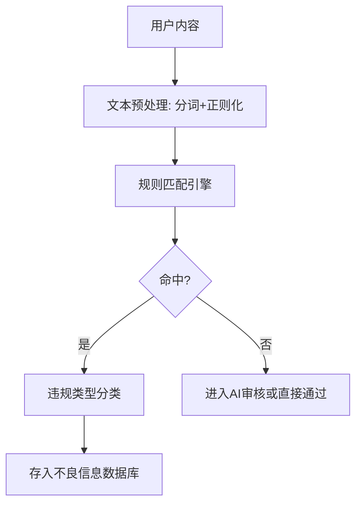

---

## 1. 规则覆盖面优化

目前本地规则审核可能还偏向于关键词匹配，建议补充：

* **正则化规则**
  处理变形、同音字、空格插入等规避手段（如“黄-色”、“H U A N G”等）。
* **多模态敏感词扩展**
  除文本外，若未来支持图片/语音，可集成简单的OCR/ASR识别结果再跑规则。
* **场景化规则分组**
  将规则分为**政治敏感、低俗暴力、广告推广、个人隐私泄露、引战言论**等类别，方便后续统计和调优。

---

## 2. 规则维护与更新机制

* **版本化管理**
  给规则集加版本号，更新时可回溯历史规则，方便审计。
* **在线热更新**
  后台支持规则更新即时生效，不需要重启审核服务。
* **自动采集补充**
  从不良信息数据库中自动提取高频违规词，提示运营人员纳入规则库。

---

## 3. 降低误判率

* **组合条件过滤**
  例如“打架”在故事情节中可能无害，但和“学校门口”结合可能是校园暴力事件，组合规则可以减少误杀。
* **上下文窗口检测**
  对长文本按段落/句子分割，判断违规词的上下文，减少因单词误判导致整篇被拒。
* **优先级机制**
  严重违规（如政治敏感）直接拒绝，其余交给AI或人工复核。

---

## 4. 性能与成本优化

* **批量规则匹配**
  使用Aho-Corasick算法或Trie树做敏感词检测，减少遍历成本。
* **预先分类**
  对内容按类型（故事墙、问卷评论等）走不同的精简规则集，避免全量规则扫描。

---

## 5. 审核透明度与后续利用

* **违规类别标注**
  不提示用户，但在数据库中标注违规类型、触发的规则ID，方便统计和改进。
* **规则命中分析**
  定期生成违规热词榜和命中频率，用于更新本地规则库。

---
好的，我会给你设计一套**本地规则审核架构 + 样例规则表**，保证能直接嵌入你们的三层审核中，并且能**减少AI调用量**、方便维护和扩展。

---

# 本地规则审核方案（样例）

## 一、审核规则架构

### 1. 规则引擎结构

**核心模块：**

1. **文本预处理**

   * 全角半角转换
   * 去除空格、符号干扰
   * 同音字替换（e.g. “习=xi”）
2. **规则匹配引擎**

   * Aho-Corasick 多模式匹配
   * 支持正则规则（处理变形词）
3. **命中后处理**

   * 按类别标注（政治、低俗、广告等）
   * 存储触发规则 ID、命中词

---

## 二、违规类别定义

| 类别代码 | 类别名  | 说明            |
| ---- | ---- | ------------- |
| POL  | 政治敏感 | 涉及国家领导人、颠覆国家等 |
| POR  | 色情低俗 | 色情描写、淫秽用语     |
| VIO  | 暴力恐怖 | 打斗、杀戮、恐怖威胁    |
| ADV  | 广告推广 | 明显广告、引流、联系方式  |
| PRI  | 个人隐私 | 身份证、手机号、家庭住址等 |
| DIS  | 引战辱骂 | 人身攻击、挑起争端     |
| OTH  | 其他违规 | 不适宜公开的敏感内容    |

---

## 三、规则样例表

| 规则ID    | 类别  | 匹配模式                                           | 类型         | 描述      |         |              |
| ------- | --- | ---------------------------------------------- | ---------- | ------- | ------- | ------------ |
| POL-001 | POL | \`习近平                                          | 李克强        | 中央政府\`  | 关键词     | 涉及现任或前任国家领导人 |
| POL-002 | POL | \`反\[政正]府                                      | 推翻制度\`     | 正则      | 政治颠覆相关  |              |
| POR-001 | POR | \`性交                                           | 裸照         | 黄片\`    | 关键词     | 明确色情用语       |
| POR-002 | POR | \`(\\\*                                        | \s)\*18禁\` | 正则      | 18禁变形表达 |              |
| VIO-001 | VIO | \`杀人                                           | 血腥         | 爆炸\`    | 关键词     | 暴力描写         |
| VIO-002 | VIO | \`持(刀                                          | 枪)\`       | 正则      | 持械暴力    |              |
| ADV-001 | ADV | \`微信号                                          | QQ号        | VX\`    | 关键词     | 联系方式广告       |
| ADV-002 | ADV | `[a-zA-Z0-9._%+-]+@[a-zA-Z0-9.-]+\\.[a-z]{2,}` | 正则         | 邮箱地址    |         |              |
| PRI-001 | PRI | `\\d{18}`                                      | 正则         | 身份证号    |         |              |
| PRI-002 | PRI | `1[3-9]\\d{9}`                                 | 正则         | 中国大陆手机号 |         |              |
| DIS-001 | DIS | \`垃圾                                           | 傻逼         | 废物\`    | 关键词     | 辱骂性用语        |
| OTH-001 | OTH | \`赌博                                           | 私彩\`       | 关键词     | 赌博相关    |              |

---

## 四、触发策略

* **POL、POR、VIO**：**直接拒绝** → 存入不良信息库
* **ADV、PRI**：**根据严重性** → 轻微广告可AI复核，严重广告/隐私直接拒绝
* **DIS、OTH**：交给AI复核，减少误杀

---

## 五、维护与更新建议

1. **版本管理**：规则集存储为 `rules_vYYYYMMDD.json`，支持回滚
2. **自动采集补充**：从不良信息库统计高频命中词 → 审核人员筛选后入库
3. **分类调优**：定期评估误杀率，调整进入 AI 审核的类别

---