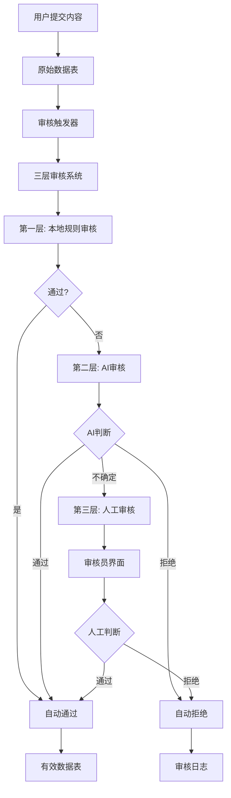
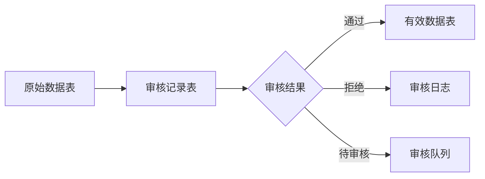

# 审核模块功能报告
**生成时间**: 2025-08-10  
**报告类型**: 系统功能分析与优化建议  
**项目**: 大学生就业调研平台  

## 📋 执行摘要

本报告基于前端代码分析，对项目当前的审核模块功能进行全面评估。审核模块是平台内容质量控制的核心组件，负责处理用户提交的问卷、故事等内容的审核流程。

### 🎯 核心发现
- **架构完整性**: ✅ 具备完整的三层审核架构（本地规则→AI审核→人工审核）
- **功能覆盖度**: ✅ 覆盖自动审核、人工审核、配置管理等核心功能
- **开发状态**: ⚠️ 部分功能为模拟实现，需要完善后端集成
- **用户体验**: ✅ 前端界面完善，交互流程清晰

---

## 🏗️ 系统架构分析

### 1. 整体架构设计



### 2. 技术栈组成

| 层级 | 技术栈 | 实现状态 |
|------|--------|----------|
| **前端界面** | React + TypeScript + Ant Design | ✅ 完整实现 |
| **审核服务** | Python Flask API | ✅ 基础实现 |
| **AI集成** | OpenAI API + 本地模型 | ⚠️ 接口预留 |
| **数据存储** | MySQL + Cloudflare D1 | ✅ 表结构完整 |
| **配置管理** | 动态配置系统 | ✅ 基础实现 |

---

## 🔍 功能模块详细分析

### 1. 审核管理界面 (AuditManagement)

**路径**: `/admin/audit-management`  
**主要功能**: 管理员审核工作台

#### 1.1 核心功能
- ✅ **待审核列表**: 分页显示待审核内容
- ✅ **内容筛选**: 按内容类型（问卷心声/就业故事）筛选
- ✅ **快速操作**: 一键通过/拒绝审核
- ✅ **详情查看**: 查看完整内容和审核历史
- ✅ **批量操作**: 支持批量审核处理

#### 1.2 界面组件
```tsx
AuditManagement
├── StatisticsCards     # 审核统计卡片
├── FilterBar          # 筛选工具栏
├── AuditTable         # 审核列表表格
│   ├── ContentPreview # 内容预览
│   ├── StatusTags     # 状态标签
│   └── ActionButtons  # 操作按钮
├── ReviewModal        # 审核弹窗
└── ConfigModal        # 配置弹窗
```

#### 1.3 数据流转
```typescript
// 获取待审核列表
const result = await auditService.getPendingAudits({
  page: currentPage,
  pageSize: pageSize,
  content_type: contentTypeFilter
});

// 提交审核决定
const result = await auditService.manualReview({
  audit_id: selectedAudit.auditId,
  decision: 'approved' | 'rejected',
  reviewer_id: user.id,
  notes: reviewNotes
});
```

### 2. AI审核助手 (AIReviewAssistant)

**功能**: 为审核员提供AI分析建议

#### 2.1 AI分析能力
- ✅ **内容质量分析**: 评估内容的完整性和相关性
- ✅ **情感分析**: 检测内容的情感倾向
- ✅ **有害内容检测**: 识别不当语言和敏感内容
- ✅ **相关性检查**: 验证内容是否符合主题
- ⚠️ **可读性分析**: 接口预留，待实现

#### 2.2 分析结果展示
```tsx
// AI分析结果结构
interface AIReviewAnalysis {
  suggestions: {
    recommendation: 'approve' | 'reject' | 'flag';
    confidence: number;
    reasons: string[];
  };
  analysis: {
    qualityScore: number;      // 质量评分 0-100
    sentimentScore: number;    // 情感评分 -1到1
    toxicityScore: number;     // 有害内容评分 0-1
    relevanceScore: number;    // 相关性评分 0-1
  };
  flags: {
    hasSensitiveContent: boolean;
    hasPersonalInfo: boolean;
    hasInappropriateLanguage: boolean;
    hasSpam: boolean;
    hasOffTopic: boolean;
  };
}
```

#### 2.3 交互功能
- ✅ **智能建议**: 基于AI分析提供审核建议
- ✅ **一键采纳**: 高置信度建议可一键采纳
- ✅ **详细分析**: 展开查看详细分析结果
- ✅ **重新分析**: 支持重新触发AI分析

### 3. 审核员工作台 (StoryReviewPage)

**路径**: `/reviewer/stories`  
**功能**: 专门的审核员操作界面

#### 3.1 工作流程
1. **加载待审核内容**: 获取分配给当前审核员的任务
2. **内容预览**: 完整显示待审核内容
3. **AI辅助分析**: 显示AI审核助手建议
4. **人工判断**: 审核员做出最终决定
5. **提交结果**: 记录审核结果和备注

#### 3.2 审核表单
```tsx
// 审核表单结构
interface ReviewFormData {
  decision: 'approved' | 'rejected';
  notes: string;
  tags?: string[];
  severity?: 'low' | 'medium' | 'high';
}
```

### 4. 审核配置管理

#### 4.1 配置项目
```typescript
interface AuditConfig {
  // 基础开关
  auto_approve_enabled: boolean;    // 启用自动审核
  auto_approve_all: boolean;        // 全部自动通过（开发模式）
  
  // 阈值设置
  manual_review_threshold: number;  // 人工审核阈值
  
  // 内容过滤规则
  content_filters: {
    min_length: number;             // 最小长度
    max_length: number;             // 最大长度
    forbidden_words: string[];      // 敏感词列表
  };
}
```

#### 4.2 三层审核配置
```sql
-- 审核模式配置
audit_mode ENUM(
    'disabled',      -- 关闭审核
    'local_only',    -- 仅本地规则
    'ai_only',       -- 仅AI审核
    'human_only',    -- 仅人工审核
    'local_ai',      -- 本地规则 + AI审核 (推荐)
    'local_human'    -- 本地规则 + 人工审核 (过渡)
)
```

---

## 📊 数据库设计分析

### 1. 核心表结构

#### 1.1 审核记录表 (audit_records)
```sql
CREATE TABLE audit_records (
    id INTEGER PRIMARY KEY AUTOINCREMENT,
    content_type TEXT NOT NULL,           -- 内容类型
    content_id INTEGER NOT NULL,          -- 内容ID
    content_uuid TEXT,                    -- 内容UUID
    user_uuid TEXT,                       -- 用户UUID
    audit_result TEXT DEFAULT 'pending',  -- 审核结果
    reviewer_id TEXT,                     -- 审核员ID
    audit_notes TEXT,                     -- 审核备注
    created_at DATETIME DEFAULT CURRENT_TIMESTAMP,
    updated_at DATETIME DEFAULT CURRENT_TIMESTAMP
);
```

#### 1.2 审核配置表 (audit_config)
```sql
CREATE TABLE audit_config (
    id INT PRIMARY KEY AUTO_INCREMENT,
    audit_mode ENUM(...),                 -- 审核模式
    local_confidence_threshold INT,       -- 本地规则置信度
    ai_confidence_threshold INT,          -- AI置信度阈值
    human_timeout_hours INT,              -- 人工审核超时
    -- ... 更多配置项
);
```

### 2. 数据流转设计



---

## 🔧 API接口分析

### 1. 审核服务接口 (auditService)

#### 1.1 核心接口
| 接口 | 方法 | 功能 | 实现状态 |
|------|------|------|----------|
| `/api/audit/process` | POST | 处理审核请求 | ✅ 完整 |
| `/api/audit/pending` | GET | 获取待审核列表 | ✅ 完整 |
| `/api/audit/manual-review` | POST | 人工审核提交 | ✅ 完整 |
| `/api/audit/config` | GET/POST | 审核配置管理 | ✅ 完整 |
| `/api/audit/stats` | GET | 审核统计数据 | ⚠️ 模拟数据 |

#### 1.2 接口示例
```typescript
// 处理审核请求
interface ProcessAuditRequest {
  source_table: string;
  source_id: number;
  content_type: 'heart_voice' | 'story';
  force_manual?: boolean;
}

// 人工审核请求
interface ManualReviewRequest {
  audit_id: number;
  decision: 'approved' | 'rejected';
  reviewer_id: number;
  notes?: string;
}
```

### 2. AI审核接口 (aiReviewService)

#### 2.1 分析接口
```typescript
// AI内容分析
async analyzeContent(content: ReviewContent): Promise<AIReviewAnalysis>

// 获取分析结果
async getAnalysisResult(contentId: string): Promise<AIReviewAnalysis | null>
```

#### 2.2 实现状态
- ✅ **接口定义**: 完整的TypeScript接口定义
- ⚠️ **后端实现**: 部分为模拟数据
- ⚠️ **AI集成**: 需要接入真实AI服务

---

## 📈 统计与监控功能

### 1. 审核统计指标

#### 1.1 核心指标
```typescript
interface AuditStats {
  total_pending: number;        // 待审核总数
  total_approved: number;       // 已通过总数
  total_rejected: number;       // 已拒绝总数
  auto_approval_rate: number;   // 自动通过率
  manual_review_rate: number;   // 人工审核率
}
```

#### 1.2 AI助手统计
```typescript
interface AIStats {
  totalAnalyzed: number;        // 总分析数
  autoApproved: number;         // 自动通过数
  flaggedForReview: number;     // 标记审核数
  accuracy: number;             // 准确率
  timesSaved: number;           // 节省时间
  costSavings: number;          // 成本节省
}
```

### 2. 可视化展示
- ✅ **统计卡片**: 关键指标概览
- ✅ **进度条**: 各项评分可视化
- ✅ **标签系统**: 问题标记和分类
- ⚠️ **图表分析**: 趋势分析待实现

---

## 🎯 用户体验分析

### 1. 管理员体验

#### 1.1 优势
- ✅ **直观界面**: 清晰的审核列表和操作按钮
- ✅ **快速操作**: 支持一键通过/拒绝
- ✅ **批量处理**: 提高审核效率
- ✅ **配置灵活**: 可调整审核规则和阈值

#### 1.2 待改进
- ⚠️ **统计不足**: 缺乏详细的审核趋势分析
- ⚠️ **搜索功能**: 缺乏内容搜索和高级筛选
- ⚠️ **导出功能**: 无法导出审核报告

### 2. 审核员体验

#### 2.1 优势
- ✅ **AI辅助**: 智能分析减少工作量
- ✅ **内容预览**: 完整的内容展示
- ✅ **操作简便**: 清晰的审核流程

#### 2.2 待改进
- ⚠️ **工作量统计**: 缺乏个人审核统计
- ⚠️ **快捷键**: 缺乏键盘快捷操作
- ⚠️ **历史记录**: 无法查看个人审核历史

---

## 🚨 问题与风险识别

### 1. 技术风险

#### 1.1 高风险问题
- ❌ **AI服务依赖**: AI审核功能依赖外部服务，存在可用性风险
- ❌ **数据一致性**: 多表数据同步可能存在一致性问题
- ❌ **性能瓶颈**: 大量审核请求可能导致性能问题

#### 1.2 中等风险问题
- ⚠️ **配置复杂性**: 三层审核配置较复杂，容易误配置
- ⚠️ **权限管理**: 审核员权限控制需要加强
- ⚠️ **日志完整性**: 审核日志记录不够详细

### 2. 业务风险

#### 2.1 内容质量风险
- ⚠️ **误判率**: AI和规则审核可能存在误判
- ⚠️ **审核延迟**: 人工审核可能导致内容发布延迟
- ⚠️ **标准不一**: 不同审核员标准可能不统一

#### 2.2 用户体验风险
- ⚠️ **审核反馈**: 用户无法了解审核进度和结果
- ⚠️ **申诉机制**: 缺乏内容审核申诉流程

---

## 💡 优化建议

### 1. 短期优化 (1-2周)

#### 1.1 功能完善
- 🎯 **完善统计功能**: 实现真实的审核统计数据
- 🎯 **优化AI集成**: 接入真实的AI审核服务
- 🎯 **增强搜索**: 添加内容搜索和高级筛选
- 🎯 **完善日志**: 增加详细的审核操作日志

#### 1.2 用户体验
- 🎯 **添加快捷键**: 支持键盘快速审核操作
- 🎯 **优化加载**: 添加加载状态和错误处理
- 🎯 **移动适配**: 优化移动端审核界面

### 2. 中期优化 (1-2月)

#### 2.1 功能扩展
- 🎯 **审核工作流**: 实现复杂的审核流程配置
- 🎯 **智能分配**: 基于审核员专长智能分配任务
- 🎯 **质量控制**: 实现审核质量评估和反馈
- 🎯 **报告系统**: 生成详细的审核报告和分析

#### 2.2 系统优化
- 🎯 **性能优化**: 优化大数据量下的审核性能
- 🎯 **缓存机制**: 实现审核结果缓存
- 🎯 **监控告警**: 添加系统监控和异常告警

### 3. 长期规划 (3-6月)

#### 3.1 智能化升级
- 🎯 **机器学习**: 基于历史数据训练专用审核模型
- 🎯 **自适应规则**: 根据审核结果自动调整规则
- 🎯 **预测分析**: 预测内容质量和审核工作量

#### 3.2 生态完善
- 🎯 **开放API**: 提供第三方审核工具集成
- 🎯 **插件系统**: 支持自定义审核规则插件
- 🎯 **多语言支持**: 支持多语言内容审核

---

## 📋 实施计划

### Phase 1: 基础完善 (优先级: 高)
- [ ] 完善AI审核服务集成
- [ ] 实现真实统计数据
- [ ] 优化错误处理和用户反馈
- [ ] 添加审核操作日志

### Phase 2: 功能增强 (优先级: 中)
- [ ] 实现高级搜索和筛选
- [ ] 添加批量操作功能
- [ ] 完善权限管理系统
- [ ] 实现审核报告导出

### Phase 3: 体验优化 (优先级: 中)
- [ ] 添加快捷键支持
- [ ] 优化移动端体验
- [ ] 实现实时通知
- [ ] 添加审核员工作台

### Phase 4: 智能升级 (优先级: 低)
- [ ] 接入高级AI模型
- [ ] 实现智能任务分配
- [ ] 添加质量控制机制
- [ ] 开发预测分析功能

---

## 📊 总体评估

### 功能完整性: ⭐⭐⭐⭐☆ (4/5)
- ✅ 核心审核流程完整
- ✅ 用户界面设计优秀
- ⚠️ 部分功能需要完善

### 技术架构: ⭐⭐⭐⭐☆ (4/5)
- ✅ 三层审核架构设计合理
- ✅ 前后端分离架构清晰
- ⚠️ AI集成需要加强

### 用户体验: ⭐⭐⭐☆☆ (3/5)
- ✅ 界面直观易用
- ⚠️ 缺乏高级功能
- ⚠️ 移动端体验待优化

### 可维护性: ⭐⭐⭐⭐☆ (4/5)
- ✅ 代码结构清晰
- ✅ 组件化设计良好
- ⚠️ 文档需要完善

**总体评分: ⭐⭐⭐⭐☆ (4/5)**

---

## 🎯 结论与建议

项目的审核模块具备了完整的功能架构和良好的用户界面设计，三层审核机制设计合理，能够满足基本的内容审核需求。主要优势在于：

1. **架构完整**: 具备从自动审核到人工审核的完整流程
2. **界面友好**: 前端界面设计直观，操作流程清晰
3. **AI集成**: 预留了AI审核助手功能，具备智能化基础
4. **配置灵活**: 支持多种审核模式和参数配置

**建议优先实施的改进**:
1. 完善AI审核服务的真实集成
2. 实现完整的统计和监控功能
3. 优化用户体验和操作效率
4. 加强系统的稳定性和性能

通过这些优化，审核模块将成为一个功能完善、性能优秀的企业级内容审核系统。
