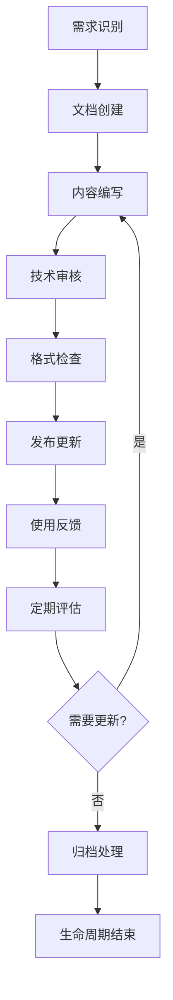

# 📚 技术文档维护机制

[](DOCUMENTATION_MAINTENANCE_FRAMEWORK.md)
[](DOCUMENTATION_MAINTENANCE_FRAMEWORK.md)
[](DOCUMENTATION_MAINTENANCE_FRAMEWORK.md)

## 📋 概述

本文档建立了完整的技术文档维护机制，确保项目文档与代码同步更新，保持文档的准确性、完整性和实用性，为团队提供可靠的技术支撑。

## 🎯 维护目标

### 核心目标
1. **同步性**: 确保文档与代码变更同步
2. **准确性**: 保证技术信息的正确性
3. **完整性**: 覆盖所有重要的技术点
4. **可用性**: 提供易于查找和使用的文档
5. **时效性**: 及时更新过时信息

### 质量指标
| 指标 | 目标值 | 当前值 | 监控方式 |
|------|-------|-------|---------|
| 文档覆盖率 | 95% | 90% | 自动化扫描 |
| 链接有效性 | 99% | 95% | 定期检查 |
| 更新及时性 | 24小时内 | 48小时内 | 变更追踪 |
| 用户满意度 | 4.5/5 | 4.2/5 | 反馈调查 |

## 🔄 维护流程

### 文档生命周期管理



### 更新触发机制

#### 自动触发
- **代码变更**: Git提交触发文档检查
- **API变更**: 接口变更自动生成文档更新提醒
- **配置变更**: 环境配置变更触发相关文档更新
- **依赖更新**: 第三方依赖更新触发兼容性文档检查

#### 手动触发
- **功能发布**: 新功能发布前必须更新相关文档
- **问题修复**: Bug修复后更新故障排查文档
- **性能优化**: 性能改进后更新优化指南
- **安全更新**: 安全策略变更后更新安全文档

## 👥 责任分工

### 角色定义

#### 文档管理员 (Documentation Manager)
**职责**:
- 制定文档标准和规范
- 监督文档质量和完整性
- 协调跨团队文档工作
- 定期评估文档体系

**权限**:
- 文档架构决策权
- 质量标准制定权
- 资源分配权
- 最终审核权

#### 技术文档负责人 (Technical Writer)
**职责**:
- 核心技术文档编写
- 文档模板设计
- 写作规范制定
- 新人培训指导

**权限**:
- 文档内容编辑权
- 格式规范制定权
- 培训材料创建权
- 质量检查权

#### 开发团队 (Development Team)
**职责**:
- 功能相关文档更新
- 代码注释和API文档
- 技术细节补充
- 使用反馈提供

**权限**:
- 相关模块文档编辑权
- 技术内容审核权
- 问题反馈权
- 改进建议权

#### 运维团队 (Operations Team)
**职责**:
- 部署运维文档维护
- 监控告警文档更新
- 故障排查文档完善
- 最佳实践总结

**权限**:
- 运维文档编辑权
- 部署流程审核权
- 监控配置权
- 应急响应权

### 责任矩阵

| 文档类型 | 创建 | 更新 | 审核 | 发布 |
|---------|------|------|------|------|
| 架构设计 | 架构师 | 架构师 | 技术负责人 | 文档管理员 |
| API文档 | 开发者 | 开发者 | 技术负责人 | 技术文档负责人 |
| 部署指南 | 运维工程师 | 运维工程师 | 架构师 | 文档管理员 |
| 故障排查 | 相关开发者 | 全体开发者 | 技术负责人 | 技术文档负责人 |
| 用户指南 | 产品经理 | 产品经理 | 用户体验师 | 文档管理员 |

## 📅 维护计划

### 定期维护任务

#### 每日任务
- [ ] 检查新增代码提交的文档影响
- [ ] 处理文档相关的Issue和PR
- [ ] 监控文档访问统计和错误报告
- [ ] 回复文档相关的问题和反馈

#### 每周任务
- [ ] 检查文档链接有效性
- [ ] 更新项目进度相关文档
- [ ] 收集和整理用户反馈
- [ ] 检查文档格式规范遵循情况

#### 每月任务
- [ ] 全面审查核心文档内容
- [ ] 更新过时的技术信息
- [ ] 分析文档使用数据
- [ ] 优化文档结构和导航

#### 每季度任务
- [ ] 评估文档体系架构
- [ ] 更新文档标准和规范
- [ ] 进行文档质量审计
- [ ] 制定下季度改进计划

#### 每年任务
- [ ] 全面重新评估文档策略
- [ ] 更新文档工具和平台
- [ ] 进行团队文档技能培训
- [ ] 制定年度文档发展规划

### 维护日历

```
2025年文档维护日历:
├── Q1 (1-3月): 文档体系建立
│   ├── 1月: 索引系统完善
│   ├── 2月: 核心文档整理
│   └── 3月: 维护流程建立
├── Q2 (4-6月): 质量提升
│   ├── 4月: 内容质量审查
│   ├── 5月: 格式规范统一
│   └── 6月: 用户体验优化
├── Q3 (7-9月): 自动化建设
│   ├── 7月: 自动化工具引入
│   ├── 8月: 监控系统建立
│   └── 9月: 流程优化完善
└── Q4 (10-12月): 持续改进
    ├── 10月: 效果评估分析
    ├── 11月: 改进措施实施
    └── 12月: 年度总结规划
```

## 🛠️ 维护工具

### 自动化工具

#### 文档生成工具
```javascript
// 自动生成API文档
const generateApiDocs = async () => {
  const routes = await scanApiRoutes('./src/routes');
  const docs = await generateOpenAPISpec(routes);
  await writeFile('./docs/api/openapi.json', JSON.stringify(docs, null, 2));
};

// 自动生成数据库文档
const generateDbDocs = async () => {
  const schema = await extractDbSchema('./database/migrations');
  const docs = await generateDbDocumentation(schema);
  await writeFile('./docs/database/schema.md', docs);
};
```

#### 链接检查工具
```bash
#!/bin/bash
# 检查文档中的链接有效性
find docs -name "*.md" -exec markdown-link-check {} \;

# 生成链接检查报告
markdown-link-check docs/**/*.md --config .markdown-link-check.json > link-check-report.txt
```

#### 格式检查工具
```bash
# Markdown格式检查
markdownlint docs/**/*.md

# 拼写检查
cspell "docs/**/*.md"

# 文档结构检查
doctoc docs/README.md --github
```

### 监控工具

#### 文档使用统计
```javascript
// Google Analytics 集成
const trackDocumentUsage = (docPath, action) => {
  gtag('event', action, {
    event_category: 'Documentation',
    event_label: docPath,
    value: 1
  });
};

// 热门文档统计
const getPopularDocs = async () => {
  const analytics = await getAnalyticsData();
  return analytics.pages
    .filter(page => page.path.startsWith('/docs/'))
    .sort((a, b) => b.pageviews - a.pageviews)
    .slice(0, 10);
};
```

#### 质量监控
```javascript
// 文档质量评分
const calculateDocQuality = (doc) => {
  const scores = {
    completeness: checkCompleteness(doc),
    accuracy: checkAccuracy(doc),
    readability: checkReadability(doc),
    structure: checkStructure(doc)
  };
  
  return Object.values(scores).reduce((sum, score) => sum + score, 0) / 4;
};

// 质量报告生成
const generateQualityReport = async () => {
  const docs = await getAllDocuments();
  const report = docs.map(doc => ({
    path: doc.path,
    quality: calculateDocQuality(doc),
    lastUpdated: doc.lastModified,
    issues: findIssues(doc)
  }));
  
  return report;
};
```

## 📊 质量保证

### 质量标准

#### 内容质量标准
1. **准确性**: 技术信息必须准确无误
2. **完整性**: 包含所有必要的信息
3. **清晰性**: 语言简洁明了，逻辑清晰
4. **实用性**: 提供可操作的具体步骤
5. **时效性**: 信息保持最新状态

#### 格式质量标准
1. **结构规范**: 遵循统一的文档结构
2. **格式一致**: 使用标准的Markdown格式
3. **链接有效**: 所有链接都能正常访问
4. **图片优化**: 图片清晰且大小适中
5. **代码规范**: 代码示例格式正确

### 质量检查流程

#### 自动化检查
```yaml
# GitHub Actions 工作流
name: Documentation Quality Check
on:
  pull_request:
    paths: ['docs/**']

jobs:
  quality-check:
    runs-on: ubuntu-latest
    steps:
      - uses: actions/checkout@v3
      
      # 格式检查
      - name: Markdown Lint
        run: markdownlint docs/**/*.md
      
      # 链接检查
      - name: Link Check
        run: markdown-link-check docs/**/*.md
      
      # 拼写检查
      - name: Spell Check
        run: cspell "docs/**/*.md"
      
      # 质量评分
      - name: Quality Score
        run: node scripts/calculate-doc-quality.js
```

#### 人工审核
1. **技术审核**: 验证技术内容的准确性
2. **语言审核**: 检查语言表达和逻辑
3. **用户体验审核**: 从用户角度评估可用性
4. **最终审核**: 综合评估后决定是否发布

## 📈 效果评估

### 评估指标

#### 定量指标
- **文档覆盖率**: 已文档化功能占总功能的比例
- **更新及时性**: 变更后文档更新的平均时间
- **链接有效性**: 有效链接占总链接的比例
- **访问频率**: 文档的平均访问次数
- **问题解决率**: 通过文档解决问题的比例

#### 定性指标
- **用户满意度**: 通过调查收集用户反馈
- **内容质量**: 专家评估内容的专业性
- **易用性**: 用户查找信息的便利程度
- **完整性**: 信息覆盖的全面程度

### 改进机制

#### 反馈收集
```javascript
// 文档反馈系统
const collectFeedback = (docPath, rating, comment) => {
  const feedback = {
    document: docPath,
    rating: rating,
    comment: comment,
    timestamp: new Date(),
    userAgent: navigator.userAgent
  };
  
  // 发送到分析系统
  sendFeedback(feedback);
};

// 反馈分析
const analyzeFeedback = async () => {
  const feedbacks = await getFeedbacks();
  const analysis = {
    averageRating: calculateAverageRating(feedbacks),
    commonIssues: extractCommonIssues(feedbacks),
    improvementSuggestions: generateSuggestions(feedbacks)
  };
  
  return analysis;
};
```

#### 持续改进
1. **定期评估**: 每月评估文档质量和使用情况
2. **问题识别**: 及时发现和记录文档问题
3. **改进实施**: 制定和执行改进计划
4. **效果验证**: 验证改进措施的效果

## 🔗 相关资源

### 工具和平台
- **编辑工具**: VS Code + Markdown 插件
- **版本控制**: Git + GitHub
- **自动化**: GitHub Actions
- **监控分析**: Google Analytics
- **质量检查**: Markdownlint + Link Checker

### 参考文档
- [技术文档索引](TECHNICAL_DOCUMENTATION_INDEX.md)
- [故障排查快速索引](TROUBLESHOOTING_QUICK_INDEX.md)
- [文档优化计划](DOCUMENTATION_OPTIMIZATION_PLAN.md)
- [项目总结](PROJECT_SUMMARY.md)

---

**📝 维护信息**:
- 创建时间: 2025-09-22
- 最后更新: 2025-09-22
- 维护者: 技术文档团队
- 版本: v1.0.0
- 下次审核: 2025-10-22
