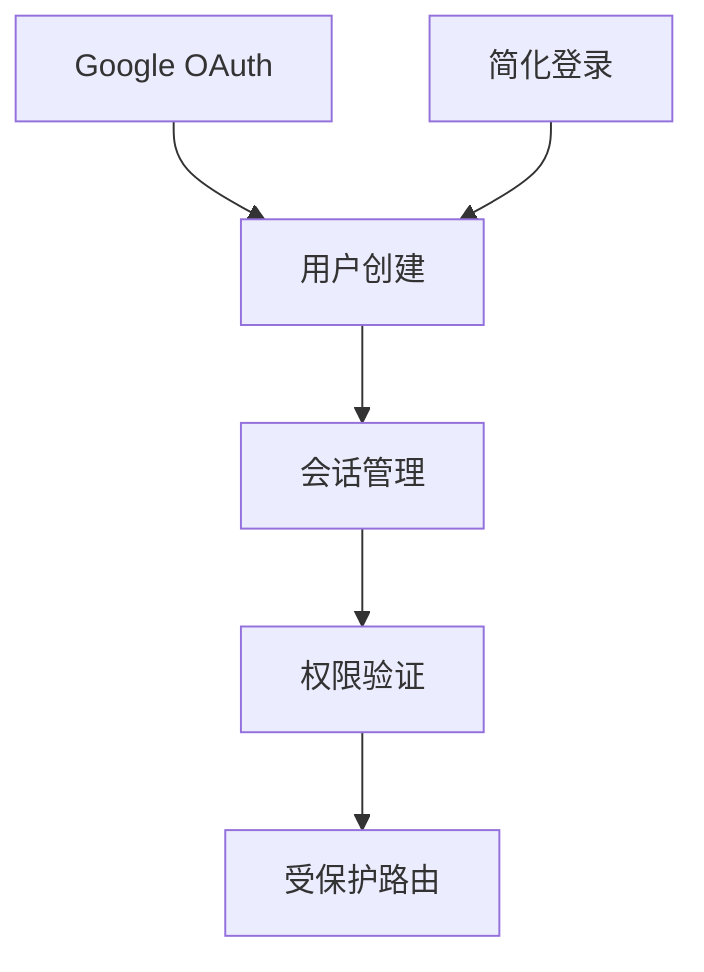

# 📚 功能文档化实施指南

> **目标**: 在1-2周内完成项目功能的系统化文档管理  
> **适用**: 99%完成度的项目，重点在于梳理和维护

## 🎯 实施概览

### 时间规划
- **阶段一**: 自动化基础文档生成（1-2天）
- **阶段二**: 手动补充核心模块（3-5天）
- **阶段三**: 整合和优化（2-3天）
- **总计**: 6-10天

### 预期成果
- ✅ 完整的功能清单索引
- ✅ 133个API端点的详细文档
- ✅ 6大模块的功能文档
- ✅ 常见问题排查指南
- ✅ 自动化文档维护机制

---

## 📋 阶段一：自动化基础文档生成（1-2天）

### Day 1: 运行自动化脚本

#### 1.1 生成API和路由索引
```bash
# 运行文档生成脚本
node scripts/generate-feature-docs.cjs

# 查看生成的文档
ls -la docs/generated/
# 应该看到:
# - API_INDEX.md (API端点索引)
# - ROUTE_INDEX.md (前端路由索引)
```

#### 1.2 验证生成结果
- [ ] 检查API端点数量是否正确（应该接近133个）
- [ ] 检查路由是否完整
- [ ] 检查分类是否合理

#### 1.3 创建文档目录结构
```bash
# 创建功能文档目录
mkdir -p docs/features/{authentication,questionnaire,stories,review,analytics,management,super-admin}

# 创建API文档目录
mkdir -p docs/api/{endpoints,schemas}

# 创建数据库文档目录
mkdir -p docs/database/{schemas,relationships}

# 创建问题排查目录
mkdir -p docs/troubleshooting
```

### Day 2: 整理现有文档

#### 2.1 分类现有报告
将根目录下的100+个报告文件按类型分类：

```bash
# 创建归档目录
mkdir -p archive/reports/{authentication,deployment,fixes,features}

# 移动认证相关报告
mv GOOGLE-OAUTH-*.md archive/reports/authentication/
mv *AUTH*.md archive/reports/authentication/

# 移动部署相关报告
mv *DEPLOYMENT*.md archive/reports/deployment/
mv *DEPLOY*.md archive/reports/deployment/

# 移动修复报告
mv *FIX*.md archive/reports/fixes/
mv *HOTFIX*.md archive/reports/fixes/

# 移动功能报告
mv *FEATURE*.md archive/reports/features/
mv *IMPLEMENTATION*.md archive/reports/features/
```

#### 2.2 创建文档索引
在每个归档目录创建README.md，列出该目录下的所有文档。

---

## 📝 阶段二：手动补充核心模块（3-5天）

### Day 3-4: 核心模块文档

为每个核心模块创建详细文档，使用以下模板：

#### 模块文档模板
```markdown
# [模块名称] 功能文档

## 模块概述
- **模块名称**: 
- **负责范围**: 
- **技术栈**: 
- **依赖模块**: 

## 功能清单

### 功能1: [功能名称]
- **功能ID**: [模块]-001
- **角色**: 
- **API端点**: 
- **数据库表**: 
- **前端页面**: 
- **测试覆盖**: 
- **已知问题**: 
- **相关文档**: 

## 共用组件
- 组件1 - 描述
- 组件2 - 描述

## API依赖关系
[Mermaid图或文字描述]

## 数据流
1. 步骤1
2. 步骤2

## 常见问题排查
### 问题1: [问题描述]
- **现象**: 
- **原因**: 
- **解决**: 
```

#### 优先级顺序
1. **认证系统** (最高优先级)
   - Google OAuth
   - 简化认证
   - 2FA
   - 权限系统

2. **问卷系统**
   - 问卷填写
   - 数据提交
   - 进度保存
   - 数据可视化

3. **故事系统**
   - 故事发布
   - 故事浏览
   - 审核流程

4. **审核系统**
   - 审核员功能
   - AI审核
   - 人工审核

5. **数据分析**
   - 统计功能
   - 可视化
   - 报表生成

6. **系统管理**
   - 用户管理
   - 内容管理
   - 系统设置

### Day 5: API详细文档

为重要的API端点创建详细文档：

#### API文档模板
```markdown
# API: [端点名称]

## 基本信息
- **路径**: `/api/xxx/xxx`
- **方法**: `GET/POST/PUT/DELETE`
- **认证**: 需要/不需要
- **角色**: 用户/审核员/管理员/超级管理员

## 请求参数

### 路径参数
| 参数名 | 类型 | 必填 | 说明 |
|--------|------|------|------|
| id | number | 是 | 用户ID |

### 查询参数
| 参数名 | 类型 | 必填 | 默认值 | 说明 |
|--------|------|------|--------|------|
| page | number | 否 | 1 | 页码 |

### 请求体
```json
{
  "field1": "value1",
  "field2": "value2"
}
```

## 响应

### 成功响应 (200)
```json
{
  "success": true,
  "data": {}
}
```

### 错误响应
- **401**: 未认证
- **403**: 无权限
- **404**: 资源不存在
- **500**: 服务器错误

## 示例

### cURL
```bash
curl -X GET "https://api.example.com/api/xxx" \
  -H "Authorization: Bearer TOKEN"
```

### JavaScript
```javascript
const response = await fetch('/api/xxx', {
  method: 'GET',
  headers: {
    'Authorization': `Bearer ${token}`
  }
});
```

## 相关信息
- **数据库表**: users, sessions
- **相关API**: /api/xxx/related
- **前端调用**: src/services/xxxService.ts
```

---

## 🔗 阶段三：整合和优化（2-3天）

### Day 6-7: 建立文档关联

#### 3.1 创建交叉引用
在各个文档之间建立链接：
- 功能文档 → API文档
- API文档 → 数据库文档
- 问题排查 → 相关功能文档

#### 3.2 创建依赖关系图
使用Mermaid创建可视化图表：

```markdown
## 认证系统依赖关系

```

#### 3.3 整理常见问题
从现有的修复报告中提取常见问题：

```markdown
# 常见问题排查指南

## 认证问题

### Q1: Token过期导致401错误
**现象**: 
- 用户突然被登出
- API返回401 Unauthorized

**原因**: 
- JWT Token超过24小时有效期
- Token被手动清除

**解决方案**:
1. 重新登录获取新Token
2. 实现Token自动刷新机制

**相关文档**: 
- [认证系统](../features/authentication/README.md)
- [JWT配置](../technical/jwt-config.md)

**相关修复**: 
- [AUTH_CONSISTENCY_FIX_REPORT.md](../../archive/reports/fixes/AUTH_CONSISTENCY_FIX_REPORT.md)
```

### Day 8: 文档质量检查

#### 4.1 检查清单
- [ ] 所有功能都有对应的文档
- [ ] API端点文档完整
- [ ] 数据库表有说明
- [ ] 常见问题有解决方案
- [ ] 文档链接都有效
- [ ] 代码示例可运行

#### 4.2 自动化检查脚本
```bash
# 检查文档链接有效性
node scripts/check-doc-links.cjs

# 检查API文档完整性
node scripts/validate-api-docs.cjs
```

---

## 🛠️ 工具和脚本

### 已提供的工具
1. **generate-feature-docs.cjs** - 自动生成API和路由索引
2. **api-scanner.cjs** - 扫描API端点
3. **api-doc-generator.cjs** - 生成API文档

### 建议创建的工具
1. **check-doc-links.cjs** - 检查文档链接有效性
2. **validate-api-docs.cjs** - 验证API文档完整性
3. **sync-db-schema.cjs** - 同步数据库Schema文档

---

## 📊 进度追踪

### 阶段一检查点
- [ ] 运行自动化脚本成功
- [ ] API索引生成完成
- [ ] 路由索引生成完成
- [ ] 文档目录结构创建完成
- [ ] 现有报告分类归档完成

### 阶段二检查点
- [ ] 认证系统文档完成
- [ ] 问卷系统文档完成
- [ ] 故事系统文档完成
- [ ] 审核系统文档完成
- [ ] 数据分析文档完成
- [ ] 系统管理文档完成

### 阶段三检查点
- [ ] 文档交叉引用建立
- [ ] 依赖关系图创建
- [ ] 常见问题整理完成
- [ ] 文档质量检查通过

---

## 🎯 成功标准

完成后应该能够：
1. **5分钟内找到任何功能的完整信息**
2. **新人可以通过文档快速上手**
3. **问题排查有明确的指引**
4. **API使用有清晰的示例**
5. **文档与代码保持同步**

---

## 💡 最佳实践

### 文档编写
1. **简洁明了**: 避免冗长的描述
2. **示例优先**: 提供可运行的代码示例
3. **图文并茂**: 使用图表辅助理解
4. **及时更新**: 代码变更时同步更新文档

### 文档组织
1. **分层结构**: 总览 → 模块 → 详细
2. **交叉引用**: 建立文档之间的链接
3. **版本控制**: 使用Git管理文档
4. **定期审查**: 每月检查文档准确性

### 文档维护
1. **自动化优先**: 能自动生成的不手写
2. **模板化**: 使用统一的文档模板
3. **工具辅助**: 使用脚本检查文档质量
4. **团队协作**: 建立文档更新流程

---

## 🚀 快速开始

```bash
# 1. 运行自动化脚本
node scripts/generate-feature-docs.cjs

# 2. 创建文档目录
mkdir -p docs/features/{authentication,questionnaire,stories,review,analytics,management}

# 3. 复制功能索引模板
cp docs/features/FEATURE_INDEX.md docs/features/authentication/README.md

# 4. 开始编写第一个模块文档
# 编辑 docs/features/authentication/README.md

# 5. 验证文档
# 在浏览器中打开 docs/features/FEATURE_INDEX.md
```

---

## 📞 需要帮助？

如果在实施过程中遇到问题：
1. 查看 [功能管理方案建议](./FEATURE_MANAGEMENT_PROPOSAL.md)
2. 参考 [功能索引示例](./features/FEATURE_INDEX.md)
3. 查看现有的实现报告获取灵感

---

**祝文档化工作顺利！** 🎉
