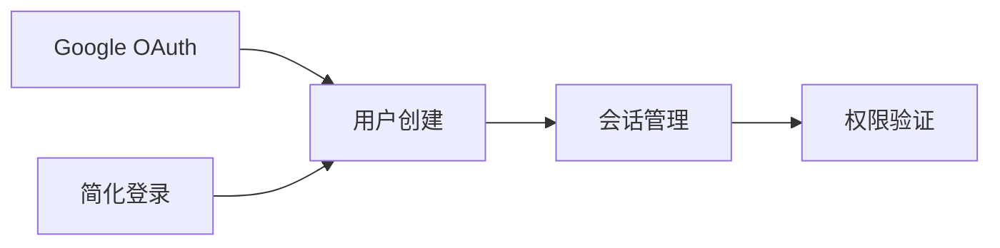

# 📋 功能管理文档化方案建议

## 🎯 方案概述

针对项目当前99%完成度的状态，提出一套适合本项目的功能管理文档化方案。

## 📊 现状分析

### 项目特点
- **完成度**: 99%，处于维护和优化阶段
- **复杂度**: 多角色系统（用户、审核员、管理员、超级管理员）
- **技术栈**: React + Hono.js + Cloudflare Workers + D1
- **文档现状**: 已有大量实现报告，但缺少系统化的功能管理文档

### 现有文档问题
1. **文档分散**: 100+ 个独立的报告文件，缺少统一索引
2. **重复内容**: 多个文档描述相同功能，信息不一致
3. **缺少关联**: 功能点之间的依赖关系不清晰
4. **维护困难**: 文档更新不及时，与代码脱节

## 💡 对提供模板的评价

### ✅ 优点
1. **结构清晰**: 功能点清单 → 详细描述 → 技术实现的层次分明
2. **实用性强**: 包含问题排查和维护指南
3. **可追溯**: 变更记录便于历史追踪
4. **关联分析**: 共用组件和API分析有助于理解模块关系

### ⚠️ 不足之处（针对本项目）
1. **不适合已完成项目**: "开发负责人"、"状态"字段对99%完成的项目意义不大
2. **缺少API文档**: 本项目有133个API端点，需要详细的API文档
3. **缺少角色维度**: 未考虑多角色系统的权限和功能分布
4. **缺少部署信息**: 未包含环境配置和部署相关信息
5. **缺少测试覆盖**: 未记录测试情况和覆盖率

## 🚀 改进方案

### 方案一：分层文档体系（推荐）

采用三层文档结构，适合大型项目的功能管理：

#### 1. 顶层：功能总览（FEATURE_INDEX.md）
```markdown
# 功能总览索引

## 按角色分类
- 用户端功能 (10个)
- 审核员功能 (8个)
- 管理员功能 (25个)
- 超级管理员功能 (12个)

## 按模块分类
- 认证系统 (5个功能)
- 问卷系统 (8个功能)
- 故事系统 (12个功能)
- 审核系统 (10个功能)
- 数据分析 (15个功能)
- 系统管理 (20个功能)

## 快速查找
- [API端点清单](./API_ENDPOINTS.md)
- [数据库表清单](./DATABASE_TABLES.md)
- [组件清单](./COMPONENTS.md)
```

#### 2. 中层：模块文档（按模块组织）
```markdown
# 认证系统功能文档

## 模块概述
- 模块名称: 用户认证系统
- 负责范围: 用户登录、注册、权限管理
- 技术栈: JWT + OAuth2.0 + 2FA
- 依赖模块: 用户管理、会话管理

## 功能清单

### 1. Google OAuth登录
- **功能ID**: AUTH-001
- **角色**: 所有用户
- **API端点**: 
  - `GET /api/uuid/auth/google` - 发起OAuth
  - `GET /api/uuid/auth/google/callback` - 回调处理
- **数据库表**: `users`, `sessions`
- **前端页面**: `/unified-login`
- **测试覆盖**: ✅ 单元测试 + 集成测试
- **已知问题**: 无
- **相关文档**: [GOOGLE-OAUTH-INTEGRATION-COMPLETE.md](../GOOGLE-OAUTH-INTEGRATION-COMPLETE.md)

### 2. 简化认证登录
- **功能ID**: AUTH-002
- **角色**: 管理员、审核员
- **API端点**: 
  - `POST /api/simple-auth/login` - 登录
  - `POST /api/simple-auth/verify` - 验证Token
- **数据库表**: `users`, `sessions`
- **前端页面**: `/admin/login`, `/reviewer/login`
- **测试覆盖**: ✅ 单元测试
- **已知问题**: 无
- **相关文档**: [SIMPLIFIED-AUTH-IMPLEMENTATION-REPORT.md](../SIMPLIFIED-AUTH-IMPLEMENTATION-REPORT.md)

## 共用组件
- `AuthProvider` - 认证上下文提供者
- `ProtectedRoute` - 路由保护组件
- `LoginForm` - 登录表单组件

## API依赖关系


## 数据流
1. 用户发起登录请求
2. 后端验证凭证
3. 生成JWT Token
4. 前端存储Token
5. 后续请求携带Token
6. 后端验证Token有效性

## 常见问题排查
### 问题1: Token过期
- **现象**: 401 Unauthorized
- **原因**: Token超过有效期（24小时）
- **解决**: 重新登录获取新Token

### 问题2: OAuth回调失败
- **现象**: 回调页面404
- **原因**: 回调URL配置错误
- **解决**: 检查Google Console配置
```

#### 3. 底层：详细文档（技术细节）
保留现有的实现报告，作为详细技术文档的补充。

### 方案二：功能矩阵（适合快速查找）

创建一个Excel或Markdown表格，包含所有功能点：

| 功能ID | 功能名称 | 角色 | 模块 | API端点 | 数据库表 | 前端页面 | 测试状态 | 文档链接 |
|--------|---------|------|------|---------|---------|---------|---------|---------|
| AUTH-001 | Google OAuth登录 | 全部 | 认证 | /api/uuid/auth/google | users, sessions | /unified-login | ✅ | [链接](../GOOGLE-OAUTH-INTEGRATION-COMPLETE.md) |
| AUTH-002 | 简化登录 | 管理员 | 认证 | /api/simple-auth/login | users, sessions | /admin/login | ✅ | [链接](../SIMPLIFIED-AUTH-IMPLEMENTATION-REPORT.md) |
| QUEST-001 | 问卷提交 | 用户 | 问卷 | /api/questionnaire/submit | questionnaire_data | /questionnaire | ✅ | [链接](../questionnaire-enhancement-report.md) |

### 方案三：交互式文档（适合团队协作）

使用工具生成交互式文档：
- **Docusaurus**: 生成静态文档网站
- **VuePress**: 基于Vue的文档生成器
- **GitBook**: 在线文档平台

## 📝 推荐实施方案

### 阶段一：建立索引（1-2天）

1. **创建功能总览**
   - 按角色分类所有功能
   - 按模块分类所有功能
   - 创建快速查找索引

2. **整理API清单**
   - 列出所有133个API端点
   - 标注认证要求
   - 标注角色权限

3. **整理数据库清单**
   - 列出所有数据库表
   - 标注表之间的关系
   - 标注关键字段

### 阶段二：模块文档（3-5天）

为每个主要模块创建详细文档：
1. 认证系统
2. 问卷系统
3. 故事系统
4. 审核系统
5. 数据分析
6. 用户管理
7. 系统管理

### 阶段三：关联整合（2-3天）

1. **建立文档链接**
   - 新文档链接到现有实现报告
   - 添加交叉引用

2. **创建依赖图**
   - 功能依赖关系
   - API调用关系
   - 数据流图

3. **问题知识库**
   - 整理常见问题
   - 添加排查步骤
   - 记录解决方案

## 🛠️ 具体实施步骤

### Step 1: 创建文档目录结构
```bash
docs/
├── features/                    # 功能文档
│   ├── FEATURE_INDEX.md        # 功能总览索引
│   ├── authentication/         # 认证系统
│   │   ├── README.md          # 模块概述
│   │   ├── google-oauth.md    # Google OAuth
│   │   └── simple-auth.md     # 简化认证
│   ├── questionnaire/          # 问卷系统
│   ├── stories/                # 故事系统
│   ├── review/                 # 审核系统
│   ├── analytics/              # 数据分析
│   └── management/             # 系统管理
├── api/                        # API文档
│   ├── API_INDEX.md           # API索引
│   ├── endpoints/             # 端点详情
│   └── schemas/               # 数据模型
├── database/                   # 数据库文档
│   ├── TABLES_INDEX.md        # 表索引
│   ├── schemas/               # 表结构
│   └── relationships.md       # 关系图
└── troubleshooting/           # 问题排查
    ├── common-issues.md       # 常见问题
    └── debugging-guide.md     # 调试指南
```

### Step 2: 使用脚本自动生成基础文档

创建一个脚本来扫描代码库，自动生成：
- API端点清单
- 数据库表清单
- 组件清单
- 路由清单

### Step 3: 手动补充详细信息

在自动生成的基础上，手动添加：
- 功能描述
- 业务逻辑
- 使用示例
- 常见问题

## 📊 文档维护策略

### 1. 版本控制
- 文档与代码同步更新
- 使用Git管理文档版本
- 重大变更记录在CHANGELOG.md

### 2. 定期审查
- 每月审查一次文档准确性
- 更新过时信息
- 补充新增功能

### 3. 自动化检查
- 使用脚本检查文档链接有效性
- 检查API文档与代码一致性
- 检查数据库文档与Schema一致性

## 🎯 预期成果

完成文档化后，将实现：
1. **快速定位**: 5分钟内找到任何功能的完整信息
2. **清晰关联**: 理解功能之间的依赖关系
3. **便于维护**: 新人可以快速上手
4. **问题排查**: 常见问题有明确的解决方案
5. **知识沉淀**: 项目知识系统化保存

## 📌 下一步行动

1. **确认方案**: 选择最适合的文档化方案
2. **创建模板**: 根据选定方案创建文档模板
3. **试点实施**: 先对一个模块进行文档化
4. **全面推广**: 逐步完成所有模块的文档化
5. **持续维护**: 建立文档维护机制

---

**建议**: 对于99%完成的项目，推荐采用**方案一（分层文档体系）**，因为：
- 结构清晰，便于查找
- 可以逐步完善，不需要一次性完成
- 适合大型项目的长期维护
- 可以复用现有的实现报告
