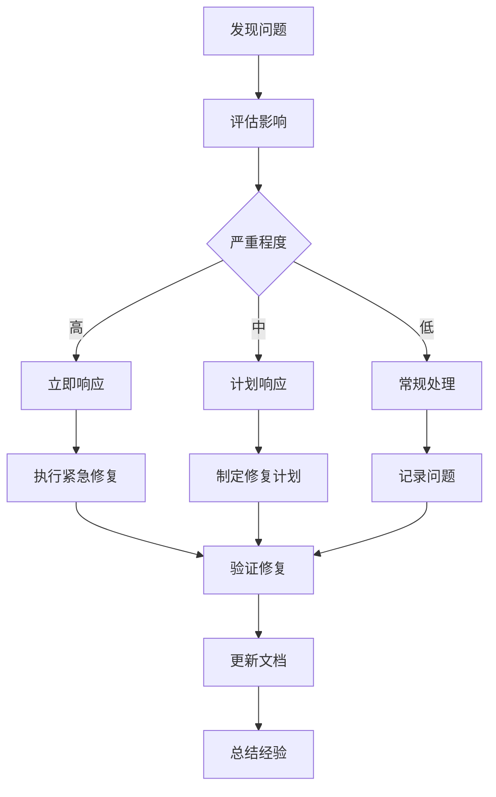

# 📊 **数据管理手册**
## 大学生就业调研项目技术指南

---

## 📋 **目录**

1. [项目概述](#项目概述)
2. [数据架构设计](#数据架构设计)
3. [数据库开发规范](#数据库开发规范)
4. [数据完整性管理](#数据完整性管理)
5. [API数据接口](#api数据接口)
6. [性能优化策略](#性能优化策略)
7. [监控与维护](#监控与维护)
8. [故障排除指南](#故障排除指南)
9. [数据安全与备份](#数据安全与备份)
10. [团队协作规范](#团队协作规范)

---

## 🎯 **项目概述**

### **系统架构**
- **前端**: React + TypeScript + Ant Design
- **后端**: Cloudflare Workers + TypeScript
- **数据库**: Cloudflare D1 (SQLite)
- **部署**: Cloudflare Pages + Workers

### **核心功能**
- 大学生就业问卷调研
- 多维度数据可视化分析
- 实时统计数据展示
- 管理员数据管理界面

### **数据流向**
```
用户填写问卷 → universal_questionnaire_responses → 
数据处理 → analytics_responses → 
统计分析 → 可视化展示
```

---

## 🏗️ **数据架构设计**

### **1. 主表结构**

#### **users表** (用户管理)
```sql
CREATE TABLE users (
  id TEXT PRIMARY KEY DEFAULT lower(hex(randomblob(16))),
  username TEXT NOT NULL,
  email TEXT NOT NULL,
  password_hash TEXT NOT NULL,
  role TEXT NOT NULL DEFAULT 'user',
  created_at TEXT NOT NULL DEFAULT datetime('now'),
  updated_at TEXT NOT NULL DEFAULT datetime('now')
);
```

#### **universal_questionnaire_responses表** (问卷数据)
```sql
CREATE TABLE universal_questionnaire_responses (
  id INTEGER PRIMARY KEY,
  questionnaire_id TEXT NOT NULL,
  user_id INTEGER,  -- 允许NULL，支持匿名问卷
  response_data TEXT NOT NULL,  -- JSON格式问卷数据
  submitted_at TEXT NOT NULL,
  ip_address TEXT,
  user_agent TEXT,
  created_at TEXT DEFAULT CURRENT_TIMESTAMP,
  updated_at TEXT DEFAULT CURRENT_TIMESTAMP,
  FOREIGN KEY (user_id) REFERENCES users(id) ON DELETE SET NULL
);
```

### **2. 功能副表结构**

#### **analytics_responses表** (分析数据)
```sql
CREATE TABLE analytics_responses (
  id TEXT PRIMARY KEY,
  user_id TEXT NOT NULL,
  submitted_at TEXT NOT NULL,
  age_range TEXT,
  education_level TEXT,
  employment_status TEXT,
  salary_range TEXT,
  work_location TEXT,
  industry TEXT,
  gender TEXT,
  -- 扩展分析字段
  job_search_channels TEXT,
  difficulties TEXT,
  skills TEXT,
  policy_suggestions TEXT,
  salary_expectation INTEGER,
  work_experience_months INTEGER,
  job_search_duration_months INTEGER,
  -- 元数据
  data_quality_score REAL DEFAULT 1.0,
  is_complete INTEGER DEFAULT 1,
  processing_version TEXT DEFAULT 'v1.0',
  is_test_data INTEGER DEFAULT 0,
  created_at TEXT NOT NULL DEFAULT datetime('now'),
  updated_at TEXT NOT NULL DEFAULT datetime('now'),
  FOREIGN KEY (user_id) REFERENCES users(id) ON DELETE CASCADE
);
```

### **3. 性能优化表结构**

#### **realtime_stats表** (实时统计缓存)
```sql
CREATE TABLE realtime_stats (
  id TEXT PRIMARY KEY,
  questionnaire_id TEXT NOT NULL,
  stat_type TEXT NOT NULL,  -- 'age_distribution', 'employment_status', etc.
  stat_data TEXT NOT NULL,  -- JSON格式统计数据
  last_updated TEXT NOT NULL DEFAULT datetime('now'),
  record_count INTEGER DEFAULT 0,
  cache_version TEXT DEFAULT 'v1.0'
);
```

### **4. 外键关系图**
```
users (id:TEXT)
  ↓ (ON DELETE SET NULL)
universal_questionnaire_responses (user_id:INTEGER)
  ↓ (数据处理)
analytics_responses (user_id:TEXT)
  ↓ (ON DELETE CASCADE)
users (id:TEXT)
```

---

## 📏 **数据库开发规范**

### **1. 字段类型标准**

| 用途 | 数据类型 | 示例 | 说明 |
|------|----------|------|------|
| 主键ID | `TEXT` | `lower(hex(randomblob(16)))` | 统一使用TEXT类型 |
| 外键引用 | `TEXT` | 与主表ID类型一致 | 避免类型不匹配 |
| 时间戳 | `TEXT` | `datetime('now')` | ISO格式时间字符串 |
| JSON数据 | `TEXT` | 问卷数据、配置信息 | 使用JSON.stringify存储 |
| 数值统计 | `INTEGER/REAL` | 计数、百分比 | 根据精度需求选择 |
| 布尔值 | `INTEGER` | 0/1 | SQLite不支持BOOLEAN |

### **2. 外键约束规范**

```sql
-- ✅ 标准外键定义
FOREIGN KEY (user_id) REFERENCES users(id) 
ON DELETE CASCADE    -- 主表删除时级联删除
ON UPDATE CASCADE;   -- 主表更新时级联更新

-- ✅ 允许NULL的外键（匿名数据）
FOREIGN KEY (user_id) REFERENCES users(id) 
ON DELETE SET NULL   -- 主表删除时设为NULL
ON UPDATE CASCADE;
```

### **3. 索引创建规范**

```sql
-- 外键字段必须创建索引
CREATE INDEX idx_analytics_user_id ON analytics_responses(user_id);
CREATE INDEX idx_analytics_submitted_at ON analytics_responses(submitted_at);

-- 查询频繁的字段创建复合索引
CREATE INDEX idx_analytics_status_date ON analytics_responses(employment_status, submitted_at);
CREATE INDEX idx_questionnaire_id_date ON universal_questionnaire_responses(questionnaire_id, submitted_at);
```

### **4. 数据插入顺序规范**

```typescript
// ✅ 正确的插入顺序
async function createCompleteRecord(userData, questionnaireData) {
  return await db.transaction(async (tx) => {
    // 1. 主表：用户数据
    const user = await tx.insert(users).values(userData).returning();
    
    // 2. 依赖表：问卷数据
    const questionnaire = await tx.insert(universal_questionnaire_responses)
      .values({
        ...questionnaireData,
        user_id: user.id  // 确保外键存在
      }).returning();
    
    // 3. 功能副表：分析数据
    const analytics = await tx.insert(analytics_responses)
      .values({
        ...generateAnalyticsData(questionnaire),
        user_id: user.id  // 确保外键存在
      });
    
    return { user, questionnaire, analytics };
  });
}
```

---

## 🔍 **数据完整性管理**

### **1. 外键完整性检查**

```sql
-- 检查analytics_responses表中的孤儿记录
SELECT 
  'analytics_responses' as table_name,
  COUNT(*) as orphan_count
FROM analytics_responses ar
LEFT JOIN users u ON ar.user_id = u.id
WHERE u.id IS NULL;

-- 检查universal_questionnaire_responses表中的孤儿记录
SELECT 
  'universal_questionnaire_responses' as table_name,
  COUNT(*) as orphan_count
FROM universal_questionnaire_responses uqr
LEFT JOIN users u ON uqr.user_id = u.id
WHERE uqr.user_id IS NOT NULL AND u.id IS NULL;
```

### **2. 数据质量验证**

```sql
-- 检查JSON数据格式
SELECT 
  id,
  CASE 
    WHEN json_valid(response_data) = 1 THEN 'Valid'
    ELSE 'Invalid'
  END as json_status
FROM universal_questionnaire_responses
WHERE json_valid(response_data) = 0;

-- 检查必填字段完整性
SELECT 
  COUNT(*) as incomplete_records
FROM analytics_responses
WHERE age_range IS NULL 
   OR education_level IS NULL 
   OR employment_status IS NULL;
```

### **3. 自动化检查脚本**

```typescript
// scripts/checkDataIntegrity.ts
export async function runDataIntegrityChecks() {
  const checks = [
    {
      name: 'Foreign Key Integrity',
      query: `
        SELECT COUNT(*) as count 
        FROM analytics_responses ar
        LEFT JOIN users u ON ar.user_id = u.id
        WHERE u.id IS NULL
      `,
      threshold: 0
    },
    {
      name: 'JSON Data Validity',
      query: `
        SELECT COUNT(*) as count
        FROM universal_questionnaire_responses
        WHERE json_valid(response_data) = 0
      `,
      threshold: 0
    },
    {
      name: 'Data Completeness',
      query: `
        SELECT COUNT(*) as count
        FROM analytics_responses
        WHERE age_range IS NULL OR education_level IS NULL
      `,
      threshold: 0
    }
  ];

  const results = [];
  for (const check of checks) {
    const result = await db.raw(check.query);
    const passed = result[0].count <= check.threshold;
    
    results.push({
      name: check.name,
      count: result[0].count,
      threshold: check.threshold,
      passed,
      status: passed ? '✅' : '❌'
    });
    
    console.log(`${check.name}: ${result[0].count} issues ${passed ? '✅' : '❌'}`);
  }
  
  return results;
}
```

---

## 🔌 **API数据接口**

### **1. 统计数据API**

#### **端点**: `/api/universal-questionnaire/statistics/{questionnaireId}`

**参数**:
- `questionnaireId`: 问卷ID
- `include_test_data`: 是否包含测试数据 (true/false)

**响应格式**:
```json
{
  "success": true,
  "data": {
    "questionnaireId": "employment-survey-2024",
    "totalResponses": 150,
    "ageDistribution": [
      {"name": "18-22", "value": 45, "percentage": 30},
      {"name": "23-25", "value": 60, "percentage": 40},
      {"name": "26-30", "value": 45, "percentage": 30}
    ],
    "employmentStatus": [
      {"name": "employed", "value": 90, "percentage": 60},
      {"name": "unemployed", "value": 30, "percentage": 20},
      {"name": "student", "value": 30, "percentage": 20}
    ],
    "educationLevel": [
      {"name": "bachelor", "value": 90, "percentage": 60},
      {"name": "master", "value": 45, "percentage": 30},
      {"name": "phd", "value": 15, "percentage": 10}
    ],
    "genderDistribution": [
      {"name": "male", "value": 75, "percentage": 50},
      {"name": "female", "value": 75, "percentage": 50}
    ],
    "cacheInfo": {
      "message": "数据来源：分析表直接查询",
      "lastUpdated": "2025-09-21T10:00:00.000Z",
      "dataSource": "analytics_table"
    }
  }
}
```

### **2. 问卷提交API**

#### **端点**: `/api/universal-questionnaire/submit`

**请求格式**:
```json
{
  "questionnaireId": "employment-survey-2024",
  "userId": "user-123",  // 可选，匿名问卷时为null
  "responseData": {
    "age_range": "23-25",
    "gender": "male",
    "education_level": "bachelor",
    "employment_status": "employed",
    "work_location": "beijing",
    "salary_range": "12000-18000",
    "industry": "technology"
  }
}
```

### **3. 数据导出API**

#### **端点**: `/api/admin/export/{format}`

**支持格式**: `json`, `csv`, `excel`

**权限**: 需要管理员权限

---

## ⚡ **性能优化策略**

### **1. 多级缓存架构**

```typescript
// 缓存策略配置
const CACHE_CONFIG = {
  realtime_stats: {
    ttl: 300,      // 5分钟
    refresh: 'auto' // 自动刷新
  },
  aggregated_stats: {
    ttl: 1800,     // 30分钟
    refresh: 'manual' // 手动刷新
  },
  dashboard_cache: {
    ttl: 3600,     // 1小时
    refresh: 'scheduled' // 定时刷新
  }
};
```

### **2. 查询优化**

```sql
-- ✅ 优化的统计查询
SELECT 
  employment_status,
  COUNT(*) as count,
  ROUND(COUNT(*) * 100.0 / (SELECT COUNT(*) FROM analytics_responses WHERE is_test_data = ?), 2) as percentage
FROM analytics_responses 
WHERE is_test_data = ?
GROUP BY employment_status
ORDER BY count DESC;

-- ✅ 使用索引的时间范围查询
SELECT COUNT(*) 
FROM analytics_responses 
WHERE submitted_at >= ? 
  AND submitted_at <= ?
  AND is_test_data = 0;
```

### **3. 定时同步任务**

```typescript
// 定时任务配置
export const CRON_JOBS = [
  {
    name: 'sync_realtime_stats',
    schedule: '*/5 * * * *',  // 每5分钟
    handler: syncRealtimeStats
  },
  {
    name: 'sync_aggregated_stats', 
    schedule: '*/30 * * * *', // 每30分钟
    handler: syncAggregatedStats
  },
  {
    name: 'cleanup_old_cache',
    schedule: '0 2 * * *',    // 每天凌晨2点
    handler: cleanupOldCache
  }
];
```

---

## 📊 **监控与维护**

### **1. 性能监控指标**

```typescript
// 监控指标定义
export const MONITORING_METRICS = {
  database: {
    response_time: { threshold: 500, unit: 'ms' },
    query_count: { threshold: 1000, unit: 'per_hour' },
    error_rate: { threshold: 1, unit: 'percentage' }
  },
  api: {
    success_rate: { threshold: 99, unit: 'percentage' },
    avg_response_time: { threshold: 200, unit: 'ms' },
    requests_per_minute: { threshold: 100, unit: 'rpm' }
  },
  data_quality: {
    orphan_records: { threshold: 0, unit: 'count' },
    invalid_json: { threshold: 0, unit: 'count' },
    incomplete_records: { threshold: 5, unit: 'percentage' }
  }
};
```

### **2. 告警配置**

```typescript
// 告警规则
export const ALERT_RULES = [
  {
    name: 'High Error Rate',
    condition: 'error_rate > 5%',
    severity: 'critical',
    notification: ['email', 'slack']
  },
  {
    name: 'Slow Database Response',
    condition: 'avg_db_response_time > 1000ms',
    severity: 'warning',
    notification: ['slack']
  },
  {
    name: 'Data Integrity Issues',
    condition: 'orphan_records > 0',
    severity: 'high',
    notification: ['email']
  }
];
```

### **3. 日常维护任务**

```bash
#!/bin/bash
# scripts/daily-maintenance.sh

echo "🔧 开始日常数据库维护..."

# 1. 数据完整性检查
echo "1. 检查数据完整性..."
npm run db:check-integrity

# 2. 性能统计
echo "2. 收集性能统计..."
npm run db:performance-stats

# 3. 清理过期缓存
echo "3. 清理过期缓存..."
npm run cache:cleanup

# 4. 备份重要数据
echo "4. 备份数据..."
npm run db:backup

# 5. 生成维护报告
echo "5. 生成维护报告..."
npm run maintenance:report

echo "✅ 日常维护完成！"
```

---

## 🚨 **故障排除指南**

### **1. 常见问题诊断**

#### **外键约束错误**
```bash
# 检查外键完整性
wrangler d1 execute college-employment-survey --remote --command="
  SELECT 'analytics_responses orphans' as issue, COUNT(*) as count
  FROM analytics_responses ar
  LEFT JOIN users u ON ar.user_id = u.id
  WHERE u.id IS NULL;
"

# 修复方案
npm run db:fix-foreign-keys
```

#### **API响应缓慢**
```bash
# 检查数据库性能
npm run db:performance-check

# 重建缓存
npm run cache:rebuild

# 检查索引使用情况
npm run db:analyze-queries
```

#### **数据不一致**
```bash
# 全面数据检查
npm run db:full-integrity-check

# 重新同步数据
npm run sync:force-refresh
```

### **2. 紧急恢复流程**

```bash
#!/bin/bash
# scripts/emergency-recovery.sh

echo "🚨 启动紧急恢复流程..."

# 1. 停止所有定时任务
echo "1. 停止定时任务..."
npm run cron:stop-all

# 2. 备份当前状态
echo "2. 备份当前数据..."
npm run db:emergency-backup

# 3. 回滚到最近的稳定状态
echo "3. 回滚数据..."
npm run db:rollback-to-stable

# 4. 重新初始化缓存
echo "4. 重建缓存..."
npm run cache:rebuild-all

# 5. 验证系统状态
echo "5. 验证系统..."
npm run system:health-check

# 6. 重启定时任务
echo "6. 重启定时任务..."
npm run cron:start-all

echo "✅ 紧急恢复完成！"
```

---

## 🔒 **数据安全与备份**

### **1. 数据备份策略**

```typescript
// 备份配置
export const BACKUP_CONFIG = {
  full_backup: {
    frequency: 'daily',
    time: '02:00',
    retention: 30 // 保留30天
  },
  incremental_backup: {
    frequency: 'hourly',
    retention: 7 // 保留7天
  },
  critical_tables: [
    'users',
    'universal_questionnaire_responses', 
    'analytics_responses'
  ]
};
```

### **2. 数据脱敏规则**

```sql
-- 生产数据脱敏
UPDATE users SET 
  email = CONCAT('user', id, '@example.com'),
  username = CONCAT('user', SUBSTR(id, 1, 8))
WHERE role != 'admin';

-- 问卷数据脱敏
UPDATE universal_questionnaire_responses SET
  ip_address = '192.168.1.1',
  user_agent = 'Anonymized Browser'
WHERE id > 0;
```

### **3. 访问控制**

```typescript
// 权限控制配置
export const ACCESS_CONTROL = {
  roles: {
    admin: ['read', 'write', 'delete', 'export'],
    reviewer: ['read', 'export'],
    user: ['read_own']
  },
  sensitive_tables: [
    'users',
    'analytics_responses'
  ],
  audit_log: true
};
```

---

## 👥 **团队协作规范**

### **1. 数据库变更流程**

1. **设计阶段**
   - 创建数据库设计文档
   - 团队评审表结构和关系
   - 确认外键约束和索引策略

2. **开发阶段**
   - 创建迁移脚本
   - 编写数据完整性测试
   - 本地环境验证

3. **测试阶段**
   - 在测试环境执行迁移
   - 运行完整性检查
   - 性能测试

4. **部署阶段**
   - 生产环境备份
   - 执行迁移脚本
   - 验证数据完整性
   - 监控系统状态

### **2. 代码审查清单**

- [ ] 外键字段类型与主表一致
- [ ] 使用事务包装多表操作
- [ ] 添加了外键存在性验证
- [ ] 迁移脚本包含回滚方案
- [ ] 种子数据按正确顺序插入
- [ ] 添加了相应的完整性检查
- [ ] 性能影响评估完成
- [ ] 文档更新完成

### **3. 紧急响应流程**



---

## 📈 **持续改进**

### **1. 性能优化路线图**

- **短期（1个月）**
  - 完善监控告警系统
  - 优化高频查询性能
  - 建立自动化测试流程

- **中期（3个月）**
  - 实施智能缓存策略
  - 优化数据库架构
  - 建立数据治理体系

- **长期（6个月）**
  - 实现数据湖架构
  - 机器学习数据分析
  - 自动化运维体系

### **2. 技术债务管理**

```typescript
// 技术债务跟踪
export const TECHNICAL_DEBT = [
  {
    id: 'TD-001',
    description: '统一外键字段类型',
    priority: 'high',
    effort: '2 days',
    impact: 'data_integrity'
  },
  {
    id: 'TD-002', 
    description: '优化复杂查询性能',
    priority: 'medium',
    effort: '1 week',
    impact: 'performance'
  }
];
```

---

## 🎯 **总结**

这份数据管理手册涵盖了项目从开发到运维的完整数据管理流程，包括：

✅ **完整的数据架构设计**  
✅ **严格的开发规范**  
✅ **自动化的完整性检查**  
✅ **全面的性能优化策略**  
✅ **完善的监控和维护体系**  
✅ **详细的故障排除指南**  
✅ **规范的团队协作流程**  

通过遵循这套规范，团队可以确保数据的完整性、一致性和高性能，为项目的长期稳定运行提供坚实保障。
