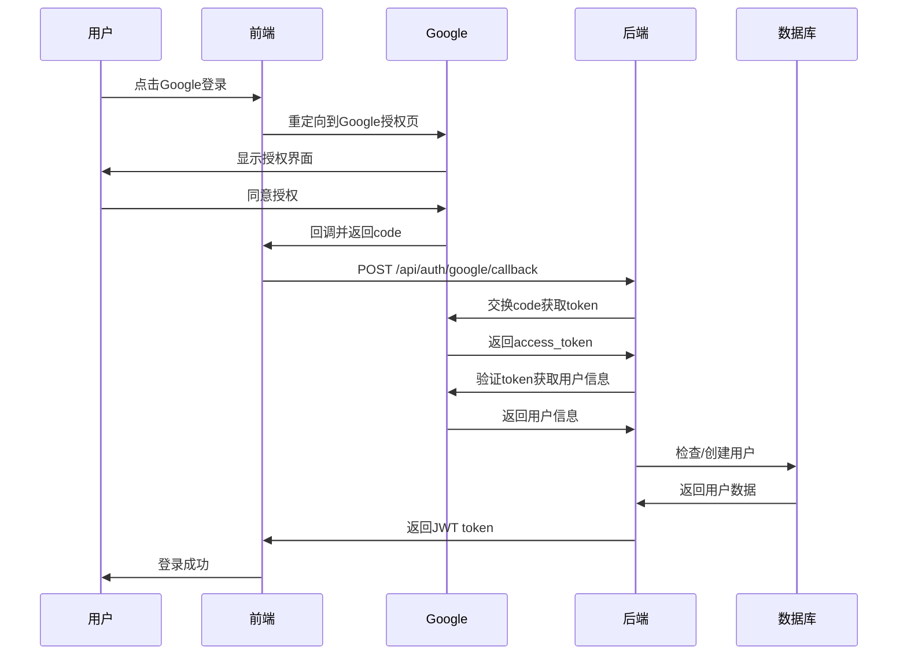
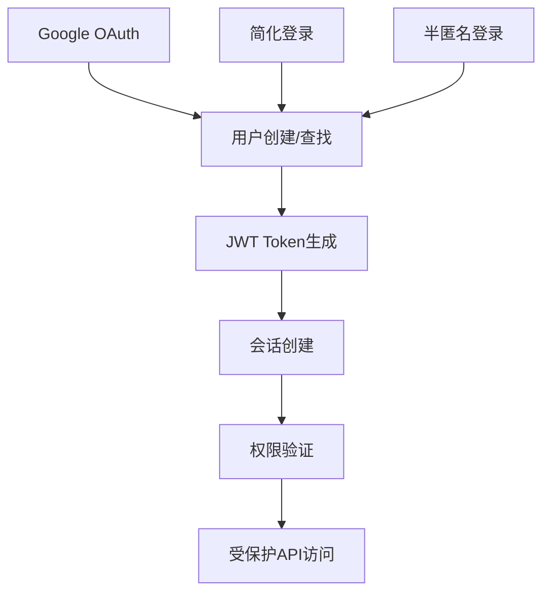

# 🔐 认证系统功能文档

> **模块**: 用户认证与权限管理  
> **完成度**: 100%  
> **最后更新**: 2025年10月7日

## 📋 模块概述

### 基本信息
- **模块名称**: 统一认证系统
- **负责范围**: 用户登录、注册、权限验证、会话管理
- **技术栈**: JWT + Google OAuth 2.0 + 2FA + RBAC
- **依赖模块**: 用户管理、会话管理、权限系统

### 架构特点
本项目采用**多层认证架构**，支持不同用户类型的差异化认证：

```
用户端 (半匿名)
├── Google OAuth (便捷注册)
└── A+B组合 (半匿名身份)

管理端 (实名制)
├── Google OAuth (白名单)
├── 简化认证 (用户名+密码)
└── 2FA (双因素认证)
```

---

## 🎯 功能清单

### 1. Google OAuth 登录

#### 功能ID: AUTH-001
- **角色**: 所有用户
- **用途**: 便捷的第三方登录
- **API端点**: 
  - `POST /api/auth/google/callback` - OAuth回调处理
  - `POST /api/auth/google/questionnaire` - 问卷用户登录
  - `POST /api/auth/google/management` - 管理员登录
- **数据库表**: 
  - `universal_users` - 统一用户表
  - `google_oauth_whitelist` - 管理员白名单
  - `sessions` - 会话管理
- **前端页面**: 
  - `/unified-login` - 统一登录页
  - `/admin/login` - 管理员登录
- **测试覆盖**: ✅ 集成测试
- **相关文档**: 
  - [GOOGLE-OAUTH-INTEGRATION-COMPLETE.md](../../../GOOGLE-OAUTH-INTEGRATION-COMPLETE.md)
  - [GOOGLE-OAUTH-INTEGRATION-ANALYSIS.md](../../../GOOGLE-OAUTH-INTEGRATION-ANALYSIS.md)

#### 实现细节

**OAuth流程**:


**关键代码**:
<augment_code_snippet path="backend/src/routes/google-auth.ts" mode="EXCERPT">
```typescript
// Google OAuth回调处理
googleAuth.post('/callback', async (c) => {
  const { code, redirectUri, userType } = await c.req.json();
  
  // 交换授权码获取访问令牌
  const tokenData = await exchangeCodeForToken(code, redirectUri, clientSecret);
  
  // 使用访问令牌获取用户信息
  const googleUser = await verifyGoogleToken(tokenData.access_token);
  
  // 根据用户类型处理不同的登录逻辑
  if (userType === 'questionnaire') {
    return await handleQuestionnaireUserCallback(c, googleUser);
  } else if (userType === 'management') {
    return await handleManagementUserCallback(c, googleUser);
  }
});
```
</augment_code_snippet>

**白名单机制**:
- 管理员必须在 `google_oauth_whitelist` 表中
- 问卷用户自动创建半匿名身份
- 支持邮箱域名白名单

---

### 2. 简化认证登录

#### 功能ID: AUTH-002
- **角色**: 管理员、审核员、超级管理员
- **用途**: 传统用户名密码登录
- **API端点**: 
  - `POST /api/simple-auth/login` - 登录
  - `POST /api/simple-auth/verify` - 验证Token
  - `GET /api/simple-auth/me` - 获取用户信息
- **数据库表**: 
  - `users` - 用户表
  - `sessions` - 会话表
- **前端页面**: 
  - `/admin/login` - 管理员登录
  - `/reviewer/login` - 审核员登录
- **测试覆盖**: ✅ 单元测试 + 集成测试
- **相关文档**: 
  - [SIMPLIFIED-AUTH-IMPLEMENTATION-REPORT.md](../../../reviewer-admin-dashboard/SIMPLIFIED-AUTH-IMPLEMENTATION-REPORT.md)

#### 实现细节

**登录流程**:
```typescript
// 1. 验证用户名和密码
const user = await db.queryFirst('SELECT * FROM users WHERE username = ?', [username]);
const isValid = await PasswordService.verifyPassword(password, user.password_hash);

// 2. 生成JWT token
const jwtService = createJWTService(env.JWT_SECRET);
const token = await jwtService.generateToken({
  userId: user.id,
  username: user.username,
  role: user.role
});

// 3. 返回用户信息和token
return { user, token };
```

**Token格式**:
```json
{
  "header": {
    "alg": "HS256",
    "typ": "JWT"
  },
  "payload": {
    "userId": "123",
    "username": "admin1",
    "role": "admin",
    "iat": 1696723200,
    "exp": 1696809600
  }
}
```

---

### 3. 半匿名认证

#### 功能ID: AUTH-003
- **角色**: 问卷用户
- **用途**: A+B组合的半匿名身份
- **API端点**: 
  - `POST /api/uuid/auth/semi-anonymous` - 半匿名登录
  - `GET /api/uuid/auth/me` - 获取用户信息
- **数据库表**: 
  - `universal_users` - 统一用户表
- **前端页面**: 
  - `/questionnaire-login` - 问卷登录
- **测试覆盖**: ✅ 单元测试
- **相关文档**: [认证系统分析](../../../AUTHENTICATION_SYSTEM_COMPLETE_ANALYSIS.md)

#### 实现细节

**A+B组合验证**:
```typescript
// 验证A+B格式
function validate_ab_format(identityA: string, identityB: string) {
  // A: 学校名称 (2-20字符)
  // B: 专业名称 (2-30字符)
  
  if (identityA.length < 2 || identityA.length > 20) {
    return { valid: false, error: 'A部分长度不符合要求' };
  }
  
  if (identityB.length < 2 || identityB.length > 30) {
    return { valid: false, error: 'B部分长度不符合要求' };
  }
  
  return { valid: true };
}

// 生成唯一标识
function generate_identity_hash(identityA: string, identityB: string) {
  return crypto.createHash('sha256')
    .update(`${identityA}:${identityB}`)
    .digest('hex');
}
```

---

### 4. 2FA 双因素认证

#### 功能ID: AUTH-004
- **角色**: 管理员、超级管理员
- **用途**: 增强账户安全性
- **API端点**: 
  - `POST /api/admin/2fa/setup` - 设置2FA
  - `POST /api/admin/2fa/verify` - 验证2FA
  - `POST /api/admin/2fa/disable` - 禁用2FA
- **数据库表**: 
  - `users` - 存储2FA密钥
  - `email_whitelist` - 2FA启用状态
- **前端页面**: 
  - `/admin/2fa-verification` - 2FA验证页
- **测试覆盖**: ✅ 集成测试
- **相关文档**: [2FA系统](./2fa.md)

#### 实现细节

**TOTP算法**:
- 使用 `speakeasy` 库生成密钥
- 30秒时间窗口
- 6位数字验证码

---

### 5. JWT Token 管理

#### 功能ID: AUTH-005
- **角色**: 所有认证用户
- **用途**: 无状态会话管理
- **实现位置**: 
  - `backend/src/utils/jwt.ts` - JWT服务
  - `backend/src/middleware/auth.ts` - 认证中间件
- **Token有效期**: 24小时
- **刷新机制**: 需要重新登录
- **相关文档**: [JWT配置](../../technical/jwt-config.md)

#### 实现细节

<augment_code_snippet path="backend/src/utils/jwt.ts" mode="EXCERPT">
```typescript
export class JWTService {
  async generateToken(payload: {
    userId: string | number;
    username: string;
    role: UserRole;
  }): Promise<string> {
    const now = Math.floor(Date.now() / 1000);
    const jwtPayload: JWTPayload = {
      ...payload,
      iat: now,
      exp: now + (24 * 60 * 60) // 24小时过期
    };
    
    // HS256签名
    const signature = await hmacSha256(this.secret, data);
    return `${encodedHeader}.${encodedPayload}.${signature}`;
  }
}
```
</augment_code_snippet>

---

### 6. 权限验证

#### 功能ID: AUTH-006
- **角色**: 所有认证用户
- **用途**: RBAC权限控制
- **实现位置**: 
  - `backend/src/middleware/simpleAuth.ts` - 权限中间件
  - `frontend/src/utils/permissions.ts` - 前端权限检查
- **权限模型**: 基于角色的访问控制(RBAC)
- **相关文档**: [权限系统](./permissions.md)

#### 权限层级

```
super_admin (超级管理员)
├── ALL 权限
└── 可以管理所有资源

admin (管理员)
├── 内容管理
├── 用户管理
├── 数据分析
└── 系统设置

reviewer (审核员)
├── 内容审核
├── 审核历史
└── 审核统计

user (普通用户)
├── 问卷填写
├── 故事发布
└── 个人内容管理
```

---

## 🔗 共用组件

### 后端组件

1. **JWTService** (`backend/src/utils/jwt.ts`)
   - Token生成和验证
   - 被所有认证端点使用

2. **authMiddleware** (`backend/src/middleware/auth.ts`)
   - 传统JWT认证中间件
   - 用于旧版API

3. **simpleAuthMiddleware** (`backend/src/middleware/simpleAuth.ts`)
   - 简化认证中间件
   - 用于管理员和审核员API

4. **unifiedAuthMiddleware** (`backend/src/middleware/unifiedAuth.ts`)
   - 统一认证中间件
   - 支持多种认证方式

5. **PasswordService** (`backend/src/services/passwordService.ts`)
   - 密码加密和验证
   - 使用bcrypt算法

### 前端组件

1. **AuthProvider** (`frontend/src/contexts/AuthContext.tsx`)
   - 全局认证状态管理
   - 提供登录/登出方法

2. **ProtectedRoute** (`frontend/src/components/ProtectedRoute.tsx`)
   - 路由保护组件
   - 检查认证和权限

3. **GoogleOAuthService** (`frontend/src/services/googleOAuthService.ts`)
   - Google OAuth客户端
   - 处理OAuth流程

4. **LoginForm** (`frontend/src/components/LoginForm.tsx`)
   - 通用登录表单
   - 支持多种登录方式

---

## 📊 API依赖关系



---

## 🔄 数据流

### 登录流程
1. 用户提交登录凭证（Google/用户名密码/A+B）
2. 后端验证凭证有效性
3. 查找或创建用户记录
4. 生成JWT Token
5. 创建会话记录
6. 返回Token和用户信息
7. 前端存储Token到localStorage
8. 后续请求携带Token访问受保护API

### Token验证流程
1. 前端从localStorage读取Token
2. 请求头添加 `Authorization: Bearer {token}`
3. 后端中间件拦截请求
4. 验证Token签名和有效期
5. 从Token提取用户信息
6. 检查用户权限
7. 允许/拒绝访问

---

## ⚠️ 常见问题排查

### 问题1: Token过期导致401错误

**现象**:
- 用户突然被登出
- API返回 `401 Unauthorized`
- 错误信息: "无效的token" 或 "token已过期"

**原因**:
- JWT Token超过24小时有效期
- Token被手动清除
- 服务器JWT_SECRET变更

**解决方案**:
```typescript
// 1. 重新登录获取新Token
await authService.login(username, password);

// 2. 实现Token自动刷新（可选）
if (error.status === 401) {
  await authService.refreshToken();
  // 重试原请求
}
```

**相关文档**: [AUTH_CONSISTENCY_FIX_REPORT.md](../../../AUTH_CONSISTENCY_FIX_REPORT.md)

---

### 问题2: Google OAuth回调失败

**现象**:
- 回调页面404
- 错误信息: "redirect_uri_mismatch"

**原因**:
- Google Console配置的回调URL不匹配
- 前端传递的redirectUri参数错误

**解决方案**:
```bash
# 1. 检查Google Console配置
# 确保包含以下URL:
# - https://your-domain.pages.dev/auth/google/callback
# - http://localhost:5177/auth/google/callback (开发环境)

# 2. 检查前端代码
const redirectUri = `${window.location.origin}/auth/google/callback`;
```

**相关文档**: [GOOGLE_OAUTH_REDIRECT_URIS.md](../../../GOOGLE_OAUTH_REDIRECT_URIS.md)

---

### 问题3: 权限不足403错误

**现象**:
- API返回 `403 Forbidden`
- 错误信息: "权限不足"

**原因**:
- 用户角色不满足API要求
- 权限配置错误

**解决方案**:
```typescript
// 1. 检查用户权限
const user = await authService.getCurrentUser();
console.log('User permissions:', user.permissions);

// 2. 检查API所需权限
// backend/src/routes/xxx.ts
simpleAdmin.get('/xxx', requireRole('admin', 'super_admin'), handler);

// 3. 确保用户有正确的角色
```

**相关文档**: [权限系统](./permissions.md)

---

## 📈 性能指标

- **登录响应时间**: < 500ms
- **Token验证时间**: < 50ms
- **OAuth回调处理**: < 2s
- **并发登录支持**: 1000+ req/s

---

## 🔒 安全特性

1. **密码安全**
   - bcrypt加密存储
   - 最小8位，包含数字和字母
   - 防暴力破解

2. **Token安全**
   - HS256签名算法
   - 24小时自动过期
   - 无法伪造

3. **OAuth安全**
   - State参数防CSRF
   - 白名单机制
   - HTTPS传输

4. **2FA保护**
   - TOTP算法
   - 30秒时间窗口
   - 备用恢复码

---

## 📚 相关文档

- [Google OAuth集成完整报告](../../../GOOGLE-OAUTH-INTEGRATION-COMPLETE.md)
- [认证系统完整分析](../../../AUTHENTICATION_SYSTEM_COMPLETE_ANALYSIS.md)
- [简化认证实现报告](../../../reviewer-admin-dashboard/SIMPLIFIED-AUTH-IMPLEMENTATION-REPORT.md)
- [邮箱角色账号系统](../../../EMAIL-ROLE-ACCOUNT-SYSTEM-COMPLETE.md)
- [2FA系统](./2fa.md)
- [权限系统](./permissions.md)
- [JWT配置](../../technical/jwt-config.md)
