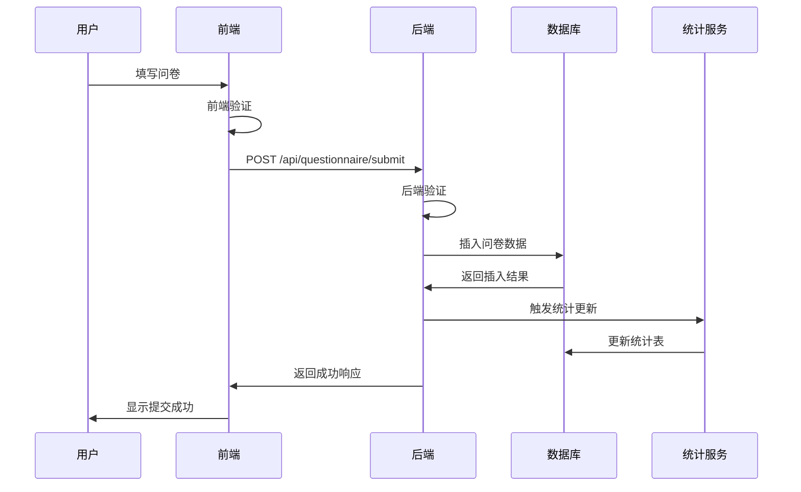

# 📝 问卷系统功能文档

> **模块**: 问卷调查与数据收集  
> **完成度**: 100%  
> **最后更新**: 2025年10月7日

## 📋 模块概述

### 基本信息
- **模块名称**: 统一问卷系统
- **负责范围**: 问卷填写、数据提交、进度保存、数据可视化
- **技术栈**: React + TypeScript + D1 Database + 实时统计
- **依赖模块**: 认证系统、数据分析系统

### 系统架构
本项目包含**两套独立的问卷系统**：

```
问卷系统V1 (传统问卷)
├── 基础就业信息收集
├── 传统表单验证
└── 简单统计分析

问卷系统V2 (智能问卷)
├── 对话式交互
├── 智能分支逻辑
├── 多维度数据分析
└── 实时统计可视化
```

---

## 🎯 功能清单

### 1. 问卷填写 (V1)

#### 功能ID: QUEST-001
- **角色**: 所有用户
- **用途**: 传统问卷填写
- **API端点**: 
  - `POST /api/questionnaire-v1/submit` - 提交问卷V1
  - `GET /api/questionnaire-v1/definition/:id` - 获取问卷定义
- **数据库表**: 
  - `questionnaire_responses` - 问卷回答表
  - `questionnaire_statistics_cache` - 统计缓存表
- **前端页面**: 
  - `/questionnaire` - 问卷填写页
- **测试覆盖**: ✅ 单元测试 + 集成测试
- **相关文档**: [问卷增强报告](../../../questionnaire-enhancement-report.md)

#### 数据结构

**提交数据格式**:
```json
{
  "questionnaireId": "employment-survey-2024",
  "personalInfo": {
    "name": "张三",
    "gender": "male",
    "age": 25,
    "phone": "13800138000",
    "email": "zhangsan@example.com"
  },
  "educationInfo": {
    "degree": "bachelor",
    "major": "计算机科学",
    "university": "清华大学",
    "graduationYear": 2023
  },
  "employmentInfo": {
    "status": "employed",
    "company": "某科技公司",
    "position": "软件工程师",
    "salary": "15000-20000"
  },
  "jobSearchInfo": {
    "duration": "3个月",
    "channels": ["校园招聘", "网络招聘"],
    "difficulties": ["经验不足", "竞争激烈"]
  },
  "employmentStatus": {
    "currentStatus": "employed",
    "satisfaction": 4
  }
}
```

---

### 2. 智能问卷填写 (V2)

#### 功能ID: QUEST-002
- **角色**: 所有用户
- **用途**: 对话式智能问卷
- **API端点**: 
  - `POST /api/questionnaire-v2/submit` - 提交问卷V2
  - `GET /api/questionnaire-v2/questionnaires/:id` - 获取问卷定义
  - `GET /api/questionnaire-v2/analytics/:id` - 获取分析数据
- **数据库表**: 
  - `questionnaire_v2_responses` - 问卷V2回答表
  - `questionnaire_v2_answers` - 答案详细表
  - `questionnaire_v2_statistics` - 统计汇总表
- **前端页面**: 
  - `/questionnaire-v2` - 智能问卷填写
  - `/questionnaire-v2/analytics` - 数据可视化
- **测试覆盖**: ✅ 完整测试
- **相关文档**: 
  - [问卷2完整技术文档](../../../问卷2-完整技术文档-数据可视化系统.md)
  - [问卷2优化总体执行摘要](../../../问卷2优化-总体执行摘要.md)

#### 核心特性

**1. 智能分支逻辑**:
```typescript
// 根据用户画像动态展示问题
const branchingLogic = {
  gender: {
    female: ['婚育状况', '生育意愿'],
    male: []
  },
  age: {
    '35+': ['年龄歧视经历'],
    '<35': []
  },
  employmentStatus: {
    unemployed: ['失业时长', '经济压力'],
    employed: ['工作满意度']
  }
};
```

**2. 多维度数据分析**:
- 经济压力维度
- 就业信心维度
- 现代负债维度
- 求职歧视维度
- 生育意愿维度

**3. 实时统计**:
```sql
-- 自动聚合统计
CREATE TABLE questionnaire_v2_statistics (
  dimension_type TEXT,
  metric_name TEXT,
  metric_value REAL,
  group_by_field TEXT,
  group_by_value TEXT,
  sample_size INTEGER
);
```

---

### 3. 问卷进度保存

#### 功能ID: QUEST-003
- **角色**: 所有用户
- **用途**: 保存填写进度，支持断点续填
- **API端点**: 
  - `POST /api/questionnaire/save-progress` - 保存进度
  - `GET /api/questionnaire/progress/:userId` - 获取进度
- **数据库表**: 
  - `questionnaire_progress` - 进度保存表
- **前端实现**: 
  - 自动保存（每30秒）
  - 手动保存按钮
  - 离开页面提示
- **测试覆盖**: ✅ 单元测试
- **相关文档**: [问卷增强报告](../../../questionnaire-enhancement-report.md)

#### 实现细节

**自动保存逻辑**:
```typescript
// 前端自动保存
useEffect(() => {
  const timer = setInterval(() => {
    if (hasUnsavedChanges) {
      saveProgress(formData);
    }
  }, 30000); // 30秒
  
  return () => clearInterval(timer);
}, [formData, hasUnsavedChanges]);
```

---

### 4. 问卷数据查看

#### 功能ID: QUEST-004
- **角色**: 已登录用户
- **用途**: 查看自己提交的问卷
- **API端点**: 
  - `GET /api/questionnaire/my-submissions` - 我的问卷列表
  - `GET /api/questionnaire/submission/:id` - 问卷详情
- **数据库表**: 
  - `questionnaire_responses` - 问卷回答表
- **前端页面**: 
  - `/my-content` - 我的内容页
- **测试覆盖**: ✅ 集成测试
- **相关文档**: [我的内容功能](./my-content.md)

---

### 5. 数据可视化

#### 功能ID: QUEST-005
- **角色**: 所有用户
- **用途**: 查看问卷统计结果
- **API端点**: 
  - `GET /api/analytics/visualization` - 可视化数据
  - `GET /api/questionnaire-v2/analytics/:id` - 问卷V2分析
- **数据库表**: 
  - `questionnaire_statistics_cache` - 统计缓存
  - `questionnaire_v2_statistics` - V2统计表
- **前端页面**: 
  - `/analytics/v1` - V1数据可视化
  - `/analytics/v3` - 七维度可视化
  - `/questionnaire-v2/analytics` - V2数据可视化
- **图表类型**: 
  - 柱状图、饼图、折线图、雷达图
  - 交叉分析图、热力图
- **测试覆盖**: ✅ 完整测试
- **相关文档**: 
  - [可视化修复报告](../../../VISUALIZATION_FIX_REPORT.md)
  - [问卷2阶段3完成报告](../../../问卷2-阶段3完成报告-七维度可视化系统.md)

#### 可视化维度

**问卷V1 - 七维度分析**:
1. 基础画像维度
2. 教育背景维度
3. 就业状况维度
4. 求职行为维度
5. 薪资待遇维度
6. 职业发展维度
7. 社会洞察维度

**问卷V2 - 多维度分析**:
1. 经济压力分析
2. 就业信心分析
3. 现代负债分析
4. 求职歧视分析
5. 生育意愿分析
6. 交叉维度分析

---

## 🔗 共用组件

### 后端组件

1. **QuestionnaireV1ConfigManager** (`backend/src/data/questionnaire1/config.ts`)
   - 问卷V1配置管理
   - 问卷定义获取
   - 验证逻辑

2. **QuestionnaireV2Service** (`backend/src/services/questionnaireV2Service.ts`)
   - 问卷V2业务逻辑
   - 数据验证和处理
   - 统计计算

3. **StatisticsService** (`backend/src/services/statisticsService.ts`)
   - 实时统计计算
   - 缓存管理
   - 数据聚合

### 前端组件

1. **QuestionnaireForm** (`frontend/src/components/questionnaire/QuestionnaireForm.tsx`)
   - 通用问卷表单
   - 表单验证
   - 进度保存

2. **ConversationalQuestionRenderer** (`frontend/src/components/questionnaire/ConversationalQuestionRenderer.tsx`)
   - 对话式问题渲染
   - 分支逻辑处理
   - 动态问题展示

3. **ChartComponents** (`frontend/src/components/charts/`)
   - UniversalChart - 通用图表组件
   - BarChart - 柱状图
   - PieChart - 饼图
   - RadarChart - 雷达图

---

## 📊 数据流

### 问卷提交流程



### 实时统计流程


---

## 📈 数据库设计

### 问卷V1表结构

```sql
CREATE TABLE questionnaire_responses (
  id INTEGER PRIMARY KEY AUTOINCREMENT,
  user_id INTEGER,
  questionnaire_id TEXT,
  personal_info TEXT,      -- JSON
  education_info TEXT,     -- JSON
  employment_info TEXT,    -- JSON
  job_search_info TEXT,    -- JSON
  employment_status TEXT,  -- JSON
  status TEXT,             -- pending/approved/rejected
  created_at DATETIME,
  updated_at DATETIME
);
```

### 问卷V2表结构

```sql
CREATE TABLE questionnaire_v2_responses (
  id TEXT PRIMARY KEY,
  user_id TEXT,
  questionnaire_id TEXT,
  status TEXT,
  basic_info TEXT,                    -- JSON
  economic_pressure_data TEXT,        -- JSON
  employment_confidence_data TEXT,    -- JSON
  modern_debt_data TEXT,              -- JSON
  created_at DATETIME,
  submitted_at DATETIME
);

CREATE TABLE questionnaire_v2_answers (
  id TEXT PRIMARY KEY,
  response_id TEXT,
  question_id TEXT,
  answer_value TEXT,
  answer_text TEXT,
  dimension_type TEXT,
  created_at DATETIME,
  FOREIGN KEY (response_id) REFERENCES questionnaire_v2_responses(id)
);

CREATE TABLE questionnaire_v2_statistics (
  id INTEGER PRIMARY KEY AUTOINCREMENT,
  questionnaire_id TEXT,
  dimension_type TEXT,
  metric_name TEXT,
  metric_value REAL,
  group_by_field TEXT,
  group_by_value TEXT,
  sample_size INTEGER,
  calculated_at DATETIME
);
```

---

## ⚠️ 常见问题排查

### 问题1: 问卷提交失败

**现象**:
- 提交按钮无响应
- 返回400错误
- 错误信息: "数据验证失败"

**原因**:
- 必填字段未填写
- 数据格式不正确
- 网络连接问题

**解决方案**:
```typescript
// 1. 检查前端验证
const validateForm = () => {
  if (!personalInfo.name) {
    return { valid: false, error: '请填写姓名' };
  }
  // ... 其他验证
  return { valid: true };
};

// 2. 查看控制台错误
console.log('Validation errors:', errors);

// 3. 检查网络请求
// 打开浏览器开发者工具 -> Network标签
```

---

### 问题2: 数据可视化不显示

**现象**:
- 图表区域空白
- 加载中状态一直显示
- 控制台报错

**原因**:
- API返回数据为空
- 图表组件渲染错误
- 数据格式不匹配

**解决方案**:
```typescript
// 1. 检查API返回数据
const response = await fetch('/api/analytics/visualization');
const data = await response.json();
console.log('Chart data:', data);

// 2. 验证数据格式
if (!data.charts || !data.charts.length) {
  console.error('No chart data available');
}

// 3. 检查图表配置
<UniversalChart
  data={chartData}
  type="bar"
  config={chartConfig}
/>
```

**相关文档**: [可视化修复报告](../../../VISUALIZATION_FIX_REPORT.md)

---

### 问题3: 进度保存失败

**现象**:
- 刷新页面后数据丢失
- 保存提示失败

**原因**:
- localStorage已满
- 用户未登录
- 网络问题

**解决方案**:
```typescript
// 1. 检查localStorage
try {
  localStorage.setItem('test', 'test');
  localStorage.removeItem('test');
} catch (e) {
  console.error('localStorage not available:', e);
}

// 2. 检查登录状态
const user = authService.getCurrentUser();
if (!user) {
  console.error('User not logged in');
}

// 3. 使用IndexedDB作为备选
import { openDB } from 'idb';
const db = await openDB('questionnaire-db', 1);
```

---

## 📈 性能指标

- **问卷加载时间**: < 1s
- **提交响应时间**: < 500ms
- **统计计算时间**: < 2s
- **可视化渲染时间**: < 1s
- **并发提交支持**: 500+ req/s

---

## 🎯 最佳实践

### 1. 问卷设计
- 问题简洁明了
- 逻辑分支清晰
- 避免过长问卷（建议<50题）

### 2. 数据验证
- 前后端双重验证
- 友好的错误提示
- 实时验证反馈

### 3. 性能优化
- 分页加载大量数据
- 图表懒加载
- 统计数据缓存

### 4. 用户体验
- 进度提示
- 自动保存
- 离开提醒

---

## 📚 相关文档

- [问卷增强报告](../../../questionnaire-enhancement-report.md)
- [问卷2完整技术文档](../../../问卷2-完整技术文档-数据可视化系统.md)
- [问卷2优化总体执行摘要](../../../问卷2优化-总体执行摘要.md)
- [可视化修复报告](../../../VISUALIZATION_FIX_REPORT.md)
- [问卷2阶段3完成报告](../../../问卷2-阶段3完成报告-七维度可视化系统.md)
- [数据分析系统](../analytics/README.md)
