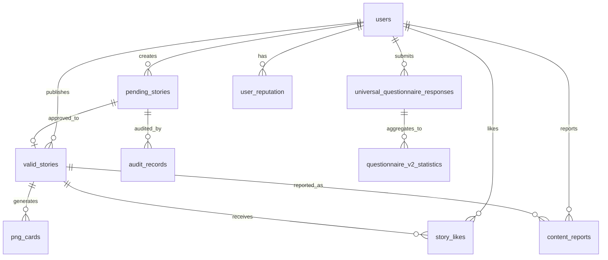

# 🗄️ 数据库设计文档

> **数据库类型**: Cloudflare D1 (SQLite)  
> **最后更新**: 2025年10月7日  
> **版本**: v1.0.0

---

## 📋 目录

- [核心表](#核心表)
- [认证相关表](#认证相关表)
- [问卷相关表](#问卷相关表)
- [故事相关表](#故事相关表)
- [审核相关表](#审核相关表)
- [管理相关表](#管理相关表)
- [统计相关表](#统计相关表)
- [索引设计](#索引设计)
- [数据关系图](#数据关系图)

---

## 🔑 核心表

### users - 用户表
```sql
CREATE TABLE users (
  id INTEGER PRIMARY KEY AUTOINCREMENT,
  uuid TEXT UNIQUE NOT NULL,
  user_type TEXT NOT NULL CHECK (user_type IN (
    'anonymous', 'semi_anonymous', 'google', 'reviewer', 'admin', 'super_admin'
  )),
  
  -- 认证信息
  email TEXT UNIQUE,
  google_id TEXT UNIQUE,
  identity_hash TEXT UNIQUE,  -- 半匿名用户的A+B哈希
  password_hash TEXT,
  
  -- 基础信息
  username TEXT,
  display_name TEXT,
  avatar_url TEXT,
  
  -- 角色权限
  role TEXT DEFAULT 'user',
  permissions TEXT,  -- JSON数组
  
  -- 状态
  status TEXT DEFAULT 'active' CHECK (status IN ('active', 'inactive', 'suspended', 'banned')),
  email_verified INTEGER DEFAULT 0,
  
  -- 时间戳
  created_at DATETIME DEFAULT CURRENT_TIMESTAMP,
  updated_at DATETIME DEFAULT CURRENT_TIMESTAMP,
  last_login_at DATETIME
);

CREATE INDEX idx_users_uuid ON users(uuid);
CREATE INDEX idx_users_email ON users(email);
CREATE INDEX idx_users_google_id ON users(google_id);
CREATE INDEX idx_users_identity_hash ON users(identity_hash);
CREATE INDEX idx_users_user_type ON users(user_type);
CREATE INDEX idx_users_status ON users(status);
```

**字段说明**:
- `user_type`: 用户类型（匿名/半匿名/Google/审核员/管理员/超级管理员）
- `identity_hash`: 半匿名用户的学校+专业组合哈希
- `permissions`: JSON格式的权限列表

---

## 🔐 认证相关表

### login_sessions - 登录会话表
```sql
CREATE TABLE login_sessions (
  id INTEGER PRIMARY KEY AUTOINCREMENT,
  session_id TEXT UNIQUE NOT NULL,
  user_id TEXT NOT NULL,
  username TEXT NOT NULL,
  role TEXT NOT NULL,
  
  -- 会话信息
  ip_address TEXT,
  user_agent TEXT,
  
  -- 时间戳
  created_at DATETIME DEFAULT CURRENT_TIMESTAMP,
  expires_at DATETIME NOT NULL,
  last_activity_at DATETIME DEFAULT CURRENT_TIMESTAMP,
  
  FOREIGN KEY (user_id) REFERENCES users(uuid)
);

CREATE INDEX idx_sessions_session_id ON login_sessions(session_id);
CREATE INDEX idx_sessions_user_id ON login_sessions(user_id);
CREATE INDEX idx_sessions_expires_at ON login_sessions(expires_at);
```

---

### google_oauth_whitelist - Google OAuth白名单
```sql
CREATE TABLE google_oauth_whitelist (
  id INTEGER PRIMARY KEY AUTOINCREMENT,
  email TEXT UNIQUE NOT NULL,
  role TEXT NOT NULL CHECK (role IN ('admin', 'reviewer', 'super_admin')),
  status TEXT DEFAULT 'active',
  added_by TEXT,
  created_at DATETIME DEFAULT CURRENT_TIMESTAMP
);

CREATE INDEX idx_oauth_whitelist_email ON google_oauth_whitelist(email);
```

---

### two_factor_auth - 2FA配置表
```sql
CREATE TABLE two_factor_auth (
  id INTEGER PRIMARY KEY AUTOINCREMENT,
  user_id TEXT UNIQUE NOT NULL,
  secret TEXT NOT NULL,
  enabled INTEGER DEFAULT 0,
  backup_codes TEXT,  -- JSON数组
  created_at DATETIME DEFAULT CURRENT_TIMESTAMP,
  
  FOREIGN KEY (user_id) REFERENCES users(uuid)
);
```

---

## 📝 问卷相关表

### universal_questionnaire_responses - 通用问卷响应表
```sql
CREATE TABLE universal_questionnaire_responses (
  id INTEGER PRIMARY KEY AUTOINCREMENT,
  response_uuid TEXT UNIQUE NOT NULL,
  questionnaire_id TEXT NOT NULL,
  user_id TEXT NOT NULL,
  
  -- 问卷数据
  responses TEXT NOT NULL,  -- JSON格式
  version INTEGER DEFAULT 1,
  
  -- 元数据
  ip_address TEXT,
  user_agent TEXT,
  completion_time INTEGER,  -- 秒
  
  -- 状态
  status TEXT DEFAULT 'completed',
  
  -- 时间戳
  created_at DATETIME DEFAULT CURRENT_TIMESTAMP,
  updated_at DATETIME DEFAULT CURRENT_TIMESTAMP,
  submitted_at DATETIME,
  
  FOREIGN KEY (user_id) REFERENCES users(uuid)
);

CREATE INDEX idx_questionnaire_responses_uuid ON universal_questionnaire_responses(response_uuid);
CREATE INDEX idx_questionnaire_responses_user_id ON universal_questionnaire_responses(user_id);
CREATE INDEX idx_questionnaire_responses_questionnaire_id ON universal_questionnaire_responses(questionnaire_id);
CREATE INDEX idx_questionnaire_responses_submitted_at ON universal_questionnaire_responses(submitted_at);
```

---

### questionnaire_v2_responses - 问卷V2响应表
```sql
CREATE TABLE questionnaire_v2_responses (
  id INTEGER PRIMARY KEY AUTOINCREMENT,
  response_uuid TEXT UNIQUE NOT NULL,
  questionnaire_id TEXT NOT NULL,
  user_id TEXT NOT NULL,
  
  -- 基础数据
  basic_demographics TEXT NOT NULL,  -- JSON
  employment_status TEXT NOT NULL,   -- JSON
  
  -- 多维度分析数据
  economic_pressure_data TEXT,       -- JSON
  employment_confidence_data TEXT,   -- JSON
  modern_debt_data TEXT,             -- JSON
  discrimination_data TEXT,          -- JSON
  fertility_intention_data TEXT,     -- JSON
  
  -- 质量控制
  completion_quality_score REAL DEFAULT 1.0,
  logical_consistency_score REAL DEFAULT 1.0,
  response_time_seconds INTEGER,
  interaction_count INTEGER,
  
  -- 时间戳
  created_at DATETIME DEFAULT CURRENT_TIMESTAMP,
  submitted_at DATETIME,
  
  FOREIGN KEY (user_id) REFERENCES users(uuid)
);

CREATE INDEX idx_v2_responses_uuid ON questionnaire_v2_responses(response_uuid);
CREATE INDEX idx_v2_responses_user_id ON questionnaire_v2_responses(user_id);
```

---

### questionnaire_v2_statistics - 问卷V2统计表
```sql
CREATE TABLE questionnaire_v2_statistics (
  id INTEGER PRIMARY KEY AUTOINCREMENT,
  questionnaire_id TEXT NOT NULL,
  dimension TEXT NOT NULL,
  metric_name TEXT NOT NULL,
  metric_value TEXT NOT NULL,
  count INTEGER DEFAULT 0,
  percentage REAL DEFAULT 0.0,
  calculated_at DATETIME DEFAULT CURRENT_TIMESTAMP,
  
  UNIQUE(questionnaire_id, dimension, metric_name, metric_value)
);

CREATE INDEX idx_v2_stats_questionnaire_id ON questionnaire_v2_statistics(questionnaire_id);
CREATE INDEX idx_v2_stats_dimension ON questionnaire_v2_statistics(dimension);
```

---

## 📖 故事相关表

### pending_stories - 待审核故事表
```sql
CREATE TABLE pending_stories (
  id INTEGER PRIMARY KEY AUTOINCREMENT,
  user_id TEXT NOT NULL,
  title TEXT NOT NULL,
  content TEXT NOT NULL,
  category TEXT DEFAULT 'general',
  tags TEXT DEFAULT '[]',  -- JSON数组
  author_name TEXT DEFAULT '匿名用户',
  
  -- 审核状态
  status TEXT DEFAULT 'pending' CHECK (status IN (
    'pending', 'rule_checking', 'rule_passed',
    'ai_checking', 'ai_passed', 'manual_review',
    'approved', 'rejected'
  )),
  audit_level INTEGER DEFAULT 1,
  
  -- 审核时间
  created_at DATETIME DEFAULT CURRENT_TIMESTAMP,
  rule_audit_at DATETIME,
  ai_audit_at DATETIME,
  manual_audit_at DATETIME,
  approved_at DATETIME,
  
  -- 审核结果
  rule_audit_result TEXT,  -- JSON
  ai_audit_result TEXT,    -- JSON
  manual_audit_result TEXT, -- JSON
  
  -- 元数据
  user_ip TEXT,
  user_agent TEXT,
  
  FOREIGN KEY (user_id) REFERENCES users(uuid)
);

CREATE INDEX idx_pending_stories_user_id ON pending_stories(user_id);
CREATE INDEX idx_pending_stories_status ON pending_stories(status);
CREATE INDEX idx_pending_stories_created_at ON pending_stories(created_at);
```

---

### valid_stories - 已发布故事表
```sql
CREATE TABLE valid_stories (
  id INTEGER PRIMARY KEY AUTOINCREMENT,
  raw_id INTEGER,
  data_uuid TEXT UNIQUE NOT NULL,
  user_id TEXT NOT NULL,
  title TEXT NOT NULL,
  content TEXT NOT NULL,
  category TEXT DEFAULT 'general',
  tags TEXT DEFAULT '[]',
  author_name TEXT DEFAULT '匿名用户',
  
  -- 审核状态
  audit_status TEXT DEFAULT 'approved',
  approved_at DATETIME DEFAULT CURRENT_TIMESTAMP,
  
  -- 互动数据
  like_count INTEGER DEFAULT 0,
  dislike_count INTEGER DEFAULT 0,
  view_count INTEGER DEFAULT 0,
  
  -- 发布状态
  is_featured INTEGER DEFAULT 0,
  published_at DATETIME,
  
  FOREIGN KEY (raw_id) REFERENCES pending_stories(id),
  FOREIGN KEY (user_id) REFERENCES users(uuid)
);

CREATE INDEX idx_valid_stories_user_id ON valid_stories(user_id);
CREATE INDEX idx_valid_stories_category ON valid_stories(category);
CREATE INDEX idx_valid_stories_approved_at ON valid_stories(approved_at);
CREATE INDEX idx_valid_stories_like_count ON valid_stories(like_count);
```

---

### story_likes - 故事点赞表
```sql
CREATE TABLE story_likes (
  id INTEGER PRIMARY KEY AUTOINCREMENT,
  story_id INTEGER NOT NULL,
  user_id TEXT NOT NULL,
  ip_address TEXT,
  created_at DATETIME DEFAULT CURRENT_TIMESTAMP,
  
  UNIQUE(story_id, user_id),
  FOREIGN KEY (story_id) REFERENCES valid_stories(id),
  FOREIGN KEY (user_id) REFERENCES users(uuid)
);

CREATE INDEX idx_story_likes_story_id ON story_likes(story_id);
CREATE INDEX idx_story_likes_user_id ON story_likes(user_id);
```

---

### png_cards - PNG卡片表
```sql
CREATE TABLE png_cards (
  id INTEGER PRIMARY KEY AUTOINCREMENT,
  content_type TEXT NOT NULL,
  content_id TEXT NOT NULL,
  card_id TEXT UNIQUE NOT NULL,
  r2_key TEXT NOT NULL,
  download_url TEXT NOT NULL,
  theme TEXT DEFAULT 'gradient',
  file_size INTEGER,
  created_at DATETIME DEFAULT CURRENT_TIMESTAMP,
  
  UNIQUE(content_type, content_id, theme)
);

CREATE INDEX idx_png_cards_content ON png_cards(content_type, content_id);
```

---

## 🛡️ 审核相关表

### audit_records - 审核记录表
```sql
CREATE TABLE audit_records (
  id INTEGER PRIMARY KEY AUTOINCREMENT,
  content_type TEXT NOT NULL,
  content_id INTEGER NOT NULL,
  audit_level TEXT NOT NULL,
  audit_result TEXT NOT NULL,
  auditor_id TEXT,
  audited_at DATETIME DEFAULT CURRENT_TIMESTAMP,
  
  -- 详细信息
  risk_score INTEGER,
  violations TEXT,  -- JSON
  notes TEXT
);

CREATE INDEX idx_audit_records_content ON audit_records(content_type, content_id);
CREATE INDEX idx_audit_records_audited_at ON audit_records(audited_at);
```

---

### violation_records - 违规记录表
```sql
CREATE TABLE violation_records (
  id INTEGER PRIMARY KEY AUTOINCREMENT,
  user_id TEXT NOT NULL,
  content_type TEXT NOT NULL,
  content_id INTEGER NOT NULL,
  violation_type TEXT NOT NULL,
  severity TEXT NOT NULL,
  details TEXT,
  created_at DATETIME DEFAULT CURRENT_TIMESTAMP,
  
  FOREIGN KEY (user_id) REFERENCES users(uuid)
);

CREATE INDEX idx_violation_records_user_id ON violation_records(user_id);
```

---

### user_reputation - 用户信誉表
```sql
CREATE TABLE user_reputation (
  user_id TEXT PRIMARY KEY,
  reputation_score INTEGER DEFAULT 100,
  violation_count INTEGER DEFAULT 0,
  report_count INTEGER DEFAULT 0,
  malicious_report_count INTEGER DEFAULT 0,
  approved_content_count INTEGER DEFAULT 0,
  last_updated DATETIME DEFAULT CURRENT_TIMESTAMP,
  
  FOREIGN KEY (user_id) REFERENCES users(uuid)
);
```

---

### content_reports - 内容举报表
```sql
CREATE TABLE content_reports (
  id INTEGER PRIMARY KEY AUTOINCREMENT,
  content_type TEXT NOT NULL,
  content_id INTEGER NOT NULL,
  reporter_id TEXT NOT NULL,
  report_type TEXT NOT NULL,
  reason TEXT,
  status TEXT DEFAULT 'pending',
  handled_by TEXT,
  handled_at DATETIME,
  created_at DATETIME DEFAULT CURRENT_TIMESTAMP,
  
  FOREIGN KEY (reporter_id) REFERENCES users(uuid)
);

CREATE INDEX idx_content_reports_status ON content_reports(status);
CREATE INDEX idx_content_reports_content ON content_reports(content_type, content_id);
```

---

## 👨‍💼 管理相关表

### role_accounts - 角色账号表
```sql
CREATE TABLE role_accounts (
  id INTEGER PRIMARY KEY AUTOINCREMENT,
  email TEXT UNIQUE NOT NULL,
  username TEXT UNIQUE NOT NULL,
  password_hash TEXT NOT NULL,
  role TEXT NOT NULL CHECK (role IN ('admin', 'reviewer', 'super_admin')),
  status TEXT DEFAULT 'active',
  created_at DATETIME DEFAULT CURRENT_TIMESTAMP,
  created_by TEXT,
  last_login DATETIME
);

CREATE INDEX idx_role_accounts_email ON role_accounts(email);
CREATE INDEX idx_role_accounts_role ON role_accounts(role);
```

---

### admin_operation_logs - 操作日志表
```sql
CREATE TABLE admin_operation_logs (
  id INTEGER PRIMARY KEY AUTOINCREMENT,
  admin_id TEXT NOT NULL,
  operation_type TEXT NOT NULL,
  target_type TEXT,
  target_id TEXT,
  details TEXT,
  ip_address TEXT,
  created_at DATETIME DEFAULT CURRENT_TIMESTAMP
);

CREATE INDEX idx_admin_logs_admin_id ON admin_operation_logs(admin_id);
CREATE INDEX idx_admin_logs_created_at ON admin_operation_logs(created_at);
```

---

### system_config - 系统配置表
```sql
CREATE TABLE system_config (
  id INTEGER PRIMARY KEY,
  project_enabled INTEGER DEFAULT 1,
  maintenance_mode INTEGER DEFAULT 0,
  emergency_shutdown INTEGER DEFAULT 0,
  config_data TEXT,  -- JSON
  updated_by TEXT,
  last_updated DATETIME DEFAULT CURRENT_TIMESTAMP
);
```

---

### security_events - 安全事件表
```sql
CREATE TABLE security_events (
  id INTEGER PRIMARY KEY AUTOINCREMENT,
  event_type TEXT NOT NULL,
  severity TEXT NOT NULL,
  ip_address TEXT,
  user_id TEXT,
  details TEXT,
  created_at DATETIME DEFAULT CURRENT_TIMESTAMP
);

CREATE INDEX idx_security_events_created_at ON security_events(created_at);
CREATE INDEX idx_security_events_severity ON security_events(severity);
```

---

## 📊 统计相关表

### page_participation_stats - 页面参与统计表
```sql
CREATE TABLE page_participation_stats (
  id INTEGER PRIMARY KEY AUTOINCREMENT,
  page_name TEXT NOT NULL,
  visit_count INTEGER DEFAULT 0,
  unique_visitors INTEGER DEFAULT 0,
  avg_duration REAL DEFAULT 0.0,
  bounce_rate REAL DEFAULT 0.0,
  date DATE NOT NULL,
  
  UNIQUE(page_name, date)
);

CREATE INDEX idx_participation_stats_date ON page_participation_stats(date);
```

---

### user_activity_logs - 用户活动日志表
```sql
CREATE TABLE user_activity_logs (
  id INTEGER PRIMARY KEY AUTOINCREMENT,
  user_id TEXT,
  activity_type TEXT NOT NULL,
  page_url TEXT,
  ip_address TEXT,
  user_agent TEXT,
  created_at DATETIME DEFAULT CURRENT_TIMESTAMP
);

CREATE INDEX idx_activity_logs_user_id ON user_activity_logs(user_id);
CREATE INDEX idx_activity_logs_created_at ON user_activity_logs(created_at);
```

---

## 🔗 数据关系图



---

## 📈 索引策略

### 高频查询索引
1. **用户查询**: `uuid`, `email`, `identity_hash`
2. **问卷查询**: `questionnaire_id`, `user_id`, `submitted_at`
3. **故事查询**: `category`, `approved_at`, `like_count`
4. **审核查询**: `status`, `created_at`

### 复合索引
```sql
CREATE INDEX idx_stories_category_approved ON valid_stories(category, approved_at);
CREATE INDEX idx_reports_status_created ON content_reports(status, created_at);
```

---

## 🎯 最佳实践

### 1. 数据完整性
- 使用外键约束保证引用完整性
- 使用CHECK约束限制枚举值
- 使用UNIQUE约束防止重复数据

### 2. 性能优化
- 为高频查询字段创建索引
- 使用JSON字段存储灵活数据
- 定期清理过期数据

### 3. 数据安全
- 密码使用bcrypt哈希
- 敏感数据加密存储
- 定期备份数据库

---

## 📚 相关文档

- [API文档](../api/API_DOCUMENTATION.md)
- [功能索引](../features/FEATURE_INDEX.md)
- [认证系统](../features/authentication/README.md)
- [问卷系统](../features/questionnaire/README.md)
- [故事系统](../features/stories/README.md)
