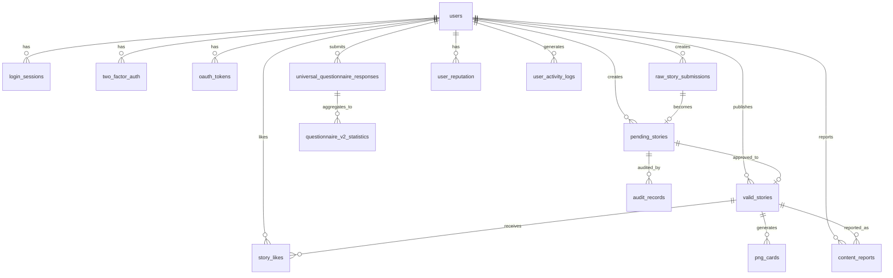

# 🗄️ 数据库表索引

> **数据库类型**: Cloudflare D1 (SQLite)  
> **最后更新**: 2025年10月7日  
> **总表数**: 20+

---

## 📋 快速导航

- [按功能模块查找](#按功能模块分类)
- [按表名查找](#按表名字母排序)
- [表关系图](#表关系图)
- [详细表结构](DATABASE_SCHEMA.md)

---

## 📊 表统计

| 模块 | 表数量 | 说明 |
|------|--------|------|
| 核心表 | 1 | 用户基础表 |
| 认证系统 | 3 | 会话、2FA、OAuth |
| 问卷系统 | 4 | 问卷数据、统计 |
| 故事系统 | 5 | 故事发布、审核、互动 |
| 审核系统 | 4 | 审核记录、违规内容 |
| 系统管理 | 3 | 日志、配置、监控 |
| **总计** | **20+** | |

---

## 🔧 按功能模块分类

### 🔑 核心表

#### users - 用户表
- **用途**: 存储所有用户的基础信息
- **主键**: `id` (自增), `uuid` (唯一标识)
- **关键字段**: `user_type`, `email`, `google_id`, `identity_hash`, `role`
- **索引**: uuid, email, google_id, identity_hash, user_type, status
- **关联**: 几乎所有表的外键来源
- **详细文档**: [schemas/users.md](schemas/users.md)

---

### 🔐 认证系统 (3个表)

#### login_sessions - 登录会话表
- **用途**: 管理用户登录会话
- **主键**: `id`, `session_id` (唯一)
- **关键字段**: `user_id`, `role`, `expires_at`
- **索引**: session_id, user_id, expires_at
- **外键**: `user_id` → users.uuid
- **详细文档**: [schemas/login_sessions.md](schemas/login_sessions.md)

#### two_factor_auth - 双因素认证表
- **用途**: 存储2FA密钥和备用码
- **主键**: `id`
- **关键字段**: `user_id`, `secret`, `backup_codes`, `enabled`
- **索引**: user_id
- **外键**: `user_id` → users.uuid
- **详细文档**: [schemas/two_factor_auth.md](schemas/two_factor_auth.md)

#### oauth_tokens - OAuth令牌表
- **用途**: 存储Google OAuth访问令牌
- **主键**: `id`
- **关键字段**: `user_id`, `provider`, `access_token`, `refresh_token`
- **索引**: user_id, provider
- **外键**: `user_id` → users.uuid
- **详细文档**: [schemas/oauth_tokens.md](schemas/oauth_tokens.md)

---

### 📝 问卷系统 (4个表)

#### universal_questionnaire_responses - 通用问卷响应表
- **用途**: 存储用户问卷提交数据
- **主键**: `id`, `data_uuid` (唯一)
- **关键字段**: `user_id`, `questionnaire_id`, `responses` (JSON), `tags` (JSON)
- **索引**: data_uuid, user_id, questionnaire_id, submitted_at
- **外键**: `user_id` → users.uuid
- **详细文档**: [schemas/universal_questionnaire_responses.md](schemas/universal_questionnaire_responses.md)

#### questionnaire_v2_statistics - V2问卷统计表
- **用途**: 存储问卷选项统计数据
- **主键**: `id`
- **关键字段**: `questionnaire_id`, `question_id`, `option_id`, `count`
- **索引**: questionnaire_id, question_id, option_id
- **详细文档**: [schemas/questionnaire_v2_statistics.md](schemas/questionnaire_v2_statistics.md)

#### questionnaire_progress - 问卷进度表
- **用途**: 保存用户未完成的问卷进度
- **主键**: `id`
- **关键字段**: `user_id`, `questionnaire_id`, `current_responses` (JSON)
- **索引**: user_id, questionnaire_id
- **外键**: `user_id` → users.uuid
- **详细文档**: [schemas/questionnaire_progress.md](schemas/questionnaire_progress.md)

#### tag_statistics - 标签统计表
- **用途**: 统计用户标签分布
- **主键**: `id`
- **关键字段**: `tag_name`, `count`, `category`
- **索引**: tag_name, category
- **详细文档**: [schemas/tag_statistics.md](schemas/tag_statistics.md)

---

### 📖 故事系统 (5个表)

#### raw_story_submissions - 原始故事提交表
- **用途**: 存储所有故事的原始提交数据
- **主键**: `id`, `data_uuid` (唯一)
- **关键字段**: `user_id`, `title`, `content`, `submission_type`
- **索引**: data_uuid, user_id, submitted_at
- **外键**: `user_id` → users.uuid
- **详细文档**: [schemas/raw_story_submissions.md](schemas/raw_story_submissions.md)

#### pending_stories - 待审核故事表
- **用途**: 存储待审核的故事
- **主键**: `id`, `data_uuid` (唯一)
- **关键字段**: `user_id`, `title`, `content`, `audit_status`
- **索引**: data_uuid, user_id, audit_status, created_at
- **外键**: `user_id` → users.uuid, `raw_id` → raw_story_submissions.id
- **详细文档**: [schemas/pending_stories.md](schemas/pending_stories.md)

#### valid_stories - 已发布故事表
- **用途**: 存储审核通过并发布的故事
- **主键**: `id`, `data_uuid` (唯一)
- **关键字段**: `user_id`, `title`, `content`, `like_count`, `view_count`
- **索引**: data_uuid, user_id, category, approved_at, like_count
- **外键**: `user_id` → users.uuid, `raw_id` → pending_stories.id
- **详细文档**: [schemas/valid_stories.md](schemas/valid_stories.md)

#### story_likes - 故事点赞表
- **用途**: 记录用户对故事的点赞/点踩
- **主键**: `id`
- **关键字段**: `user_id`, `story_id`, `like_type`
- **索引**: user_id, story_id, 复合索引(user_id, story_id)
- **外键**: `user_id` → users.uuid, `story_id` → valid_stories.data_uuid
- **详细文档**: [schemas/story_likes.md](schemas/story_likes.md)

#### png_cards - PNG卡片表
- **用途**: 存储故事PNG卡片的元数据
- **主键**: `id`
- **关键字段**: `story_id`, `r2_key`, `theme`, `generated_at`
- **索引**: story_id, r2_key
- **外键**: `story_id` → valid_stories.data_uuid
- **详细文档**: [schemas/png_cards.md](schemas/png_cards.md)

---

### ✅ 审核系统 (4个表)

#### audit_records - 审核记录表
- **用途**: 记录所有审核操作
- **主键**: `id`
- **关键字段**: `content_id`, `content_type`, `reviewer_id`, `action`, `reason`
- **索引**: content_id, reviewer_id, created_at
- **外键**: `reviewer_id` → users.uuid
- **详细文档**: [schemas/audit_records.md](schemas/audit_records.md)

#### violation_content - 违规内容表
- **用途**: 存储被标记为违规的内容
- **主键**: `id`
- **关键字段**: `content_id`, `content_type`, `violation_type`, `severity`
- **索引**: content_id, violation_type, created_at
- **详细文档**: [schemas/violation_content.md](schemas/violation_content.md)

#### content_reports - 内容举报表
- **用途**: 用户举报不当内容
- **主键**: `id`
- **关键字段**: `reporter_id`, `content_id`, `content_type`, `reason`, `status`
- **索引**: reporter_id, content_id, status, created_at
- **外键**: `reporter_id` → users.uuid
- **详细文档**: [schemas/content_reports.md](schemas/content_reports.md)

#### user_reputation - 用户信誉表
- **用途**: 跟踪用户信誉分数
- **主键**: `id`
- **关键字段**: `user_id`, `reputation_score`, `violation_count`
- **索引**: user_id, reputation_score
- **外键**: `user_id` → users.uuid
- **详细文档**: [schemas/user_reputation.md](schemas/user_reputation.md)

---

### ⚙️ 系统管理 (3个表)

#### user_activity_logs - 用户活动日志表
- **用途**: 记录用户关键操作
- **主键**: `id`
- **关键字段**: `user_id`, `action`, `details` (JSON), `ip_address`
- **索引**: user_id, action, created_at
- **外键**: `user_id` → users.uuid
- **详细文档**: [schemas/user_activity_logs.md](schemas/user_activity_logs.md)

#### system_config - 系统配置表
- **用途**: 存储系统配置参数
- **主键**: `id`, `config_key` (唯一)
- **关键字段**: `config_key`, `config_value`, `category`
- **索引**: config_key, category
- **详细文档**: [schemas/system_config.md](schemas/system_config.md)

#### admin_operations - 管理员操作日志表
- **用途**: 记录管理员敏感操作
- **主键**: `id`
- **关键字段**: `admin_id`, `operation_type`, `target_id`, `details` (JSON)
- **索引**: admin_id, operation_type, created_at
- **外键**: `admin_id` → users.uuid
- **详细文档**: [schemas/admin_operations.md](schemas/admin_operations.md)

---

## 🔤 按表名字母排序

| 表名 | 中文名 | 模块 | 详细文档 |
|------|--------|------|----------|
| admin_operations | 管理员操作日志 | 系统管理 | [查看](schemas/admin_operations.md) |
| audit_records | 审核记录 | 审核系统 | [查看](schemas/audit_records.md) |
| content_reports | 内容举报 | 审核系统 | [查看](schemas/content_reports.md) |
| login_sessions | 登录会话 | 认证系统 | [查看](schemas/login_sessions.md) |
| oauth_tokens | OAuth令牌 | 认证系统 | [查看](schemas/oauth_tokens.md) |
| pending_stories | 待审核故事 | 故事系统 | [查看](schemas/pending_stories.md) |
| png_cards | PNG卡片 | 故事系统 | [查看](schemas/png_cards.md) |
| questionnaire_progress | 问卷进度 | 问卷系统 | [查看](schemas/questionnaire_progress.md) |
| questionnaire_v2_statistics | V2问卷统计 | 问卷系统 | [查看](schemas/questionnaire_v2_statistics.md) |
| raw_story_submissions | 原始故事提交 | 故事系统 | [查看](schemas/raw_story_submissions.md) |
| story_likes | 故事点赞 | 故事系统 | [查看](schemas/story_likes.md) |
| system_config | 系统配置 | 系统管理 | [查看](schemas/system_config.md) |
| tag_statistics | 标签统计 | 问卷系统 | [查看](schemas/tag_statistics.md) |
| two_factor_auth | 双因素认证 | 认证系统 | [查看](schemas/two_factor_auth.md) |
| universal_questionnaire_responses | 通用问卷响应 | 问卷系统 | [查看](schemas/universal_questionnaire_responses.md) |
| user_activity_logs | 用户活动日志 | 系统管理 | [查看](schemas/user_activity_logs.md) |
| user_reputation | 用户信誉 | 审核系统 | [查看](schemas/user_reputation.md) |
| users | 用户 | 核心表 | [查看](schemas/users.md) |
| valid_stories | 已发布故事 | 故事系统 | [查看](schemas/valid_stories.md) |
| violation_content | 违规内容 | 审核系统 | [查看](schemas/violation_content.md) |

---

## 🔗 表关系图

---

## 📚 相关文档

- [完整数据库设计](DATABASE_SCHEMA.md) - 所有表的详细SQL定义
- [表关系图](relationships/erd.md) - 可视化关系图
- [索引策略](relationships/indexes.md) - 索引设计说明
- [数据迁移指南](../guides/database-migration.md) - 数据库迁移流程

---

**维护说明**: 
- 添加新表时，请同时更新本索引和DATABASE_SCHEMA.md
- 修改表结构时，请更新对应的schemas/文档
- 定期检查表关系图的准确性

