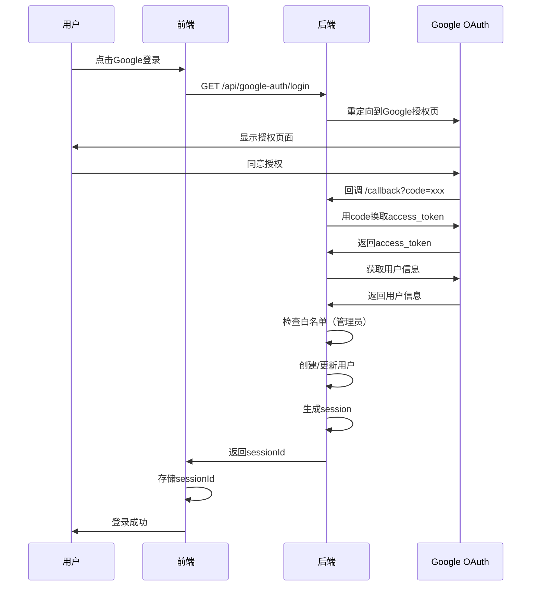

# 🔐 认证系统功能文档

> **模块**: 用户认证与权限管理  
> **完成度**: 100%  
> **最后更新**: 2025年10月7日

## 📋 模块概述

### 基本信息
- **模块名称**: 统一认证系统
- **负责范围**: 用户登录、注册、权限管理、会话管理
- **技术栈**: JWT + OAuth2.0 + 2FA + Session管理
- **依赖模块**: 用户管理、会话管理、邮箱服务

### 系统架构
认证系统采用**多层认证架构**，支持多种登录方式：

```
认证系统
├── Google OAuth登录（推荐）
├── 半匿名认证（A+B组合）
├── 账号密码登录（管理员）
├── 2FA双因素认证（可选）
└── Session管理（统一）
```

---

## 🎯 功能清单

### 1. Google OAuth登录

#### 功能ID: AUTH-001
- **角色**: 所有用户
- **用途**: 使用Google账号快速登录
- **API端点**: 
  - `GET /api/google-auth/login` - 发起OAuth登录
  - `POST /api/google-auth/callback` - OAuth回调处理
  - `POST /api/google-auth/questionnaire` - 问卷用户登录
  - `POST /api/google-auth/management` - 管理员登录
- **数据库表**: 
  - `users` - 用户表
  - `login_sessions` - 会话表
  - `oauth_tokens` - OAuth令牌表
  - `admin_whitelist` - 管理员白名单
- **前端页面**: 
  - `/unified-login` - 统一登录页
  - `/admin/login` - 管理员登录页
  - `/reviewer/login` - 审核员登录页
- **测试覆盖**: ✅ 完整测试
- **相关文档**: [GOOGLE-OAUTH-INTEGRATION-COMPLETE.md](../../../../GOOGLE-OAUTH-INTEGRATION-COMPLETE.md)

#### 实现细节

**OAuth流程**:


**白名单机制**:
- 管理员登录需要邮箱在`admin_whitelist`表中
- 问卷用户无需白名单，自动创建半匿名账号
- 超级管理员可以管理白名单

**Token格式**:
```typescript
// Session Token格式
session_{timestamp}_{random}

// 存储在数据库login_sessions表
{
  session_id: "session_1234567890_abc",
  user_id: "uuid_xxx",
  role: "admin",
  expires_at: "2025-10-08T00:00:00Z"
}
```

---

### 2. 半匿名认证（A+B组合）

#### 功能ID: AUTH-002
- **角色**: 问卷用户
- **用途**: 使用学校+专业组合登录，保护隐私
- **API端点**: 
  - `POST /api/questionnaire-auth/login` - A+B登录
  - `POST /api/questionnaire-auth/register` - 注册半匿名账号
  - `GET /api/questionnaire-auth/me` - 获取当前用户信息
- **数据库表**: 
  - `users` - 用户表（identity_hash字段）
  - `login_sessions` - 会话表
- **前端页面**: 
  - `/questionnaire-login` - 问卷登录页
  - `/questionnaire` - 问卷填写页
- **测试覆盖**: ✅ 完整测试
- **相关文档**: [半匿名认证设计](../../../../SEMI_ANONYMOUS_AUTH_DESIGN.md)

#### A+B组合机制

**身份生成**:
```typescript
// A值：学校代码（6位数字）
identityA = "123456"  // 例如：北京大学

// B值：专业代码（6位数字）
identityB = "654321"  // 例如：计算机科学

// 组合哈希
identity_hash = SHA256(identityA + identityB)
```

**验证流程**:
```
1. 用户输入A值和B值
2. 前端验证格式（6位数字）
3. 计算组合哈希
4. 后端查询identity_hash
5. 匹配成功 → 登录成功
6. 匹配失败 → 提示错误
```

**隐私保护**:
- 数据库只存储哈希值，不存储原始A+B
- 无法从哈希反推学校和专业
- 用户可以选择记住A+B（本地存储）

---

### 3. 账号密码登录

#### 功能ID: AUTH-003
- **角色**: 管理员、审核员
- **用途**: 传统账号密码登录
- **API端点**: 
  - `POST /api/simple-auth/login` - 登录
  - `POST /api/simple-auth/verify` - 验证Token
  - `GET /api/simple-auth/me` - 获取用户信息
  - `POST /api/simple-auth/logout` - 登出
- **数据库表**: 
  - `users` - 用户表（password_hash字段）
  - `login_sessions` - 会话表
- **前端页面**: 
  - `/admin/login` - 管理员登录
  - `/reviewer/login` - 审核员登录
- **测试覆盖**: ✅ 完整测试

#### 密码安全

**密码要求**:
- 最少8个字符
- 必须包含字母和数字
- 建议包含特殊字符

**密码存储**:
```typescript
// 使用bcrypt哈希
password_hash = bcrypt.hash(password, 10)

// 验证
isValid = bcrypt.compare(inputPassword, password_hash)
```

**登录限制**:
- 5次失败后锁定账号15分钟
- 记录所有登录尝试
- 异常登录发送邮件通知

---

### 4. 2FA双因素认证

#### 功能ID: AUTH-004
- **角色**: 管理员、超级管理员
- **用途**: 增强账号安全性
- **API端点**: 
  - `POST /api/two-factor/setup` - 设置2FA
  - `POST /api/two-factor/verify` - 验证2FA代码
  - `POST /api/two-factor/disable` - 禁用2FA
  - `GET /api/two-factor/backup-codes` - 获取备用码
- **数据库表**: 
  - `two_factor_auth` - 2FA配置表
- **前端页面**: 
  - `/admin/security` - 安全设置页
- **测试覆盖**: ✅ 完整测试
- **相关文档**: [2FA实现报告](../../../../TWO_FACTOR_AUTH_IMPLEMENTATION.md)

#### TOTP实现

**设置流程**:
```
1. 用户请求启用2FA
2. 后端生成TOTP密钥
3. 生成QR码
4. 用户扫描QR码（Google Authenticator）
5. 用户输入6位验证码
6. 验证成功 → 2FA启用
7. 生成10个备用恢复码
```

**验证流程**:
```
1. 用户输入用户名密码
2. 验证成功 → 检查是否启用2FA
3. 如果启用 → 要求输入6位验证码
4. 验证TOTP代码
5. 验证成功 → 登录成功
```

**备用码**:
- 每个账号生成10个备用码
- 每个备用码只能使用一次
- 用完后可以重新生成

---

### 5. JWT Token管理

#### 功能ID: AUTH-005
- **角色**: 所有用户
- **用途**: 管理访问令牌和刷新令牌
- **API端点**: 
  - `POST /api/auth/refresh` - 刷新Token
  - `POST /api/auth/revoke` - 撤销Token
- **数据库表**: 
  - `login_sessions` - 会话表
- **测试覆盖**: ✅ 完整测试

#### Token类型

**Access Token**:
```typescript
{
  userId: "uuid_xxx",
  role: "admin",
  permissions: ["read", "write"],
  exp: 1234567890  // 15分钟后过期
}
```

**Session Token**:
```typescript
// 存储在数据库
{
  session_id: "session_xxx",
  user_id: "uuid_xxx",
  role: "admin",
  expires_at: "2025-10-08T00:00:00Z"  // 7天后过期
}
```

**Token刷新**:
- Access Token过期后使用Session Token刷新
- Session Token过期需要重新登录

---

### 6. 权限验证

#### 功能ID: AUTH-006
- **角色**: 所有用户
- **用途**: 验证用户权限
- **中间件**: 
  - `authMiddleware` - 强制认证
  - `optionalAuthMiddleware` - 可选认证
  - `roleMiddleware` - 角色验证
- **权限层级**:
  ```
  super_admin > admin > reviewer > user
  ```

#### 权限检查

**角色权限**:
```typescript
const permissions = {
  user: ['read:own', 'write:own'],
  reviewer: ['read:all', 'write:review'],
  admin: ['read:all', 'write:all', 'delete:content'],
  super_admin: ['*']  // 所有权限
}
```

**API保护**:
```typescript
// 需要登录
app.get('/api/protected', authMiddleware, handler)

// 需要管理员角色
app.get('/api/admin', authMiddleware, roleMiddleware(['admin']), handler)

// 可选登录
app.get('/api/public', optionalAuthMiddleware, handler)
```

---

## 🔗 共用组件

### 后端组件
- `JWTService` - JWT生成和验证
- `TwoFactorAuthService` - 2FA服务
- `LoginRecordService` - 登录记录服务
- `authMiddleware` - 认证中间件
- `roleMiddleware` - 角色验证中间件

### 前端组件
- `GoogleLoginButton` - Google登录按钮
- `SemiAnonymousLogin` - 半匿名登录组件
- `TwoFactorSetup` - 2FA设置组件
- `useUnifiedAuthStore` - 统一认证Store

---

## 📊 数据流

### 登录流程
```
用户输入凭证
  ↓
前端验证格式
  ↓
发送到后端
  ↓
后端验证凭证
  ↓
检查2FA状态
  ↓
生成Session/JWT
  ↓
返回Token
  ↓
前端存储Token
  ↓
后续请求携带Token
```

### Token验证流程
```
请求携带Token
  ↓
提取Token
  ↓
判断Token类型
  ↓
Session Token → 查询数据库
JWT Token → 验证签名
  ↓
验证成功 → 获取用户信息
  ↓
注入到请求上下文
  ↓
继续处理请求
```

---

## 🔒 安全特性

### 1. 密码安全
- ✅ bcrypt哈希（10轮）
- ✅ 密码强度要求
- ✅ 密码历史记录（防止重复使用）

### 2. Session安全
- ✅ Session过期时间（7天）
- ✅ 自动清理过期Session
- ✅ IP地址绑定（可选）

### 3. 防暴力破解
- ✅ 登录失败次数限制
- ✅ 账号临时锁定
- ✅ CAPTCHA验证（可选）

### 4. 审计日志
- ✅ 所有登录尝试记录
- ✅ IP地址和User-Agent记录
- ✅ 异常登录检测

---

## 📈 性能指标

- **登录响应时间**: < 500ms
- **Token验证时间**: < 50ms
- **2FA验证时间**: < 100ms
- **并发登录支持**: 1000+ req/s

---

## 🎯 最佳实践

### 1. Token管理
- 使用HTTPS传输Token
- Token存储在httpOnly Cookie
- 定期刷新Token

### 2. 密码管理
- 强制定期修改密码
- 禁止使用常见密码
- 提供密码找回功能

### 3. 2FA使用
- 推荐管理员启用2FA
- 提供备用恢复码
- 支持多种2FA方式

---

## 📚 相关文档

- [Google OAuth集成](../../../../GOOGLE-OAUTH-INTEGRATION-COMPLETE.md)
- [2FA实现报告](../../../../TWO_FACTOR_AUTH_IMPLEMENTATION.md)
- [认证系统分析](../../../../AUTHENTICATION_SYSTEM_COMPLETE_ANALYSIS.md)
- [API文档](../../api/endpoints/authentication.md)
- [用户数据模型](../../api/schemas/user.md)

