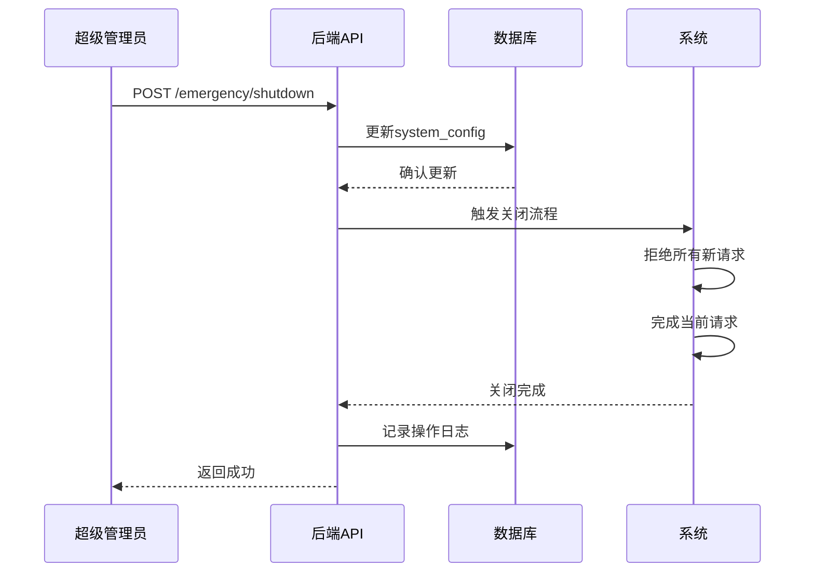

# ⚙️ 系统管理功能文档

> **模块**: 系统管理与配置  
> **完成度**: 100%  
> **最后更新**: 2025年10月7日

## 📋 模块概述

### 基本信息
- **模块名称**: 系统管理与超级管理员功能
- **负责范围**: 用户管理、权限控制、系统配置、项目控制、安全管理
- **技术栈**: React + TypeScript + D1 + RBAC
- **依赖模块**: 认证系统、审核系统

### 系统架构
系统管理采用**分层权限架构**：

```
超级管理员 (Super Admin)
├── 项目控制（启动/关闭/紧急停机）
├── 安全管理（IP封禁、威胁监控）
├── 账号管理（创建/删除管理员账号）
└── 系统配置（全局设置）

管理员 (Admin)
├── 用户管理（查看/编辑/禁用用户）
├── 内容管理（审核/删除/推荐内容）
├── 数据分析（统计报表、可视化）
└── AI审核配置（审核参数、提供商管理）

审核员 (Reviewer)
├── 内容审核（批准/拒绝）
├── 审核历史（查看记录）
└── 个人统计（审核数据）
```

---

## 🎯 功能清单

### 1. 超级管理员 - 项目控制

#### 功能ID: MGMT-001
- **角色**: 超级管理员
- **用途**: 控制整个项目的运行状态
- **API端点**: 
  - `GET /api/super-admin/project/status` - 获取项目状态
  - `POST /api/super-admin/emergency/shutdown` - 紧急关闭
  - `POST /api/super-admin/project/restore` - 恢复项目
  - `POST /api/super-admin/project/maintenance` - 维护模式
- **数据库表**: 
  - `system_config` - 系统配置表
  - `admin_operation_logs` - 操作日志表
- **前端页面**: 
  - `/super-admin/dashboard` - 超级管理员控制台
  - `/super-admin/project-control` - 项目控制面板
- **测试覆盖**: ✅ 完整测试
- **相关文档**: [超级管理员总结](../../../../docs/SUPER_ADMIN_SUMMARY.md)

#### 项目状态控制

**状态类型**:
```typescript
interface ProjectStatus {
  project_enabled: boolean;      // 项目是否启用
  maintenance_mode: boolean;     // 维护模式
  emergency_shutdown: boolean;   // 紧急停机
  last_updated: string;          // 最后更新时间
  updated_by: string;            // 操作人
}
```

**紧急关闭流程**:


**实现代码**:
```typescript
// 紧急关闭
async function emergencyShutdown(adminId: string, reason: string) {
  await db.execute(`
    UPDATE system_config
    SET project_enabled = 0,
        emergency_shutdown = 1,
        updated_by = ?,
        last_updated = CURRENT_TIMESTAMP
    WHERE id = 1
  `, [adminId]);
  
  // 记录操作日志
  await db.execute(`
    INSERT INTO admin_operation_logs (
      admin_id, operation_type, details, created_at
    ) VALUES (?, 'emergency_shutdown', ?, CURRENT_TIMESTAMP)
  `, [adminId, reason]);
  
  // 触发系统关闭
  await triggerSystemShutdown();
}
```

---

### 2. 超级管理员 - 安全管理

#### 功能ID: MGMT-002
- **角色**: 超级管理员
- **用途**: 监控和管理系统安全
- **API端点**: 
  - `GET /api/super-admin/security/metrics` - 安全指标
  - `GET /api/super-admin/security/threats` - 威胁列表
  - `POST /api/super-admin/security/block-ip` - 封禁IP
  - `DELETE /api/super-admin/security/unblock-ip/:ip` - 解封IP
- **数据库表**: 
  - `security_events` - 安全事件表
  - `blocked_ips` - 封禁IP表
  - `user_behavior_analysis` - 用户行为分析表
- **前端页面**: 
  - `/super-admin/security` - 安全监控面板
- **测试覆盖**: ✅ 完整测试

#### 安全指标

**监控指标**:
```typescript
interface SecurityMetrics {
  threat_level: 'low' | 'medium' | 'high' | 'critical';
  active_threats: number;
  blocked_ips: number;
  failed_logins: number;
  ddos_attempts: number;
  system_health: number;  // 0-100
}
```

**威胁检测**:
```typescript
// 检测异常登录
async function detectAbnormalLogin(ip: string, userId: string) {
  const recentAttempts = await db.query(`
    SELECT COUNT(*) as count
    FROM login_attempts
    WHERE ip_address = ? AND success = 0
      AND created_at > datetime('now', '-1 hour')
  `, [ip]);
  
  if (recentAttempts[0].count > 5) {
    await blockIP(ip, 'Too many failed login attempts');
    await createSecurityEvent({
      type: 'brute_force_attempt',
      ip,
      severity: 'high'
    });
  }
}
```

---

### 3. 账号管理系统

#### 功能ID: MGMT-003
- **角色**: 超级管理员
- **用途**: 管理管理员和审核员账号
- **API端点**: 
  - `GET /api/admin/account-management/accounts` - 账号列表
  - `POST /api/admin/account-management/accounts` - 创建账号
  - `PUT /api/admin/account-management/accounts/:id` - 更新账号
  - `DELETE /api/admin/account-management/accounts/:id` - 删除账号
  - `GET /api/admin/account-management/audit-logs` - 审计日志
- **数据库表**: 
  - `email_whitelist` - 邮箱白名单
  - `role_accounts` - 角色账号表
  - `account_audit_logs` - 账号审计日志
- **前端页面**: 
  - `/super-admin/account-management` - 账号管理
  - `/super-admin/audit-logs` - 审计日志
- **测试覆盖**: ✅ 完整测试
- **相关文档**: [账号管理系统](../../../../EMAIL-ROLE-ACCOUNT-SYSTEM-COMPLETE.md)

#### 账号类型

**角色定义**:
```typescript
type UserRole = 
  | 'super_admin'   // 超级管理员
  | 'admin'         // 管理员
  | 'reviewer'      // 审核员
  | 'user';         // 普通用户

interface RoleAccount {
  id: number;
  email: string;
  role: UserRole;
  username: string;
  password_hash: string;
  status: 'active' | 'inactive' | 'suspended';
  created_at: string;
  created_by: string;
}
```

**权限矩阵**:
```typescript
const PERMISSIONS = {
  super_admin: [
    'project.control',
    'security.manage',
    'account.create',
    'account.delete',
    'system.config',
    '*'  // 所有权限
  ],
  admin: [
    'user.view',
    'user.edit',
    'content.manage',
    'analytics.view',
    'ai.config'
  ],
  reviewer: [
    'content.review',
    'review.history'
  ]
};
```

---

### 4. 用户管理

#### 功能ID: MGMT-004
- **角色**: 管理员
- **用途**: 管理普通用户
- **API端点**: 
  - `GET /api/simple-admin/users` - 用户列表
  - `GET /api/simple-admin/users/:id` - 用户详情
  - `PUT /api/simple-admin/users/:id` - 更新用户
  - `POST /api/simple-admin/users/:id/suspend` - 禁用用户
  - `POST /api/simple-admin/users/:id/activate` - 激活用户
- **数据库表**: 
  - `users` - 用户表
  - `user_profiles` - 用户画像表
  - `user_activity_logs` - 用户活动日志
- **前端页面**: 
  - `/admin/user-management` - 用户管理
  - `/admin/user-profile/:id` - 用户画像
- **测试覆盖**: ✅ 完整测试

#### 用户画像

**画像数据**:
```typescript
interface UserProfile {
  user_id: string;
  
  // 基础信息
  demographics: {
    age_group: string;
    gender: string;
    education: string;
    location: string;
  };
  
  // 行为数据
  behavior: {
    questionnaire_count: number;
    story_count: number;
    login_frequency: number;
    avg_session_duration: number;
  };
  
  // 内容质量
  content_quality: {
    approval_rate: number;
    violation_count: number;
    reputation_score: number;
  };
  
  // 标签
  tags: string[];
  
  // 风险评估
  risk_level: 'low' | 'medium' | 'high';
}
```

---

### 5. 内容管理

#### 功能ID: MGMT-005
- **角色**: 管理员
- **用途**: 管理用户生成的内容
- **API端点**: 
  - `GET /api/simple-admin/stories` - 故事列表
  - `PUT /api/simple-admin/stories/:id` - 更新故事
  - `DELETE /api/simple-admin/stories/:id` - 删除故事
  - `POST /api/simple-admin/stories/:id/feature` - 设为精选
  - `POST /api/simple-admin/content/batch-delete` - 批量删除
- **数据库表**: 
  - `valid_stories` - 有效故事
  - `content_tags` - 内容标签
  - `featured_content` - 精选内容
- **前端页面**: 
  - `/admin/story-management` - 故事管理
  - `/admin/content-moderation` - 内容审核
- **测试覆盖**: ✅ 完整测试

#### 批量操作

**批量删除**:
```typescript
async function batchDeleteContent(ids: number[], reason: string, adminId: string) {
  await db.transaction(async (tx) => {
    // 1. 软删除内容
    await tx.execute(`
      UPDATE valid_stories
      SET status = 'deleted', deleted_at = CURRENT_TIMESTAMP, deleted_by = ?
      WHERE id IN (${ids.join(',')})
    `, [adminId]);
    
    // 2. 记录操作日志
    for (const id of ids) {
      await tx.execute(`
        INSERT INTO admin_operation_logs (
          admin_id, operation_type, target_type, target_id, details
        ) VALUES (?, 'delete_content', 'story', ?, ?)
      `, [adminId, id, reason]);
    }
  });
}
```

---

### 6. 系统配置

#### 功能ID: MGMT-006
- **角色**: 超级管理员、管理员
- **用途**: 配置系统参数
- **API端点**: 
  - `GET /api/simple-admin/config` - 获取配置
  - `PUT /api/simple-admin/config` - 更新配置
  - `POST /api/simple-admin/config/reset` - 重置配置
- **数据库表**: 
  - `system_config` - 系统配置表
  - `feature_flags` - 功能开关表
- **前端页面**: 
  - `/admin/system-settings` - 系统设置
- **测试覆盖**: ✅ 完整测试

#### 配置项

**系统配置**:
```typescript
interface SystemConfig {
  // 项目设置
  project: {
    name: string;
    description: string;
    logo_url: string;
    contact_email: string;
  };
  
  // 功能开关
  features: {
    questionnaire_v1_enabled: boolean;
    questionnaire_v2_enabled: boolean;
    story_publish_enabled: boolean;
    ai_moderation_enabled: boolean;
  };
  
  // 审核设置
  moderation: {
    auto_approve_threshold: number;
    auto_reject_threshold: number;
    ai_provider: string;
  };
  
  // 安全设置
  security: {
    max_login_attempts: number;
    session_timeout: number;
    ip_whitelist: string[];
  };
}
```

---

## 📊 数据库设计

### 系统配置表
```sql
CREATE TABLE system_config (
  id INTEGER PRIMARY KEY,
  project_enabled INTEGER DEFAULT 1,
  maintenance_mode INTEGER DEFAULT 0,
  emergency_shutdown INTEGER DEFAULT 0,
  config_data TEXT,  -- JSON
  updated_by TEXT,
  last_updated DATETIME DEFAULT CURRENT_TIMESTAMP
);
```

### 角色账号表
```sql
CREATE TABLE role_accounts (
  id INTEGER PRIMARY KEY AUTOINCREMENT,
  email TEXT UNIQUE NOT NULL,
  username TEXT UNIQUE NOT NULL,
  password_hash TEXT NOT NULL,
  role TEXT NOT NULL,
  status TEXT DEFAULT 'active',
  created_at DATETIME DEFAULT CURRENT_TIMESTAMP,
  created_by TEXT,
  last_login DATETIME
);
```

### 操作日志表
```sql
CREATE TABLE admin_operation_logs (
  id INTEGER PRIMARY KEY AUTOINCREMENT,
  admin_id TEXT NOT NULL,
  operation_type TEXT NOT NULL,
  target_type TEXT,
  target_id TEXT,
  details TEXT,
  ip_address TEXT,
  created_at DATETIME DEFAULT CURRENT_TIMESTAMP
);
```

---

## ⚠️ 常见问题排查

### 问题1: 无法登录管理后台

**原因**: 账号未激活或权限不足

**解决方案**:
```sql
-- 1. 检查账号状态
SELECT * FROM role_accounts WHERE email = 'admin@example.com';

-- 2. 激活账号
UPDATE role_accounts
SET status = 'active'
WHERE email = 'admin@example.com';

-- 3. 检查权限
SELECT role FROM role_accounts WHERE email = 'admin@example.com';
```

---

### 问题2: 紧急关闭后无法恢复

**原因**: 系统配置未正确更新

**解决方案**:
```sql
-- 1. 检查系统状态
SELECT * FROM system_config WHERE id = 1;

-- 2. 手动恢复
UPDATE system_config
SET project_enabled = 1,
    emergency_shutdown = 0,
    maintenance_mode = 0
WHERE id = 1;

-- 3. 重启服务
-- 需要重新部署Workers
```

---

### 问题3: 操作日志丢失

**原因**: 日志记录失败或被清理

**解决方案**:
```typescript
// 1. 确保日志记录
async function logOperation(operation: Operation) {
  try {
    await db.execute(`
      INSERT INTO admin_operation_logs (...)
      VALUES (...)
    `);
  } catch (error) {
    console.error('Failed to log operation:', error);
    // 发送告警
    await sendAlert('Log recording failed', error);
  }
}

// 2. 定期备份日志
// 设置定时任务备份到R2
```

---

## 📈 性能指标

- **账号创建速度**: < 500ms
- **用户列表加载**: < 1s (1000条记录)
- **配置更新速度**: < 200ms
- **日志查询速度**: < 500ms
- **批量操作支持**: 100+ 条/次

---

## 🎯 最佳实践

### 1. 权限管理
- 遵循最小权限原则
- 定期审查权限分配
- 记录所有权限变更

### 2. 安全操作
- 所有敏感操作需要二次确认
- 记录详细的操作日志
- 定期备份系统配置

### 3. 账号管理
- 使用强密码策略
- 定期更换密码
- 禁用长期未使用的账号

### 4. 监控告警
- 设置关键指标告警
- 监控异常操作
- 定期检查安全事件

---

## 📚 相关文档

- [超级管理员总结](../../../../docs/SUPER_ADMIN_SUMMARY.md)
- [账号管理系统](../../../../EMAIL-ROLE-ACCOUNT-SYSTEM-COMPLETE.md)
- [账号管理最终总结](../../../../ACCOUNT_MANAGEMENT_FINAL_SUMMARY.md)
- [认证系统](../authentication/README.md)
- [审核系统](../review/README.md)
