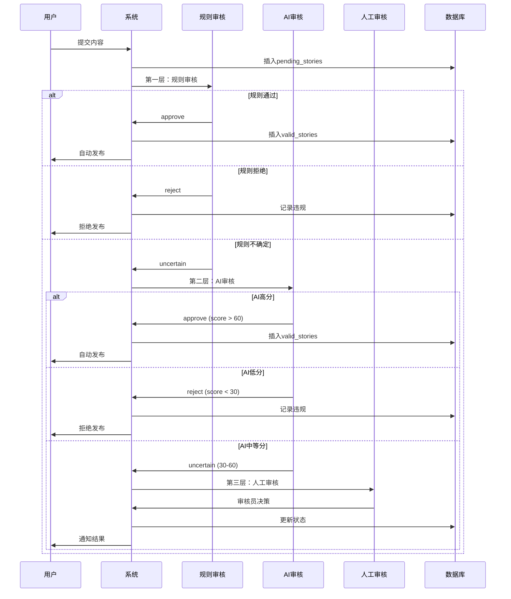
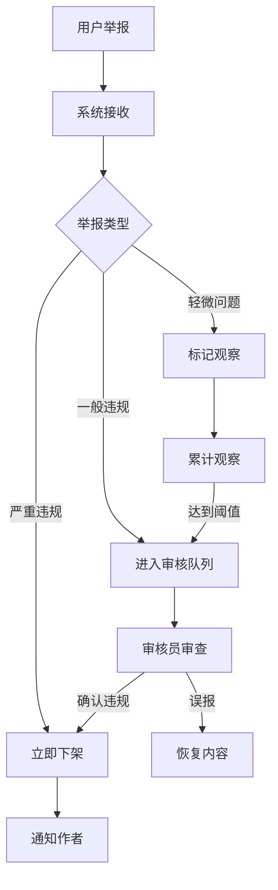

# 🛡️ 审核系统功能文档

> **模块**: 内容审核与安全管理  
> **完成度**: 100%  
> **最后更新**: 2025年10月7日

## 📋 模块概述

### 基本信息
- **模块名称**: 三层审核系统
- **负责范围**: 内容审核、AI辅助审核、人工审核、信誉管理、举报处理
- **技术栈**: Cloudflare Workers AI + 规则引擎 + 人工审核
- **依赖模块**: 认证系统、故事系统、AI服务

### 系统架构
审核系统采用**三层渐进式审核架构**：

```
第一层：规则审核（Rule-Based）
├── 敏感词过滤
├── 长度检查
├── 格式验证
└── 快速决策（通过/拒绝/不确定）

第二层：AI审核（AI-Powered）
├── 内容质量评分
├── 安全性检测
├── 相关性分析
└── 智能决策（通过/拒绝/需人工）

第三层：人工审核（Human Review）
├── 审核员队列
├── 详细审查
├── 最终决策
└── 免疫标记
```

---

## 🎯 功能清单

### 1. 三层审核流程

#### 功能ID: REVIEW-001
- **角色**: 系统自动
- **用途**: 自动化内容审核
- **API端点**: 
  - `POST /api/audit/check` - 内容审核检查
  - `POST /api/audit/test` - 审核测试
  - `GET /api/audit/stats` - 审核统计
- **数据库表**: 
  - `pending_stories` - 待审核内容
  - `audit_records` - 审核记录
  - `violation_records` - 违规记录
- **核心服务**: 
  - `StoryAuditController` - 审核流程控制器
  - `TieredAuditManager` - 三层审核管理器
  - `BatchAIAuditService` - AI批量审核服务
- **测试覆盖**: ✅ 完整测试
- **相关文档**: [故事审核系统](../../../../STORY_REVIEW_SYSTEM_SUMMARY.md)

#### 实现细节

**审核流程图**:


**规则审核实现**:
```typescript
class TieredAuditManager {
  checkContent(content: string, contentType: string, userIP?: string): AuditResult {
    // 1. 预处理
    const processed = this.preprocessText(content);
    
    // 2. 敏感词检查
    const sensitiveWords = this.checkSensitiveWords(processed);
    if (sensitiveWords.length > 0) {
      return {
        action: 'reject',
        reason: '包含敏感词',
        violations: sensitiveWords,
        riskScore: 100
      };
    }
    
    // 3. 长度检查
    if (content.length < 50) {
      return {
        action: 'reject',
        reason: '内容过短',
        riskScore: 80
      };
    }
    
    // 4. 格式检查
    const formatCheck = this.checkFormat(content);
    if (!formatCheck.valid) {
      return {
        action: 'reject',
        reason: formatCheck.reason,
        riskScore: 70
      };
    }
    
    // 5. 无明显问题，进入AI审核
    return {
      action: 'uncertain',
      reason: '需要AI审核',
      riskScore: 50
    };
  }
}
```

**AI审核实现**:
```typescript
class BatchAIAuditService {
  async auditContent(content: string, contentType: string): Promise<AIAuditResult> {
    // 调用Cloudflare Workers AI
    const response = await this.env.AI.run('@cf/meta/llama-2-7b-chat-int8', {
      messages: [
        {
          role: 'system',
          content: '你是内容审核助手，评估内容的质量、安全性和相关性。'
        },
        {
          role: 'user',
          content: `请评估以下内容：\n\n${content}\n\n请给出质量分(0-100)、安全分(0-100)、相关分(0-100)。`
        }
      ]
    });
    
    const scores = this.parseAIResponse(response);
    
    // 综合评分
    const finalScore = (scores.quality + scores.safety + scores.relevance) / 3;
    
    // 决策逻辑
    if (finalScore >= 60) {
      return { decision: 'approve', score: finalScore, scores };
    } else if (finalScore < 30) {
      return { decision: 'reject', score: finalScore, scores };
    } else {
      return { decision: 'manual_review', score: finalScore, scores };
    }
  }
}
```

---

### 2. 审核员工作流程

#### 功能ID: REVIEW-002
- **角色**: 审核员
- **用途**: 人工审核待审内容
- **API端点**: 
  - `GET /api/simple-reviewer/pending-reviews` - 待审核列表
  - `POST /api/simple-reviewer/submit-review` - 提交审核结果
  - `GET /api/simple-reviewer/review-history` - 审核历史
- **数据库表**: 
  - `manual_review_queue` - 人工审核队列
  - `reviewer_activity_logs` - 审核员活动日志
- **前端页面**: 
  - `/reviewer/pending-reviews` - 待审核列表
  - `/reviewer/review-history` - 审核历史
- **测试覆盖**: ✅ 完整测试
- **相关文档**: [审核员系统](../../../../REVIEWER-SYSTEM-STATUS-REPORT.md)

#### 审核员界面功能

**待审核列表**:
```typescript
interface PendingReview {
  id: number;
  content_type: 'story' | 'heart_voice';
  content_id: number;
  title: string;
  content: string;
  author: string;
  submitted_at: string;
  ai_score?: number;
  ai_reason?: string;
  priority: 'high' | 'medium' | 'low';
}
```

**审核操作**:
```typescript
interface ReviewSubmission {
  review_id: number;
  decision: 'approve' | 'reject' | 'flag';
  reviewer_id: string;
  notes?: string;
  grant_immunity?: boolean;  // 授予免疫（跳过未来审核）
}
```

**审核统计**:
- 今日审核数量
- 通过率
- 平均审核时间
- 审核质量评分

---

### 3. AI审核配置管理

#### 功能ID: REVIEW-003
- **角色**: 管理员
- **用途**: 配置AI审核参数
- **API端点**: 
  - `GET /api/simple-admin/ai-moderation/config` - 获取配置
  - `POST /api/simple-admin/ai-moderation/config` - 更新配置
  - `GET /api/simple-admin/ai-moderation/stats` - AI审核统计
- **数据库表**: 
  - `audit_config` - 审核配置表
  - `ai_audit_batches` - AI审核批次表
- **前端页面**: 
  - `/admin/ai-moderation` - AI审核配置
- **测试覆盖**: ✅ 完整测试
- **相关文档**: [AI审核集成](../../../../AI-CONTENT-MODERATION-COMPLETE-INTEGRATION-REPORT.md)

#### 配置项

**审核模式**:
```typescript
type AuditMode = 
  | 'disabled'      // 关闭审核
  | 'local_only'    // 仅本地规则
  | 'ai_only'       // 仅AI审核
  | 'human_only'    // 仅人工审核
  | 'local_ai'      // 本地规则 + AI审核（推荐）
  | 'local_human';  // 本地规则 + 人工审核
```

**AI提供商配置**:
```typescript
interface AIProviderConfig {
  provider: 'openai' | 'grok' | 'claude' | 'gemini' | 'workers-ai';
  enabled: boolean;
  priority: number;
  apiKey?: string;
  model?: string;
  maxTokens?: number;
  temperature?: number;
}
```

**审核阈值**:
```typescript
interface AuditThresholds {
  autoApproveScore: number;   // 自动通过阈值（默认60）
  autoRejectScore: number;    // 自动拒绝阈值（默认30）
  manualReviewScore: number;  // 人工审核阈值（30-60）
}
```

---

### 4. 信誉管理系统

#### 功能ID: REVIEW-004
- **角色**: 管理员
- **用途**: 管理用户信誉和恶意行为
- **API端点**: 
  - `GET /api/simple-admin/reports/admin/malicious-users` - 恶意用户列表
  - `GET /api/simple-admin/reports/admin/report-records` - 举报记录
  - `POST /api/simple-admin/reputation/update` - 更新信誉
- **数据库表**: 
  - `user_reputation` - 用户信誉表
  - `user_violation_analysis` - 用户违规分析表
  - `malicious_user_detection` - 恶意用户检测表
- **前端页面**: 
  - `/admin/reputation-management` - 信誉管理
- **测试覆盖**: ✅ 完整测试
- **相关文档**: [信誉管理系统](../../../../ADMIN_REPUTATION_MANAGEMENT_FIX_REPORT.md)

#### 信誉计算

**信誉分计算公式**:
```typescript
function calculateReputationScore(user: User): number {
  const baseScore = 100;
  
  // 违规扣分
  const violationPenalty = user.violationCount * 10;
  
  // 举报扣分
  const reportPenalty = user.reportCount * 5;
  
  // 恶意举报扣分
  const maliciousReportPenalty = user.maliciousReportCount * 20;
  
  // 优质内容加分
  const qualityBonus = user.approvedContentCount * 2;
  
  // 最终分数
  const finalScore = baseScore 
    - violationPenalty 
    - reportPenalty 
    - maliciousReportPenalty 
    + qualityBonus;
  
  return Math.max(0, Math.min(100, finalScore));
}
```

**恶意用户检测**:
```typescript
interface MaliciousUserCriteria {
  violationCount: number;      // 违规次数 > 5
  reportCount: number;         // 被举报次数 > 10
  maliciousReportRate: number; // 恶意举报率 > 50%
  reputationScore: number;     // 信誉分 < 30
  accountAge: number;          // 账号年龄 < 7天
}

function detectMaliciousUser(user: User): boolean {
  return (
    user.violationCount > 5 ||
    user.reportCount > 10 ||
    (user.maliciousReportCount / user.totalReportCount) > 0.5 ||
    user.reputationScore < 30
  );
}
```

---

### 5. 举报处理系统

#### 功能ID: REVIEW-005
- **角色**: 所有用户
- **用途**: 举报不当内容
- **API端点**: 
  - `POST /api/reports` - 提交举报
  - `GET /api/reports/my-reports` - 我的举报
  - `POST /api/simple-admin/reports/handle` - 处理举报
- **数据库表**: 
  - `content_reports` - 内容举报表
  - `report_handling_records` - 举报处理记录表
- **前端页面**: 
  - 故事详情页举报按钮
  - `/admin/report-management` - 举报管理
- **测试覆盖**: ✅ 完整测试
- **相关文档**: [内容审核系统](../../../../CONTENT_REVIEW_SYSTEM_IMPLEMENTATION.md)

#### 举报类型

```typescript
type ReportType = 
  | 'spam'              // 垃圾信息
  | 'harassment'        // 骚扰
  | 'hate_speech'       // 仇恨言论
  | 'violence'          // 暴力内容
  | 'sexual_content'    // 色情内容
  | 'misinformation'    // 虚假信息
  | 'copyright'         // 侵权
  | 'other';            // 其他
```

**举报处理流程**:


---

## 📊 数据库设计

### 待审核故事表
```sql
CREATE TABLE pending_stories (
  id INTEGER PRIMARY KEY AUTOINCREMENT,
  user_id TEXT NOT NULL,
  title TEXT NOT NULL,
  content TEXT NOT NULL,
  
  -- 审核状态
  status TEXT DEFAULT 'pending' CHECK (status IN (
    'pending', 'rule_checking', 'rule_passed',
    'ai_checking', 'ai_passed', 'manual_review',
    'approved', 'rejected'
  )),
  audit_level INTEGER DEFAULT 1,
  
  -- 审核时间
  created_at DATETIME DEFAULT CURRENT_TIMESTAMP,
  rule_audit_at DATETIME,
  ai_audit_at DATETIME,
  manual_audit_at DATETIME,
  approved_at DATETIME,
  
  -- 审核结果
  rule_audit_result TEXT,
  ai_audit_result TEXT,
  manual_audit_result TEXT
);
```

### 审核记录表
```sql
CREATE TABLE audit_records (
  id INTEGER PRIMARY KEY AUTOINCREMENT,
  content_type TEXT NOT NULL,
  content_id INTEGER NOT NULL,
  audit_level TEXT NOT NULL,
  audit_result TEXT NOT NULL,
  auditor_id TEXT,
  audited_at DATETIME DEFAULT CURRENT_TIMESTAMP,
  
  -- 详细信息
  risk_score INTEGER,
  violations TEXT,  -- JSON
  notes TEXT
);
```

### 用户信誉表
```sql
CREATE TABLE user_reputation (
  user_id TEXT PRIMARY KEY,
  reputation_score INTEGER DEFAULT 100,
  violation_count INTEGER DEFAULT 0,
  report_count INTEGER DEFAULT 0,
  malicious_report_count INTEGER DEFAULT 0,
  approved_content_count INTEGER DEFAULT 0,
  last_updated DATETIME DEFAULT CURRENT_TIMESTAMP
);
```

---

## ⚠️ 常见问题排查

### 问题1: 内容一直pending不发布

**原因**: AI审核服务不可用或人工审核队列积压

**解决方案**:
```bash
# 1. 检查AI服务状态
curl https://api.cloudflare.com/client/v4/accounts/{account_id}/ai/status

# 2. 手动批准pending内容
UPDATE pending_stories
SET status = 'approved', approved_at = CURRENT_TIMESTAMP
WHERE id = xxx;

# 3. 移动到valid_stories
INSERT INTO valid_stories SELECT * FROM pending_stories WHERE id = xxx;
```

---

### 问题2: 误判率过高

**原因**: 规则过于严格或AI模型不准确

**解决方案**:
```typescript
// 1. 调整审核阈值
const config = {
  autoApproveScore: 50,  // 降低自动通过阈值
  autoRejectScore: 20,   // 降低自动拒绝阈值
};

// 2. 优化敏感词库
const sensitiveWords = [
  // 移除误判词汇
  // 添加真正的违规词
];

// 3. 切换AI模型
const aiConfig = {
  provider: 'claude',  // 使用更准确的模型
  model: 'claude-3-sonnet'
};
```

---

### 问题3: 审核员队列积压

**原因**: 人工审核任务过多

**解决方案**:
```typescript
// 1. 提高AI自动通过率
const config = {
  autoApproveScore: 55,  // 从60降到55
};

// 2. 增加审核员
// 在管理后台添加更多审核员账号

// 3. 批量处理
// 提供批量审核功能
async function batchApprove(ids: number[]) {
  await db.execute(`
    UPDATE pending_stories
    SET status = 'approved'
    WHERE id IN (${ids.join(',')})
  `);
}
```

---

## 📈 性能指标

- **规则审核速度**: < 100ms
- **AI审核速度**: < 2s
- **人工审核时间**: < 24h
- **误判率**: < 5%
- **自动通过率**: > 70%

---

## 🎯 最佳实践

### 1. 审核配置
- 使用 `local_ai` 模式（规则+AI）
- 设置合理的阈值（60/30）
- 定期审查误判案例

### 2. 审核员管理
- 培训审核员
- 监控审核质量
- 定期轮换审核员

### 3. 用户体验
- 提供审核进度反馈
- 明确拒绝原因
- 允许申诉机制

---

## 📚 相关文档

- [故事审核系统](../../../../STORY_REVIEW_SYSTEM_SUMMARY.md)
- [AI审核集成](../../../../AI-CONTENT-MODERATION-COMPLETE-INTEGRATION-REPORT.md)
- [审核员系统](../../../../REVIEWER-SYSTEM-STATUS-REPORT.md)
- [信誉管理](../../../../ADMIN_REPUTATION_MANAGEMENT_FIX_REPORT.md)
- [内容审核实现](../../../../CONTENT_REVIEW_SYSTEM_IMPLEMENTATION.md)
