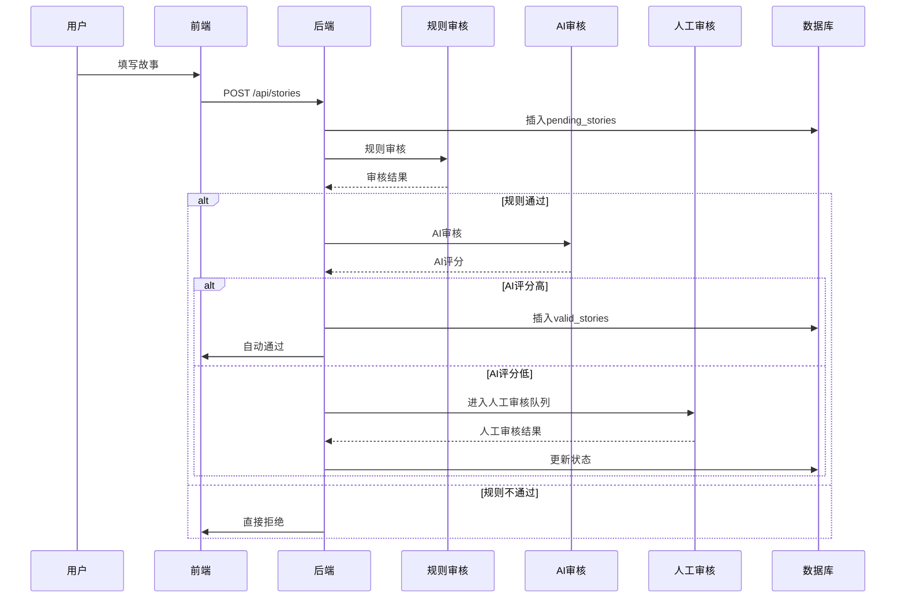
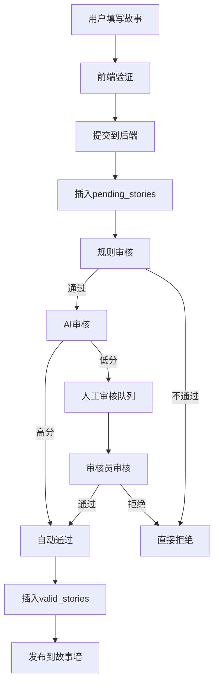
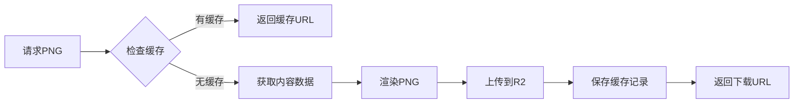

# 📖 故事系统功能文档

> **模块**: 故事分享与社区互动  
> **完成度**: 100%  
> **最后更新**: 2025年10月7日

## 📋 模块概述

### 基本信息
- **模块名称**: 故事墙系统
- **负责范围**: 故事发布、浏览、审核、PNG卡片生成、社区互动
- **技术栈**: React + TypeScript + D1 + R2 Storage + AI审核
- **依赖模块**: 认证系统、审核系统、AI服务

### 系统架构
故事系统采用**三层审核架构** + **PNG卡片生成**：

```
故事提交
├── 规则审核（自动）
├── AI审核（自动）
├── 人工审核（可选）
└── 发布到故事墙

PNG卡片生成
├── 内容渲染
├── 主题样式
├── R2存储
└── 缓存管理
```

---

## 🎯 功能清单

### 1. 故事发布

#### 功能ID: STORY-001
- **角色**: 已登录用户
- **用途**: 发布求职经历故事
- **API端点**: 
  - `POST /api/stories` - 提交故事
  - `GET /api/stories/my-stories` - 我的故事列表
- **数据库表**: 
  - `pending_stories` - 待审核故事表
  - `valid_stories` - 已发布故事表
  - `raw_story_submissions` - 原始提交表
- **前端页面**: 
  - `/story-publish` - 故事发布页
  - `/my-content` - 我的内容管理
- **测试覆盖**: ✅ 完整测试
- **相关文档**: [故事发布迁移](../../../../STORY_PUBLISH_MIGRATION.md)

#### 实现细节

**提交流程**:


**数据结构**:
```typescript
interface StorySubmission {
  user_id: string;
  title: string;
  content: string;
  category: 'job_search' | 'career_change' | 'success' | 'challenge' | 'advice';
  tags: string[];
  author_name?: string;
  is_anonymous?: boolean;
}
```

**三层审核机制**:
```typescript
// 1. 规则审核
const ruleCheck = {
  minLength: 50,        // 最小字数
  maxLength: 5000,      // 最大字数
  bannedWords: [...],   // 禁用词列表
  requiredFields: ['title', 'content', 'category']
};

// 2. AI审核
const aiCheck = {
  qualityScore: 0-100,  // 内容质量评分
  safetyScore: 0-100,   // 安全性评分
  relevanceScore: 0-100,// 相关性评分
  threshold: 60         // 自动通过阈值
};

// 3. 人工审核
const manualReview = {
  trigger: aiScore < 60,  // 触发条件
  reviewers: ['admin', 'reviewer'],
  actions: ['approve', 'reject', 'request_edit']
};
```

---

### 2. 故事浏览

#### 功能ID: STORY-002
- **角色**: 所有用户
- **用途**: 浏览已发布的故事
- **API端点**: 
  - `GET /api/stories` - 故事列表（分页、筛选、排序）
  - `GET /api/stories/:id` - 故事详情
  - `GET /api/stories/featured` - 精选故事
- **数据库表**: 
  - `valid_stories` - 已发布故事表
- **前端页面**: 
  - `/stories` - 故事墙
  - `/stories/:id` - 故事详情页
- **测试覆盖**: ✅ 完整测试
- **相关文档**: [故事管理功能](../../../../STORY_MANAGEMENT_FEATURE.md)

#### 查询参数

**列表查询**:
```typescript
interface StoryListQuery {
  page?: number;          // 页码，默认1
  pageSize?: number;      // 每页数量，默认20
  category?: string;      // 分类筛选
  tags?: string;          // 标签筛选（逗号分隔）
  sortBy?: 'approved_at' | 'like_count' | 'view_count';
  sortOrder?: 'asc' | 'desc';
  published?: boolean;    // 是否只显示已发布，默认true
}
```

**精选故事算法**:
```sql
SELECT * FROM valid_stories
WHERE audit_status = 'approved'
ORDER BY like_count DESC, view_count DESC
LIMIT 6
```

---

### 3. PNG卡片生成

#### 功能ID: STORY-003
- **角色**: 系统自动 + 用户手动
- **用途**: 生成精美的分享卡片
- **API端点**: 
  - `POST /api/png-management/generate` - 生成PNG卡片
  - `GET /api/stories/:id/png` - 获取故事PNG
  - `POST /api/png-management/cache/clear` - 清除缓存
- **数据库表**: 
  - `png_cards` - PNG卡片记录表
  - `png_generation_cache` - 生成缓存表
- **R2存储**: 
  - Bucket: `employment-survey-storage`
  - 路径: `png-cards/{cardId}.png`
- **测试覆盖**: ✅ 完整测试
- **相关文档**: [PNG缓存管理](../../../../scripts/README-PNG-CACHE.md)

#### 实现细节

**生成流程**:
```typescript
class IntegratedPngService {
  async generatePng(contentType: 'story' | 'heart_voice', contentId: string, theme: string) {
    // 1. 检查缓存
    const cached = await this.cacheService.getCacheEntry(contentType, contentId, theme);
    if (cached) return cached;
    
    // 2. 获取内容数据
    const contentData = await this.getContentData(contentType, contentId);
    
    // 3. 生成PNG
    const pngBuffer = await this.pngGenerator.generateStoryPng(contentData, {
      theme,
      quality: 0.9,
      watermark: true,
      retina: false
    });
    
    // 4. 上传到R2
    const r2Key = `png-cards/${contentType}-${contentId}-${theme}-${Date.now()}.png`;
    await this.r2Service.uploadFile(r2Key, pngBuffer);
    
    // 5. 保存缓存记录
    await this.cacheService.saveCacheEntry({
      contentType,
      contentId,
      theme,
      r2Key,
      downloadUrl: `https://r2.domain.com/${r2Key}`,
      fileSize: pngBuffer.length
    });
    
    return { downloadUrl, r2Key };
  }
}
```

**支持的主题**:
- `gradient` - 渐变主题
- `minimal` - 简约主题
- `elegant` - 优雅主题
- `modern` - 现代主题

**缓存策略**:
```typescript
// 缓存键格式
const cacheKey = `${contentType}:${contentId}:${theme}`;

// 缓存失效条件
const invalidateCache = {
  contentUpdated: true,    // 内容更新
  themeChanged: true,      // 主题变更
  manualClear: true,       // 手动清除
  ttl: 30 * 24 * 60 * 60  // 30天过期
};
```

---

### 4. 社区互动

#### 功能ID: STORY-004
- **角色**: 所有用户
- **用途**: 点赞、踩、浏览计数
- **API端点**: 
  - `POST /api/stories/:id/like` - 点赞
  - `POST /api/stories/:id/dislike` - 踩
  - `GET /api/stories/:id` - 自动增加浏览量
- **数据库表**: 
  - `valid_stories` - 存储计数
  - `story_likes` - 点赞记录
  - `story_dislikes` - 踩记录
- **前端页面**: 
  - `/stories/:id` - 故事详情页
- **测试覆盖**: ✅ 单元测试

#### 实现细节

**点赞逻辑**:
```typescript
// 防重复点赞
const existingLike = await db.queryFirst(`
  SELECT id FROM story_likes
  WHERE story_id = ? AND user_id = ?
`, [storyId, userId]);

if (existingLike) {
  return { success: false, message: '已经点赞过了' };
}

// 增加点赞数
await db.execute(`
  UPDATE valid_stories
  SET like_count = like_count + 1
  WHERE id = ?
`, [storyId]);

// 记录点赞
await db.execute(`
  INSERT INTO story_likes (story_id, user_id, ip_address)
  VALUES (?, ?, ?)
`, [storyId, userId, ipAddress]);
```

**浏览计数**:
```typescript
// 每次访问详情页自动增加
await db.execute(`
  UPDATE valid_stories
  SET view_count = view_count + 1
  WHERE id = ?
`, [storyId]);
```

---

### 5. 故事审核管理

#### 功能ID: STORY-005
- **角色**: 审核员、管理员
- **用途**: 审核待发布的故事
- **API端点**: 
  - `GET /api/simple-reviewer/pending-reviews` - 待审核列表
  - `POST /api/simple-reviewer/submit-review` - 提交审核
  - `GET /api/simple-admin/stories` - 故事管理
- **数据库表**: 
  - `pending_stories` - 待审核故事
  - `audit_records` - 审核记录
  - `violation_content` - 违规内容
- **前端页面**: 
  - `/reviewer/pending-reviews` - 审核员审核页
  - `/admin/story-management` - 管理员故事管理
- **测试覆盖**: ✅ 完整测试
- **相关文档**: [故事审核系统](../../../../STORY_REVIEW_SYSTEM_SUMMARY.md)

#### 审核状态流转

```
pending (待审核)
  ↓
rule_checking (规则审核中)
  ↓
rule_passed (规则通过) → rule_rejected (规则拒绝)
  ↓
ai_checking (AI审核中)
  ↓
ai_passed (AI通过) → manual_review (需人工审核)
  ↓                      ↓
approved (最终通过)  ←  manual_approved
  ↓
published (已发布)
```

---

## 🔗 共用组件

### 后端组件

1. **StoryAuditController** (`backend/src/services/storyAuditController.ts`)
   - 三层审核流程控制
   - 状态管理
   - 审核结果处理

2. **IntegratedPngService** (`backend/src/services/integratedPngService.ts`)
   - PNG卡片生成
   - R2存储管理
   - 缓存管理

3. **PngGenerator** (`backend/src/services/pngGenerator.ts`)
   - 图片渲染
   - 主题样式
   - 水印添加

4. **R2Service** (`backend/src/services/r2Service.ts`)
   - R2文件上传
   - 文件删除
   - URL生成

### 前端组件

1. **StoryPublishForm** (`frontend/src/components/stories/StoryPublishForm.tsx`)
   - 故事发布表单
   - 富文本编辑器
   - 分类和标签选择

2. **StoryCard** (`frontend/src/components/stories/StoryCard.tsx`)
   - 故事卡片展示
   - 互动按钮
   - 分享功能

3. **StoryWall** (`frontend/src/components/stories/StoryWall.tsx`)
   - 瀑布流布局
   - 无限滚动
   - 筛选和排序

4. **PngCardPreview** (`frontend/src/components/stories/PngCardPreview.tsx`)
   - PNG卡片预览
   - 主题切换
   - 下载功能

---

## 📊 数据流

### 故事发布流程



### PNG生成流程



---

## 📈 数据库设计

### 待审核故事表
```sql
CREATE TABLE pending_stories (
  id INTEGER PRIMARY KEY AUTOINCREMENT,
  user_id TEXT NOT NULL,
  title TEXT NOT NULL,
  content TEXT NOT NULL,
  category TEXT DEFAULT 'general',
  tags TEXT DEFAULT '[]',
  author_name TEXT DEFAULT '匿名用户',
  
  -- 审核状态
  status TEXT DEFAULT 'pending',
  audit_level INTEGER DEFAULT 1,
  
  -- 审核时间
  created_at DATETIME DEFAULT CURRENT_TIMESTAMP,
  rule_audit_at DATETIME,
  ai_audit_at DATETIME,
  manual_audit_at DATETIME,
  approved_at DATETIME,
  
  -- 审核结果
  rule_audit_result TEXT,
  ai_audit_result TEXT,
  manual_audit_result TEXT,
  
  -- 元数据
  user_ip TEXT,
  user_agent TEXT
);
```

### 已发布故事表
```sql
CREATE TABLE valid_stories (
  id INTEGER PRIMARY KEY AUTOINCREMENT,
  raw_id INTEGER,
  data_uuid TEXT UNIQUE NOT NULL,
  user_id TEXT NOT NULL,
  title TEXT NOT NULL,
  content TEXT NOT NULL,
  category TEXT DEFAULT 'general',
  tags TEXT DEFAULT '[]',
  author_name TEXT DEFAULT '匿名用户',
  
  -- 审核状态
  audit_status TEXT DEFAULT 'approved',
  approved_at DATETIME DEFAULT CURRENT_TIMESTAMP,
  
  -- 互动数据
  like_count INTEGER DEFAULT 0,
  dislike_count INTEGER DEFAULT 0,
  view_count INTEGER DEFAULT 0,
  
  -- 发布状态
  is_featured INTEGER DEFAULT 0,
  published_at DATETIME,
  
  FOREIGN KEY (raw_id) REFERENCES pending_stories(id)
);
```

### PNG卡片表
```sql
CREATE TABLE png_cards (
  id INTEGER PRIMARY KEY AUTOINCREMENT,
  content_type TEXT NOT NULL,
  content_id TEXT NOT NULL,
  card_id TEXT UNIQUE NOT NULL,
  r2_key TEXT NOT NULL,
  download_url TEXT NOT NULL,
  theme TEXT DEFAULT 'gradient',
  file_size INTEGER,
  created_at DATETIME DEFAULT CURRENT_TIMESTAMP,
  
  UNIQUE(content_type, content_id, theme)
);
```

---

## ⚠️ 常见问题排查

### 问题1: 故事提交后一直pending

**现象**:
- 故事提交成功但不显示
- 状态一直是pending

**原因**:
- 审核流程卡住
- AI服务不可用
- 人工审核队列积压

**解决方案**:
```bash
# 1. 检查审核状态
SELECT id, status, audit_level, created_at
FROM pending_stories
WHERE user_id = 'xxx'
ORDER BY created_at DESC;

# 2. 手动推进审核
UPDATE pending_stories
SET status = 'approved', approved_at = CURRENT_TIMESTAMP
WHERE id = xxx;

# 3. 移动到valid_stories
INSERT INTO valid_stories (...)
SELECT ... FROM pending_stories WHERE id = xxx;
```

---

### 问题2: PNG卡片生成失败

**现象**:
- 点击生成PNG无响应
- 返回500错误

**原因**:
- R2存储配置错误
- 内容数据不完整
- 渲染引擎错误

**解决方案**:
```typescript
// 1. 检查R2配置
const r2Config = {
  accountId: env.R2_ACCOUNT_ID,
  accessKeyId: env.R2_ACCESS_KEY_ID,
  secretAccessKey: env.R2_SECRET_ACCESS_KEY,
  bucket: 'employment-survey-storage'
};

// 2. 验证内容数据
const story = await db.queryFirst('SELECT * FROM valid_stories WHERE id = ?', [id]);
if (!story) {
  throw new Error('Story not found');
}

// 3. 清除缓存重试
await pngService.clearCache(contentType, contentId);
await pngService.generatePng(contentType, contentId, theme);
```

---

### 问题3: 点赞/踩不生效

**现象**:
- 点击点赞按钮无反应
- 计数不增加

**原因**:
- 用户未登录
- 重复点赞
- 数据库更新失败

**解决方案**:
```typescript
// 1. 检查登录状态
const user = authService.getCurrentUser();
if (!user) {
  return { error: '请先登录' };
}

// 2. 检查是否已点赞
const existing = await db.queryFirst(`
  SELECT id FROM story_likes
  WHERE story_id = ? AND user_id = ?
`, [storyId, user.id]);

if (existing) {
  return { error: '已经点赞过了' };
}

// 3. 使用事务确保一致性
await db.transaction(async (tx) => {
  await tx.execute('UPDATE valid_stories SET like_count = like_count + 1 WHERE id = ?', [storyId]);
  await tx.execute('INSERT INTO story_likes (story_id, user_id) VALUES (?, ?)', [storyId, user.id]);
});
```

---

## 📈 性能指标

- **故事列表加载**: < 500ms
- **故事详情加载**: < 300ms
- **PNG生成时间**: < 3s
- **审核处理时间**: < 2s (自动) / < 24h (人工)
- **并发提交支持**: 200+ req/s

---

## 🎯 最佳实践

### 1. 内容质量
- 鼓励真实经历分享
- 提供写作指南
- 设置字数要求（50-5000字）

### 2. 审核效率
- 规则审核快速过滤
- AI审核减少人工负担
- 人工审核处理边缘案例

### 3. 用户体验
- 提交后即时反馈
- 审核进度透明
- 拒绝原因明确

### 4. 性能优化
- PNG缓存机制
- 图片懒加载
- 分页加载故事

---

## 📚 相关文档

- [故事发布迁移](../../../../STORY_PUBLISH_MIGRATION.md)
- [故事管理功能](../../../../STORY_MANAGEMENT_FEATURE.md)
- [故事审核系统](../../../../STORY_REVIEW_SYSTEM_SUMMARY.md)
- [PNG缓存管理](../../../../scripts/README-PNG-CACHE.md)
- [审核系统](../review/README.md)
- [AI审核集成](../../../../AI-CONTENT-MODERATION-COMPLETE-INTEGRATION-REPORT.md)
