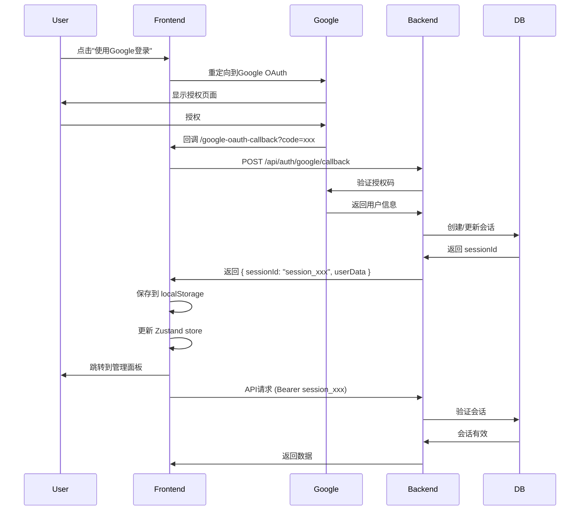

# 超级管理员Google OAuth登录后闪退问题修复文档

## 📋 问题概述

**问题描述**：超级管理员使用Google OAuth登录后，能成功跳转到`/admin/super-admin-panel`，但页面立即闪退并重定向到登录页。

**影响范围**：
- ✅ 普通管理员和审核员不受影响
- ❌ 超级管理员无法使用任何功能
- ❌ 所有超级管理员专属API返回401

**发生时间**：2025-10-06

**修复状态**：✅ 已完全修复

---

## 🔍 问题诊断过程

### 1. 初步现象
```
用户操作流程：
1. 访问 /unified-login
2. 选择"超级管理员"标签
3. 点击"使用Google登录"
4. Google OAuth认证成功
5. 回调到 /google-oauth-callback
6. 跳转到 /admin/super-admin-panel ✅
7. 页面立即闪退，重定向到 /unified-login ❌
```

### 2. 控制台日志分析

**成功部分**：
```javascript
[GoogleOAuthCallback] 📝 Saving auth data: Object
[GoogleOAuthCallback] 🔄 Updating Zustand store state...
[SUPER_ADMIN_AUTH] 🔄 Setting auth state directly: Object
[SUPER_ADMIN_AUTH] ✅ Auth state saved to localStorage
```

**失败部分**：
```javascript
[ADMIN_API_CLIENT] Token type: { 
  isSimpleAuth: undefined, 
  isSession: undefined, 
  tokenPreview: 'undefined...' 
}
[ADMIN_API_CLIENT] ❌ Super admin API returned 401
```

### 3. 关键发现

通过详细日志分析，发现：
1. ✅ Google OAuth登录成功
2. ✅ Token被保存到localStorage（格式：`session_175976888494_xxxxx`）
3. ✅ Zustand store状态更新成功
4. ❌ 第一次API请求时，token被判定为**无效格式**并清除
5. ❌ 后续API请求时，token为`undefined`
6. ❌ 返回401并触发重定向

---

## 🐛 根本原因

### Token格式验证逻辑不完整

**问题代码位置**：`reviewer-admin-dashboard/src/services/adminApiClient.ts`

**原始代码**（第32-42行）：
```typescript
// 🔍 检查token格式 - 支持两种格式：
// 1. UUID格式（新的会话ID）: xxxxxxxx-xxxx-xxxx-xxxx-xxxxxxxxxxxx
// 2. JWT格式（旧的简单认证）: eyJ...
const uuidRegex = /^[0-9a-f]{8}-[0-9a-f]{4}-[0-9a-f]{4}-[0-9a-f]{4}-[0-9a-f]{12}$/i;
const jwtRegex = /^eyJ[A-Za-z0-9_-]+\.[A-Za-z0-9_-]+\.[A-Za-z0-9_-]+$/;

const isUUID = uuidRegex.test(token);
const isJWT = jwtRegex.test(token);

if (!isUUID && !isJWT) {
  // ❌ 清除token并重定向
}
```

**问题分析**：
- Google OAuth生成的token格式：`session_175976888494_xxxxx`
- 这个格式**既不是UUID也不是JWT**
- 被判定为无效token并清除
- 导致后续API请求失败

---

## 🔧 修复方案

### 修复内容

**文件**：`reviewer-admin-dashboard/src/services/adminApiClient.ts`

**修改位置**：第32-72行

**修复后代码**：
```typescript
if (token) {
  // 🔍 检查token格式 - 支持三种格式：
  // 1. Session格式（Google OAuth会话）: session_timestamp_randomhash
  // 2. UUID格式（会话ID）: xxxxxxxx-xxxx-xxxx-xxxx-xxxxxxxxxxxx
  // 3. JWT格式（旧的简单认证）: eyJ...
  const sessionRegex = /^session_[0-9]+_[a-z0-9]+$/;
  const uuidRegex = /^[0-9a-f]{8}-[0-9a-f]{4}-[0-9a-f]{4}-[0-9a-f]{4}-[0-9a-f]{12}$/i;
  const jwtRegex = /^eyJ[A-Za-z0-9_-]+\.[A-Za-z0-9_-]+\.[A-Za-z0-9_-]+$/;

  const isSession = sessionRegex.test(token);
  const isUUID = uuidRegex.test(token);
  const isJWT = jwtRegex.test(token);

  if (!isSession && !isUUID && !isJWT) {
    console.error('[ADMIN_API_CLIENT] ❌ 检测到无效token格式！');
    console.error('[ADMIN_API_CLIENT] Token:', token.substring(0, 50));
    console.error('[ADMIN_API_CLIENT] 期望格式: Session (session_xxx) / UUID / JWT');
    // ... 清除token并重定向
  }

  config.headers.Authorization = `Bearer ${token}`;
  const tokenType = isSession ? 'Session (OAuth)' : isUUID ? 'UUID (Session)' : 'JWT (Simple Auth)';
  console.log(`[ADMIN_API_CLIENT] ✅ Request with ${tokenType} token: ${token.substring(0, 20)}...`);
}
```

### 关键改动

1. **新增Session格式支持**：
   ```typescript
   const sessionRegex = /^session_[0-9]+_[a-z0-9]+$/;
   const isSession = sessionRegex.test(token);
   ```

2. **更新验证逻辑**：
   ```typescript
   if (!isSession && !isUUID && !isJWT) {
     // 只有三种格式都不匹配才判定为无效
   }
   ```

3. **增强日志输出**：
   ```typescript
   const tokenType = isSession ? 'Session (OAuth)' : 
                     isUUID ? 'UUID (Session)' : 
                     'JWT (Simple Auth)';
   console.log(`[ADMIN_API_CLIENT] ✅ Request with ${tokenType} token: ...`);
   ```

---

## ✅ 验证结果

### 修复前
```
[ADMIN_API_CLIENT] Token type: { isSimpleAuth: undefined, isSession: undefined }
[ADMIN_API_CLIENT] ❌ Super admin API returned 401
→ 页面闪退，重定向到登录页
```

### 修复后
```
[ADMIN_API_CLIENT] ✅ Request with Session (OAuth) token: session_175976888494...
[ADMIN_API_CLIENT] Response success: /api/super-admin/security/metrics
[ADMIN_API_CLIENT] Response status: 200
[ADMIN_API_CLIENT] Response success: /api/super-admin/project/status
[ADMIN_API_CLIENT] Response status: 200
[ADMIN_API_CLIENT] Response success: /api/super-admin/security/threats
[ADMIN_API_CLIENT] Response status: 200
→ 页面正常显示，所有功能可用 ✅
```

---

## 🧪 测试步骤

### 1. 清除缓存
```javascript
// 在浏览器控制台执行
localStorage.clear();
location.reload();
```

### 2. Google OAuth登录
1. 访问 `/unified-login`
2. 选择"超级管理员"标签
3. 点击"使用Google登录"
4. 选择超级管理员账号

### 3. 验证功能
访问以下页面，确认无闪退：
- ✅ 安全控制台 (`/admin/security-console`)
- ✅ 系统日志 (`/admin/system-logs`)
- ✅ 系统设置 (`/admin/system-settings`)
- ✅ 审计日志 (`/admin/audit-logs`)
- ✅ 诊断工具 (`/admin/diagnostics`)

### 4. 检查控制台日志
应该看到：
```
[ADMIN_API_CLIENT] ✅ Request with Session (OAuth) token: session_xxx...
[ADMIN_API_CLIENT] Response success: /api/super-admin/...
[ADMIN_API_CLIENT] Response status: 200
```

---

## 📚 相关技术要点

### Token格式说明

| 格式 | 示例 | 用途 | 来源 |
|------|------|------|------|
| **Session** | `session_175976888494_a1b2c3` | Google OAuth会话 | Google OAuth回调 |
| **UUID** | `550e8400-e29b-41d4-a716-446655440000` | 会话ID | 传统登录 |
| **JWT** | `eyJhbGciOiJIUzI1NiIsInR5cCI6IkpXVCJ9...` | 简单认证 | 旧版认证系统 |

### 认证流程



---

## 🔒 安全考虑

### Token验证最佳实践

1. **支持多种格式**：
   - 不要硬编码单一格式
   - 使用正则表达式灵活匹配
   - 预留扩展空间

2. **详细的错误日志**：
   ```typescript
   console.error('[ADMIN_API_CLIENT] Token:', token.substring(0, 50));
   console.error('[ADMIN_API_CLIENT] 期望格式: Session / UUID / JWT');
   ```

3. **优雅的降级处理**：
   - 清除无效token
   - 延迟跳转（让用户看到错误信息）
   - 重定向到登录页

---

## 📝 经验总结

### 问题定位技巧

1. **详细的日志**是关键：
   - 在关键节点添加日志
   - 记录token格式、长度、前缀
   - 记录验证结果

2. **分段验证**：
   - 先验证OAuth回调是否成功
   - 再验证token是否保存
   - 最后验证API请求是否携带token

3. **使用浏览器开发工具**：
   - Network标签查看请求头
   - Application标签查看localStorage
   - Console标签查看日志

### 预防措施

1. **Token格式文档化**：
   - 在代码注释中说明所有支持的格式
   - 在API文档中说明token规范

2. **单元测试**：
   ```typescript
   describe('Token Format Validation', () => {
     it('should accept session format', () => {
       expect(isValidToken('session_123456_abc')).toBe(true);
     });
     it('should accept UUID format', () => {
       expect(isValidToken('550e8400-e29b-41d4-a716-446655440000')).toBe(true);
     });
     it('should accept JWT format', () => {
       expect(isValidToken('eyJhbGciOiJIUzI1NiIsInR5cCI6IkpXVCJ9...')).toBe(true);
     });
   });
   ```

3. **集成测试**：
   - 测试完整的OAuth登录流程
   - 测试API请求是否携带正确的token
   - 测试token过期后的处理

---

## 🚀 部署清单

- [x] 修改 `adminApiClient.ts`
- [x] 构建前端：`npm run build`
- [x] 部署到Cloudflare Pages
- [x] 清除浏览器缓存测试
- [x] 验证所有超级管理员功能
- [x] 创建问题处理文档
- [x] 提交代码到Git仓库

---

## 📞 联系信息

**问题处理人**：AI Assistant  
**处理日期**：2025-10-06  
**文档版本**：v1.0  

---

## 附录：完整修改对比

### 修改前
```typescript
// 只支持UUID和JWT
const uuidRegex = /^[0-9a-f]{8}-[0-9a-f]{4}-[0-9a-f]{4}-[0-9a-f]{4}-[0-9a-f]{12}$/i;
const jwtRegex = /^eyJ[A-Za-z0-9_-]+\.[A-Za-z0-9_-]+\.[A-Za-z0-9_-]+$/;

const isUUID = uuidRegex.test(token);
const isJWT = jwtRegex.test(token);

if (!isUUID && !isJWT) {
  // 清除token
}
```

### 修改后
```typescript
// 支持Session、UUID和JWT
const sessionRegex = /^session_[0-9]+_[a-z0-9]+$/;
const uuidRegex = /^[0-9a-f]{8}-[0-9a-f]{4}-[0-9a-f]{4}-[0-9a-f]{4}-[0-9a-f]{12}$/i;
const jwtRegex = /^eyJ[A-Za-z0-9_-]+\.[A-Za-z0-9_-]+\.[A-Za-z0-9_-]+$/;

const isSession = sessionRegex.test(token);
const isUUID = uuidRegex.test(token);
const isJWT = jwtRegex.test(token);

if (!isSession && !isUUID && !isJWT) {
  // 清除token
}
```

---

**文档结束** ✅

