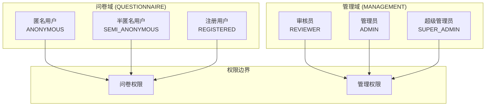
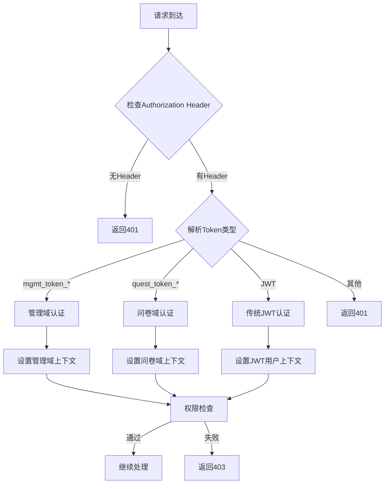

# 🏗️ 统一权限系统迁移计划

## 📊 **迁移概述**

### **目标**
将现有的双权限系统（问卷系统 + 管理系统）统一为单一、清晰的权限架构，同时保持功能完整性和用户体验。

### **核心原则**
1. **权限界清**: 问卷用户和管理用户权限完全分离
2. **向后兼容**: 现有功能不受影响
3. **渐进迁移**: 分阶段实施，降低风险
4. **统一中间件**: 后端使用统一认证逻辑

## 🎯 **权限界清设计**

### **用户域分离**



### **权限映射表**

| 用户类型 | 域 | 主要权限 | 访问路径 |
|---------|---|---------|---------|
| ANONYMOUS | 问卷域 | 浏览内容 | `/`, `/analytics`, `/stories` |
| SEMI_ANONYMOUS | 问卷域 | 填写问卷、发布内容 | 上述 + `/submit` |
| REGISTERED | 问卷域 | 管理个人内容、下载报告 | 上述 + `/my-*` |
| REVIEWER | 管理域 | 内容审核 | `/reviewer/*` |
| ADMIN | 管理域 | 用户管理、内容管理 | `/admin/*` |
| SUPER_ADMIN | 管理域 | 系统管理、所有权限 | `/admin/*` + 系统设置 |

## 📋 **分阶段迁移计划**

### **阶段1: 基础架构搭建** (已完成)
- [x] 创建统一类型定义 (`unified-auth.ts`)
- [x] 实现统一认证服务 (`unifiedAuthService.ts`)
- [x] 创建统一状态管理 (`unifiedAuthStore.ts`)
- [x] 开发统一路由守卫 (`UnifiedRouteGuard.tsx`)
- [x] 设计统一后端中间件 (`unifiedAuth.ts`)

### **阶段2: 兼容性层实现** (当前阶段)
```typescript
// 创建兼容性适配器
export const legacyAuthAdapter = {
  // 将旧的managementAuthStore调用转换为新的unifiedAuthStore
  adaptManagementAuth: (oldStore) => newStore,
  
  // 将旧的universalAuthStore调用转换为新的unifiedAuthStore
  adaptUniversalAuth: (oldStore) => newStore
};
```

### **阶段3: 前端逐步迁移**
1. **路由守卫替换**
   ```typescript
   // 替换所有旧的路由守卫
   // 旧: <AdminRouteGuard>
   // 新: <AdminRouteGuard> (使用统一实现)
   ```

2. **组件认证调用更新**
   ```typescript
   // 旧: const { currentUser } = useManagementAuthStore();
   // 新: const { currentUser } = useUnifiedAuthStore();
   ```

3. **API服务更新**
   ```typescript
   // 统一Token获取逻辑
   const token = unifiedAuthService.getAuthToken();
   ```

### **阶段4: 后端中间件迁移**
1. **替换认证中间件**
   ```typescript
   // 旧: admin.use('*', authMiddleware);
   // 新: admin.use('*', unifiedAuthMiddleware);
   ```

2. **更新权限检查**
   ```typescript
   // 旧: requireRole('admin', 'super_admin')
   // 新: requireUnifiedRole(UnifiedUserType.ADMIN, UnifiedUserType.SUPER_ADMIN)
   ```

### **阶段5: 清理和优化**
1. 删除旧的认证文件
2. 清理冗余代码
3. 更新文档
4. 性能优化

## 🔧 **统一中间件架构**

### **Token格式标准化**

```typescript
// 管理域Token格式
mgmt_token_{USER_TYPE}_{timestamp}
// 例: mgmt_token_SUPER_ADMIN_1727172000000

// 问卷域Token格式  
quest_token_{USER_TYPE}_{timestamp}
// 例: quest_token_SEMI_ANONYMOUS_1727172000000

// 传统JWT Token (向后兼容)
eyJhbGciOiJIUzI1NiIsInR5cCI6IkpXVCJ9...
```

### **中间件处理流程**



## 🚀 **立即执行步骤**

### **第一步: 修复当前管理员问题** (5分钟)
```bash
# 1. 更新管理员路由使用统一守卫
# 2. 修复Token格式生成
# 3. 部署前端修复
```

### **第二步: 后端中间件部署** (10分钟)
```bash
# 1. 部署统一认证中间件
# 2. 更新管理员路由使用新中间件
# 3. 测试API调用
```

### **第三步: 全面迁移** (30分钟)
```bash
# 1. 替换所有前端认证调用
# 2. 更新所有路由守卫
# 3. 测试完整流程
```

## 📊 **迁移验证清单**

### **功能验证**
- [ ] 匿名用户可以浏览内容
- [ ] 半匿名用户可以填写问卷和发布内容
- [ ] 注册用户可以管理个人内容
- [ ] 审核员可以审核内容
- [ ] 管理员可以管理用户和内容
- [ ] 超级管理员可以访问系统设置

### **权限边界验证**
- [ ] 问卷用户无法访问管理页面
- [ ] 管理用户可以访问问卷功能
- [ ] 不同管理角色权限正确分离
- [ ] API权限检查正确工作

### **兼容性验证**
- [ ] 现有用户会话继续有效
- [ ] 旧Token格式仍然被接受
- [ ] 数据库查询正常工作
- [ ] 第三方集成不受影响

## 🎯 **预期收益**

### **技术收益**
1. **代码简化**: 减少50%的认证相关代码
2. **维护性提升**: 统一的认证逻辑更易维护
3. **扩展性增强**: 新增用户类型更容易
4. **安全性提升**: 统一的安全检查

### **业务收益**
1. **用户体验**: 更清晰的权限边界
2. **开发效率**: 新功能开发更快
3. **运维简化**: 统一的监控和日志
4. **合规性**: 更好的权限审计

## 🚨 **风险控制**

### **回滚计划**
1. 保留旧认证系统代码
2. 使用特性开关控制迁移
3. 数据库备份和恢复方案
4. 快速回滚脚本

### **监控指标**
1. 认证成功率
2. API响应时间
3. 错误率监控
4. 用户投诉数量

---

**下一步行动**: 是否立即开始执行阶段2的兼容性层实现？
