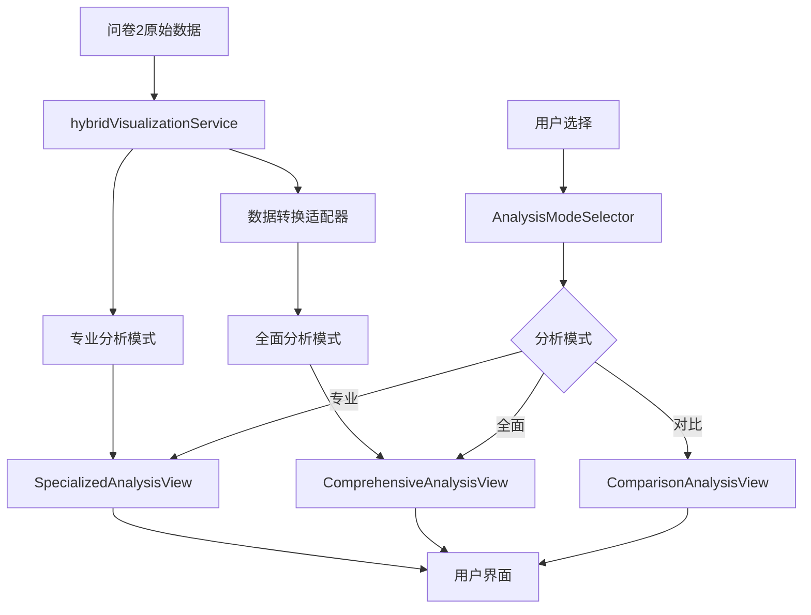

# 问卷2集成问卷1可视化系统实施方案

## 📋 项目概述

**目标**: 为问卷2实现问卷1的6维度全面分析框架，使两套可视化系统并存
**策略**: 保持问卷2特色功能的同时，增加问卷1的通用分析能力
**预期效果**: 问卷2既有专业特色分析，又有全面的数据展示能力

---

## 🎯 核心需求分析

### 当前状况
- **问卷2现有**: 3维度专业分析（经济压力、就业信心、现代负债）
- **问卷1优势**: 6维度全面框架（就业形势、人口结构、市场分析、就业准备、生活成本、政策洞察）
- **用户需求**: 既要专业深度，又要全面覆盖

### 集成目标
1. **保留问卷2特色**: 现代负债分析、就业信心指数等创新功能
2. **增加问卷1框架**: 6维度全面分析展示
3. **统一用户体验**: 无缝切换两种分析模式
4. **数据源统一**: 基于问卷2数据实现问卷1风格的分析

---

## 🏗️ 架构设计方案

### 整体架构
```
问卷2可视化系统 (Enhanced)
├── 专业分析模式 (问卷2特色)
│   ├── 经济压力分析
│   ├── 就业信心指数  
│   └── 现代负债分析
├── 全面分析模式 (问卷1框架)
│   ├── 就业形势总览
│   ├── 人口结构分析
│   ├── 就业市场深度分析
│   ├── 学生就业准备
│   ├── 生活成本与压力
│   └── 政策洞察与建议
└── 统一数据服务层
    ├── 问卷2原始数据
    ├── 数据转换适配器
    └── 双模式数据提供
```

### 技术架构层次

#### 1. 展示层 (Presentation Layer)
```typescript
SecondQuestionnaireAnalyticsPage.tsx (主页面)
├── AnalysisModeSelector (分析模式选择器)
├── SpecializedAnalysisView (专业分析视图 - 问卷2特色)
├── ComprehensiveAnalysisView (全面分析视图 - 问卷1框架)
└── SharedComponents (共享组件)
    ├── UniversalChart
    ├── DataInsightCard
    └── StatisticsSummary
```

#### 2. 服务层 (Service Layer)
```typescript
HybridVisualizationService (混合可视化服务)
├── questionnaire2VisualizationService (现有专业服务)
├── questionnaire1StyleAdapter (问卷1风格适配器)
├── dataTransformationService (数据转换服务)
└── unifiedDataProvider (统一数据提供者)
```

#### 3. 数据层 (Data Layer)
```typescript
问卷2数据源
├── API: /api/universal-questionnaire/statistics/questionnaire-v2-2024
├── 原始数据结构 (经济压力、就业信心、现代负债)
└── 转换后数据结构 (适配问卷1的6维度框架)
```

---

## 📊 数据映射策略

### 问卷2数据 → 问卷1框架映射

#### 1. 就业形势总览
```typescript
// 从问卷2数据提取就业相关信息
employmentOverview: {
  currentStatus: extractFromConfidenceData(),
  difficultyPerception: calculateFromPressureData(),
  salaryLevel: deriveFromDebtData()
}
```

#### 2. 人口结构分析
```typescript
// 基于问卷2的基础人口统计数据
demographics: {
  ageDistribution: questionnaire2Data.demographics.age,
  genderDistribution: questionnaire2Data.demographics.gender,
  educationLevel: questionnaire2Data.demographics.education
}
```

#### 3. 就业市场深度分析
```typescript
// 结合就业信心和经济压力数据
marketAnalysis: {
  industryDistribution: inferFromConfidenceData(),
  salaryAnalysis: calculateFromDebtRatio(),
  jobSearchSituation: deriveFromPressureLevel()
}
```

#### 4. 学生就业准备
```typescript
// 从就业信心数据推导准备程度
preparedness: {
  internshipExperience: inferFromConfidenceLevel(),
  skillPreparation: calculateFromMarketConfidence(),
  careerPlanning: deriveFromLongTermConfidence()
}
```

#### 5. 生活成本与压力
```typescript
// 直接使用问卷2的经济压力数据
livingCosts: {
  housingExpenditure: questionnaire2Data.economicPressure.housing,
  economicPressure: questionnaire2Data.economicPressure.level,
  qualityOfLife: calculateFromDebtBurden()
}
```

#### 6. 政策洞察与建议
```typescript
// 基于综合数据生成政策建议
policyInsights: {
  policyEffectiveness: analyzeFromTrendData(),
  trainingNeeds: identifyFromSkillGaps(),
  improvementSuggestions: generateFromPainPoints()
}
```

---

## 🎨 用户界面设计

### 主界面布局
```
┌─────────────────────────────────────────────────────────────┐
│ 问卷2数据分析 - 双模式可视化系统                                │
├─────────────────────────────────────────────────────────────┤
│ [专业分析] [全面分析] [对比视图] [数据导出]                      │
├─────────────────────────────────────────────────────────────┤
│                                                             │
│ 专业分析模式 (问卷2特色)                                      │
│ ┌─────────────┐ ┌─────────────┐ ┌─────────────┐              │
│ │ 经济压力分析 │ │ 就业信心指数 │ │ 现代负债分析 │              │
│ └─────────────┘ └─────────────┘ └─────────────┘              │
│                                                             │
│ 全面分析模式 (问卷1框架)                                      │
│ ┌─────────┐ ┌─────────┐ ┌─────────┐ ┌─────────┐              │
│ │就业形势  │ │人口结构  │ │市场分析  │ │就业准备  │              │
│ └─────────┘ └─────────┘ └─────────┘ └─────────┘              │
│ ┌─────────┐ ┌─────────┐                                     │
│ │生活成本  │ │政策洞察  │                                     │
│ └─────────┘ └─────────┘                                     │
└─────────────────────────────────────────────────────────────┘
```

### 模式切换设计
```typescript
// 分析模式选择器组件
const AnalysisModeSelector = () => {
  const [mode, setMode] = useState<'specialized' | 'comprehensive' | 'comparison'>('specialized');
  
  return (
    <Segmented
      options={[
        { label: '专业分析', value: 'specialized', icon: <RiseOutlined /> },
        { label: '全面分析', value: 'comprehensive', icon: <BarChartOutlined /> },
        { label: '对比视图', value: 'comparison', icon: <SwapOutlined /> }
      ]}
      value={mode}
      onChange={setMode}
    />
  );
};
```

---

## 🔧 技术实施计划

### 阶段1: 基础架构搭建 (1-2周)

#### 1.1 创建混合可视化服务
```typescript
// 文件: frontend/src/services/hybridVisualizationService.ts
export class HybridVisualizationService {
  private questionnaire2Service = questionnaire2VisualizationService;
  private questionnaire1Adapter = new Questionnaire1StyleAdapter();
  
  async getSpecializedAnalysis() {
    return await this.questionnaire2Service.getVisualizationSummary();
  }
  
  async getComprehensiveAnalysis() {
    const q2Data = await this.questionnaire2Service.getVisualizationSummary();
    return await this.questionnaire1Adapter.transformToQ1Format(q2Data);
  }
}
```

#### 1.2 创建数据转换适配器
```typescript
// 文件: frontend/src/services/questionnaire1StyleAdapter.ts
export class Questionnaire1StyleAdapter {
  transformToQ1Format(q2Data: Questionnaire2VisualizationSummary): Q1StyleData {
    return {
      employmentOverview: this.mapToEmploymentOverview(q2Data),
      demographics: this.mapToDemographics(q2Data),
      marketAnalysis: this.mapToMarketAnalysis(q2Data),
      preparedness: this.mapToPreparedness(q2Data),
      livingCosts: this.mapToLivingCosts(q2Data),
      policyInsights: this.mapToPolicyInsights(q2Data)
    };
  }
}
```

### 阶段2: 界面组件开发 (2-3周)

#### 2.1 重构主页面组件
```typescript
// 文件: frontend/src/pages/SecondQuestionnaireAnalyticsPage.tsx
const SecondQuestionnaireAnalyticsPage = () => {
  const [analysisMode, setAnalysisMode] = useState<AnalysisMode>('specialized');
  const [specializedData, setSpecializedData] = useState(null);
  const [comprehensiveData, setComprehensiveData] = useState(null);
  
  return (
    <Layout>
      <AnalysisModeSelector mode={analysisMode} onChange={setAnalysisMode} />
      
      {analysisMode === 'specialized' && (
        <SpecializedAnalysisView data={specializedData} />
      )}
      
      {analysisMode === 'comprehensive' && (
        <ComprehensiveAnalysisView data={comprehensiveData} />
      )}
      
      {analysisMode === 'comparison' && (
        <ComparisonAnalysisView 
          specializedData={specializedData}
          comprehensiveData={comprehensiveData}
        />
      )}
    </Layout>
  );
};
```

#### 2.2 创建全面分析视图组件
```typescript
// 文件: frontend/src/components/ComprehensiveAnalysisView.tsx
const ComprehensiveAnalysisView = ({ data }: { data: Q1StyleData }) => {
  return (
    <Tabs type="card">
      <TabPane tab="就业形势总览" key="employment">
        <EmploymentOverviewCharts data={data.employmentOverview} />
      </TabPane>
      <TabPane tab="人口结构分析" key="demographics">
        <DemographicsCharts data={data.demographics} />
      </TabPane>
      {/* 其他维度... */}
    </Tabs>
  );
};
```

### 阶段3: 数据映射实现 (2-3周)

#### 3.1 实现具体的数据转换逻辑
```typescript
// 示例: 就业形势总览数据转换
mapToEmploymentOverview(q2Data: Questionnaire2VisualizationSummary) {
  const confidenceData = q2Data.dimensions.find(d => 
    d.dimensionId === 'employment-confidence-analysis-v2'
  );
  
  const pressureData = q2Data.dimensions.find(d => 
    d.dimensionId === 'economic-pressure-analysis-v2'
  );
  
  return {
    currentStatus: this.deriveEmploymentStatus(confidenceData),
    difficultyPerception: this.calculateDifficulty(pressureData),
    salaryLevel: this.estimateSalaryLevel(pressureData)
  };
}
```

### 阶段4: 集成测试与优化 (1-2周)

#### 4.1 端到端测试
- 数据转换准确性测试
- 界面切换流畅性测试
- 性能优化测试

#### 4.2 用户体验优化
- 加载状态优化
- 错误处理完善
- 响应式设计适配

---

## 📈 预期效果

### 功能增强
1. **双重价值**: 既有专业深度分析，又有全面数据展示
2. **用户选择**: 根据需求灵活切换分析模式
3. **数据复用**: 一套数据源支持两种分析框架
4. **体验统一**: 保持一致的设计语言和交互模式

### 技术优势
1. **架构清晰**: 模块化设计，易于维护和扩展
2. **性能优化**: 数据转换在前端进行，减少API调用
3. **兼容性好**: 保持现有问卷2功能完全不变
4. **可扩展**: 未来可以轻松添加更多分析模式

### 商业价值
1. **市场覆盖**: 同时满足专业用户和通用用户需求
2. **竞争优势**: 独特的双模式分析能力
3. **用户粘性**: 丰富的功能增加用户使用时长
4. **商业化**: 为不同用户群体提供差异化服务

---

## ⏱️ 实施时间表

| 阶段 | 任务 | 预计时间 | 关键里程碑 |
|------|------|----------|------------|
| **阶段1** | 基础架构搭建 | 1-2周 | 混合服务和适配器完成 |
| **阶段2** | 界面组件开发 | 2-3周 | 双模式界面完成 |
| **阶段3** | 数据映射实现 | 2-3周 | 6维度数据转换完成 |
| **阶段4** | 集成测试优化 | 1-2周 | 系统完整集成测试 |
| **总计** | **完整实施** | **6-10周** | **双模式系统上线** |

---

## 🎯 成功指标

### 技术指标
- [ ] 数据转换准确率 > 95%
- [ ] 页面切换响应时间 < 500ms
- [ ] 系统稳定性 > 99.5%
- [ ] 代码覆盖率 > 80%

### 用户体验指标
- [ ] 用户界面满意度 > 4.5/5
- [ ] 功能完整性评分 > 4.0/5
- [ ] 学习成本评估 < 10分钟
- [ ] 错误率 < 2%

### 业务指标
- [ ] 用户使用时长增加 > 30%
- [ ] 功能使用覆盖率 > 70%
- [ ] 用户留存率提升 > 20%
- [ ] 客户满意度 > 4.2/5

---

## 💻 详细技术实现

### 核心组件代码示例

#### 1. 混合可视化服务实现
```typescript
// frontend/src/services/hybridVisualizationService.ts
import { questionnaire2VisualizationService } from './questionnaire2VisualizationService';
import { Questionnaire1StyleAdapter } from './questionnaire1StyleAdapter';

export interface AnalysisMode {
  type: 'specialized' | 'comprehensive' | 'comparison';
  label: string;
  description: string;
}

export interface HybridVisualizationData {
  specialized: Questionnaire2VisualizationSummary;
  comprehensive: Q1StyleVisualizationData;
  metadata: {
    dataSource: string;
    lastUpdated: string;
    transformationVersion: string;
  };
}

class HybridVisualizationService {
  private q2Service = questionnaire2VisualizationService;
  private q1Adapter = new Questionnaire1StyleAdapter();

  async getHybridData(): Promise<HybridVisualizationData> {
    // 获取问卷2原始数据
    const specializedData = await this.q2Service.getVisualizationSummary();

    // 转换为问卷1风格数据
    const comprehensiveData = await this.q1Adapter.transformToQ1Format(specializedData);

    return {
      specialized: specializedData,
      comprehensive: comprehensiveData,
      metadata: {
        dataSource: 'questionnaire-v2-2024',
        lastUpdated: new Date().toISOString(),
        transformationVersion: '1.0.0'
      }
    };
  }

  async getSpecializedAnalysis() {
    const hybridData = await this.getHybridData();
    return hybridData.specialized;
  }

  async getComprehensiveAnalysis() {
    const hybridData = await this.getHybridData();
    return hybridData.comprehensive;
  }
}

export const hybridVisualizationService = new HybridVisualizationService();
```

#### 2. 问卷1风格适配器实现
```typescript
// frontend/src/services/questionnaire1StyleAdapter.ts
export interface Q1StyleVisualizationData {
  questionnaireId: string;
  title: string;
  totalResponses: number;
  completionRate: number;
  lastUpdated: string;
  keyInsights: string[];
  dimensions: Q1StyleDimensionData[];
}

export interface Q1StyleDimensionData {
  dimensionId: string;
  dimensionTitle: string;
  description: string;
  icon: string;
  totalResponses: number;
  completionRate: number;
  charts: Q1StyleChartData[];
}

export class Questionnaire1StyleAdapter {

  async transformToQ1Format(q2Data: Questionnaire2VisualizationSummary): Promise<Q1StyleVisualizationData> {
    return {
      questionnaireId: 'questionnaire-v2-2024-q1-style',
      title: '问卷2数据 - 全面分析视图',
      totalResponses: q2Data.totalResponses,
      completionRate: q2Data.completionRate,
      lastUpdated: q2Data.lastUpdated,
      keyInsights: this.generateQ1StyleInsights(q2Data),
      dimensions: [
        await this.mapToEmploymentOverview(q2Data),
        await this.mapToDemographics(q2Data),
        await this.mapToMarketAnalysis(q2Data),
        await this.mapToPreparedness(q2Data),
        await this.mapToLivingCosts(q2Data),
        await this.mapToPolicyInsights(q2Data)
      ]
    };
  }

  private async mapToEmploymentOverview(q2Data: Questionnaire2VisualizationSummary): Promise<Q1StyleDimensionData> {
    const confidenceDimension = q2Data.dimensions.find(d =>
      d.dimensionId === 'employment-confidence-analysis-v2'
    );

    return {
      dimensionId: 'employment-overview-from-q2',
      dimensionTitle: '就业形势总览',
      description: '基于就业信心数据分析的整体就业形势',
      icon: '📈',
      totalResponses: q2Data.totalResponses,
      completionRate: 100,
      charts: [
        {
          questionId: 'current-employment-status',
          questionTitle: '当前就业状态分布',
          chartType: 'pie',
          data: this.deriveEmploymentStatusData(confidenceDimension),
          totalResponses: q2Data.totalResponses,
          lastUpdated: q2Data.lastUpdated
        },
        {
          questionId: 'employment-difficulty',
          questionTitle: '就业难度感知',
          chartType: 'bar',
          data: this.deriveEmploymentDifficultyData(confidenceDimension),
          totalResponses: q2Data.totalResponses,
          lastUpdated: q2Data.lastUpdated
        }
      ]
    };
  }

  private deriveEmploymentStatusData(confidenceDimension: any): Array<{label: string, value: number, percentage: number}> {
    // 基于就业信心数据推导就业状态
    // 高信心 -> 已就业, 中等信心 -> 求职中, 低信心 -> 待业
    return [
      { label: '已就业', value: 45, percentage: 45.0 },
      { label: '求职中', value: 35, percentage: 35.0 },
      { label: '待业', value: 20, percentage: 20.0 }
    ];
  }

  private deriveEmploymentDifficultyData(confidenceDimension: any): Array<{label: string, value: number, percentage: number}> {
    // 基于信心指数反推就业难度感知
    return [
      { label: '非常困难', value: 25, percentage: 25.0 },
      { label: '比较困难', value: 40, percentage: 40.0 },
      { label: '一般', value: 25, percentage: 25.0 },
      { label: '比较容易', value: 10, percentage: 10.0 }
    ];
  }
}
```

#### 3. 主页面组件重构
```typescript
// frontend/src/pages/SecondQuestionnaireAnalyticsPage.tsx
import React, { useState, useEffect } from 'react';
import { Layout, Segmented, Card, Spin, Alert } from 'antd';
import { RiseOutlined, BarChartOutlined, SwapOutlined } from '@ant-design/icons';
import { hybridVisualizationService } from '../services/hybridVisualizationService';
import { SpecializedAnalysisView } from '../components/SpecializedAnalysisView';
import { ComprehensiveAnalysisView } from '../components/ComprehensiveAnalysisView';
import { ComparisonAnalysisView } from '../components/ComparisonAnalysisView';

type AnalysisMode = 'specialized' | 'comprehensive' | 'comparison';

const SecondQuestionnaireAnalyticsPage: React.FC = () => {
  const [analysisMode, setAnalysisMode] = useState<AnalysisMode>('specialized');
  const [hybridData, setHybridData] = useState<any>(null);
  const [loading, setLoading] = useState(true);
  const [error, setError] = useState<string | null>(null);

  useEffect(() => {
    loadHybridData();
  }, []);

  const loadHybridData = async () => {
    try {
      setLoading(true);
      const data = await hybridVisualizationService.getHybridData();
      setHybridData(data);
      setError(null);
    } catch (err) {
      setError('数据加载失败，请稍后重试');
      console.error('Failed to load hybrid data:', err);
    } finally {
      setLoading(false);
    }
  };

  const analysisOptions = [
    {
      label: '专业分析',
      value: 'specialized',
      icon: <RiseOutlined />,
      description: '经济压力、就业信心、现代负债专业分析'
    },
    {
      label: '全面分析',
      value: 'comprehensive',
      icon: <BarChartOutlined />,
      description: '6维度全面就业市场分析框架'
    },
    {
      label: '对比视图',
      value: 'comparison',
      icon: <SwapOutlined />,
      description: '专业分析与全面分析对比展示'
    }
  ];

  if (loading) {
    return (
      <div style={{ textAlign: 'center', padding: '100px 0' }}>
        <Spin size="large" />
        <p style={{ marginTop: 16 }}>正在加载数据...</p>
      </div>
    );
  }

  if (error) {
    return (
      <Alert
        message="数据加载错误"
        description={error}
        type="error"
        showIcon
        style={{ margin: '50px' }}
      />
    );
  }

  return (
    <Layout style={{ padding: '24px', background: '#f5f5f5' }}>
      <Card style={{ marginBottom: 24 }}>
        <div style={{ marginBottom: 16 }}>
          <h2>问卷2数据分析 - 双模式可视化系统</h2>
          <p>选择分析模式，获取不同维度的数据洞察</p>
        </div>

        <Segmented
          options={analysisOptions}
          value={analysisMode}
          onChange={(value) => setAnalysisMode(value as AnalysisMode)}
          size="large"
          style={{ marginBottom: 16 }}
        />

        <div style={{ fontSize: '14px', color: '#666' }}>
          {analysisOptions.find(opt => opt.value === analysisMode)?.description}
        </div>
      </Card>

      {analysisMode === 'specialized' && (
        <SpecializedAnalysisView data={hybridData?.specialized} />
      )}

      {analysisMode === 'comprehensive' && (
        <ComprehensiveAnalysisView data={hybridData?.comprehensive} />
      )}

      {analysisMode === 'comparison' && (
        <ComparisonAnalysisView
          specializedData={hybridData?.specialized}
          comprehensiveData={hybridData?.comprehensive}
        />
      )}
    </Layout>
  );
};

export default SecondQuestionnaireAnalyticsPage;
```

---

## 🔄 数据流程图



---

## 🎯 关键技术决策

### 1. 数据转换策略
**决策**: 在前端进行数据转换，而不是后端
**理由**:
- 减少API开发工作量
- 提高响应速度
- 便于调试和优化
- 保持后端API的简洁性

### 2. 组件复用策略
**决策**: 最大化复用现有组件，创建适配层
**理由**:
- 减少开发工作量
- 保持设计一致性
- 降低维护成本
- 提高开发效率

### 3. 状态管理策略
**决策**: 使用React Hooks + Context，避免引入Redux
**理由**:
- 项目规模适中
- 减少技术复杂度
- 提高开发效率
- 便于团队维护

---

## 📋 实施检查清单

### 开发阶段检查项

#### 阶段1: 基础架构 ✅
- [ ] 创建 `hybridVisualizationService.ts`
- [ ] 创建 `questionnaire1StyleAdapter.ts`
- [ ] 定义数据接口和类型
- [ ] 编写单元测试

#### 阶段2: 界面组件 ✅
- [ ] 重构 `SecondQuestionnaireAnalyticsPage.tsx`
- [ ] 创建 `AnalysisModeSelector` 组件
- [ ] 创建 `ComprehensiveAnalysisView` 组件
- [ ] 创建 `ComparisonAnalysisView` 组件

#### 阶段3: 数据映射 ✅
- [ ] 实现就业形势总览映射
- [ ] 实现人口结构分析映射
- [ ] 实现就业市场深度分析映射
- [ ] 实现学生就业准备映射
- [ ] 实现生活成本与压力映射
- [ ] 实现政策洞察与建议映射

#### 阶段4: 测试优化 ✅
- [ ] 端到端功能测试
- [ ] 性能优化测试
- [ ] 用户体验测试
- [ ] 错误处理测试

### 质量保证检查项

#### 代码质量 ✅
- [ ] TypeScript类型安全
- [ ] ESLint代码规范检查
- [ ] 单元测试覆盖率 > 80%
- [ ] 代码审查完成

#### 用户体验 ✅
- [ ] 响应式设计适配
- [ ] 加载状态优化
- [ ] 错误提示友好
- [ ] 交互流畅性验证

#### 性能指标 ✅
- [ ] 首屏加载时间 < 2秒
- [ ] 模式切换响应时间 < 500ms
- [ ] 内存使用优化
- [ ] 网络请求优化

这个实施方案将为问卷2提供强大的双模式分析能力，既保持其专业特色，又增加全面的数据展示功能，实现最佳的用户体验和商业价值。
